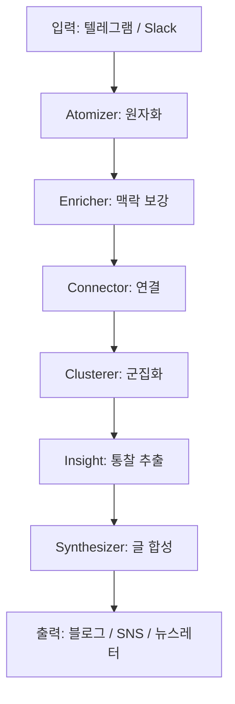

## 개요

> **요약**: 지식은 입력되는 순간 원자적 단위로 분해되고, AI가 자동으로 연결·군집화하여 구조화된 인사이트로 발전한다. 이 인사이트가 블로그·SNS·뉴스레터 등 다양한 채널로 자동 발행된다.

Synapse는 분산된 생각을 하나의 살아있는 지식 코어로 만드는 시스템이다.

## 핵심 원칙 비교

| 원칙 | 기존 방식 | Synapse 방식 |
|------|-----------|-------------|
| 입력 처리 | 수동 분류 | 자동 원자화 (Atomizer) |
| 연결 | 사람이 직접 태그 | AI 자동 벡터 연결 |
| 군집화 | 폴더 구조 | 의미 기반 Clusterer |
| 출력 | 단일 형태로 작성 | 매체별 자동 변환 |
| 원본 보존 | 수정 가능 | 원본 불변 원칙 |

## 처리 파이프라인

## 원본 불변 원칙

Synapse에서 가장 중요한 설계 결정 중 하나는 **원본 불변(Immutable Source)** 원칙이다. 입력된 메모는 절대 수정되지 않는다. 모든 분석 결과와 구조화는 별도의 레이어에 저장된다.

이 원칙이 중요한 이유:

1. 원본 의도가 왜곡되지 않는다.
2. 언제든지 재분석이 가능하다.
3. AI 처리 결과와 원본을 명확히 분리한다.

## 결론

Synapse의 핵심은 **생각의 자동 구조화**와 **원본 불변**이다. 이 두 원칙이 조화를 이룰 때, 지식은 시간이 지남에 따라 더 깊어지고 연결된다.
