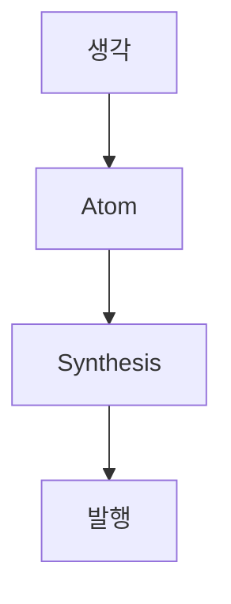

## 개요

> 핵심 요약: Synapse가 생각을 글로 합성해 GitHub 드래프트 PR로 발행하는 전 과정을 점검합니다. 이미지 호스팅 없이 표·박스·다이어그램이 텍스트로 렌더됩니다.

## 파이프라인 단계

| 단계 | 역할 |
| --- | --- |
| Atomizer | 생각을 원자 아이디어로 분해 |
| Synthesizer | 원자를 한 편의 글로 합성 |
| StaticSiteAdapter | thishw/hw_insight에 드래프트 PR 발행 |

