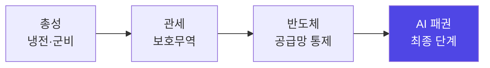

엔비디아가 오르는 날에도 AI 소프트웨어주가 빠지는 날이 늘었다.

작년까지는 상상하기 어려운 그림이었다. 'AI 테마'로 묶이기만 하면 다 같이 오르던 시장이, 올해 들어 하위 섹터별로 제각기 다른 길을 가기 시작했다. 개인적으로는 이게 단순한 순환매가 아니라 구조 변화라고 보고 있어서, 생각을 한번 정리해 둔다.

---

> **핵심 요약**
> AI 관련주가 한 덩어리로 움직이던 동조화 시대는 끝난 것 같다.
> 실적 가시성은 인프라 계층(반도체·HBM·전력)이 가장 높고, 응용 계층은 옥석 가리기 구간이다.
> 전략은 바벨 — 실적으로 증명되는 인프라 + 현금흐름을 가진 빅테크, 미증명 응용은 증거가 나올 때.

---

### 1. 덩어리 투자의 종말 — 그리고 그 범인은 AI 자신

2024년과 2025년까지 AI 관련주들은 거대한 하나의 덩어리로 움직였다.

엔비디아가 급등하면 밸류체인 전체가 따라 올랐고, AI 테마로 분류되기만 하면 기초체력(Fundamental)과 무관하게 주가가 우상향했다. 전형적인 '동조화 투자'의 시대였다.

근데 올해 들어 이 횡단적 상관관계가 깨져버렸다. 왜일까?

역설적이게도 범인은 AI 자신인 것 같다. 투자자들이 진일보한 AI를 시장 분석 도구로 직접 쓰기 시작하면서, 하위 섹터들의 실적·기술 우위·밸류에이션이 예전과 비교할 수 없는 속도로 분해되고 있다. 정보 비대칭이 해소되는 속도가 빨라지면, '테마'라는 뭉툭한 라벨로 묶여 있던 종목들 사이의 실력 차이가 가격에 드러나기 시작한다.

**AI가 자산 가격의 효율성을 끌어올리고, 그 결과 AI 테마 자체의 동조화가 깨지는** 구조다.

즉, AI 산업의 장기 성장을 아무리 낙관하더라도 단순 적립식·테마식 투자는 이제 통하지 않을 것 같다. 고평가 거품은 걷히고, 실적을 증명하는 기업만 차별화되는 장으로 바뀌는 중이다.

---

### 2. 큰 그림: 패권 경쟁의 종착지는 AI

방향을 잡으려면 패권 경쟁의 흐름부터 볼 필요가 있다.

총성에서 관세로, 관세에서 반도체로, 반도체에서 AI로. 패권 경쟁의 무대가 계속 수렴해 왔고, 지금의 승부처는 단연 미국이다.

역사적으로 미국은 혁신 기술의 패권을 쥐고 수출 지형을 바꿔 왔다. 전통 소프트웨어(SaaS) 수출국이 클라우드 인프라(IaaS/PaaS) 수출국으로 도약했고, 이제는 AI 기술 자체의 최고 수출국이 되려 하고 있다.

지정학적 재편과 함께 AI 빌드아웃(Build-out, 인프라 대확장) 시대가 오면서, 이 파도의 중심에 있는 미국 핵심 기업들의 현금흐름 전망은 어느 때보다 견고해 보인다. 국가 안보 전략과 천문학적인 설비투자(CAPEX)가 맞물려 장기 공급 계약이 이어지고 있기 때문이다.

---

### 3. 밸류체인 해부: 계층마다 사정이 완전히 다르다

동조화가 깨진 시장에서는 'AI'라는 한 단어 대신 밸류체인을 계층으로 쪼개서 봐야 한다.

| 계층 | 대표 영역 | 실적 가시성 | 관전 포인트 |
|---|---|---|---|
| **인프라 — 반도체** | GPU, 커스텀 실리콘, HBM, 선단 파운드리 | 높음 (캐펙스가 매출로 확인) | GPU 독점 완화, 커스텀 칩 비중 확대 |
| **인프라 — 물리** | 전력망 장비, 냉각(액체냉각), 송배전, 네트워킹 | 높음 (수주 잔고 기반) | 데이터센터 전력 병목, 그리드 증설 속도 |
| **플랫폼** | 하이퍼스케일러, 파운데이션 모델 | 중간 | 캐펙스 부담 vs AI 매출 전환 속도 |
| **응용·소프트웨어** | SaaS, AI 에이전트 서비스 | 낮음 (수익화 시차) | 좌석 과금 모델의 운명, 옥석 가리기 |

#### 인프라: '곡괭이와 삽'은 여전히 유효하다

기술 무게중심이 사전학습에서 **추론(Inference-time) 스케일링과 에이전틱 AI**로 이동하면서, GPU 수요의 성격이 학습용 일회성에서 추론용 상시 수요로 바뀌고 있다. 토큰 단가는 급락하는데 사용량이 그보다 훨씬 빠르게 늘어나는 제번스 역설 구간이라, 인퍼런스 인프라는 당분간 공급이 수요를 못 따라갈 것 같다.

여기서 눈여겨볼 지점 하나. GPU 독점 구조에 균열이 나기 시작했다는 것이다. 하이퍼스케일러들이 자체 칩을 추론 워크로드에 대규모로 투입하면서 커스텀 실리콘 비중이 구조적으로 올라가고 있다.

다만 어느 칩이 이기든 **HBM과 선단 파운드리는 공통 수혜**다. 골드러시 때 곡괭이와 삽을 팔던 포지션 — 칩 전쟁의 승자가 누구든 메모리와 파운드리는 팔린다.

그리고 진짜 병목은 이제 칩이 아니라 **전력**이다. 데이터센터 전력 수요가 그리드 증설 속도를 넘어서면서 전력 확보가 하이퍼스케일러의 핵심 경쟁력이 됐고, 원전 재가동·SMR·가스터빈 계약이 잇따르는 이유가 여기 있다. 수혜의 범위가 반도체를 넘어 전력망·냉각·송배전 장비로 번지는 국면이다.

#### 응용 계층: 좌석 모델의 운명이 갈림길

응용·소프트웨어 계층은 사정이 다르다.

AI 에이전트가 업무를 대신 수행하기 시작하면, 사람 수대로 과금하던 **좌석(seat) 기반 SaaS 모델이 흔들린다**. 반면 데이터와 워크플로우를 쥔 시스템오브레코드, AI를 깊게 내재화한 소프트웨어는 오히려 가격 결정력이 세진다.

같은 'AI 소프트웨어주'라도 승자와 패자가 극명하게 갈리는 구간이라는 뜻이다. AI 도입이 실제 매출 증가나 비용 절감으로 증명되기까지 시차도 있다. 옥석 가리기가 가장 까다로운 계층이라, 실적 분석과 핀포인트 종목 선별이 특히 중요해 보인다.

---

### 4. 리스크 체크리스트: 이 네 가지는 계속 봐야 한다

물론 인프라 낙관론에도 변수는 있다. 개인적으로 계속 체크하는 목록은 네 가지다.

1. **하이퍼스케일러 캐펙스 가이던스** — AI 인프라 주식의 최대 변수. 캐펙스는 사이클이라, 한 분기 가이던스 둔화에도 섹터 전체가 출렁일 수 있다.
2. **AI 매출 전환 지연** — 인프라 투자 대비 수익화가 늦어지면 밸류에이션 재조정이 온다.
3. **금리 경로** — 성장주 멀티플은 결국 금리의 함수다.
4. **수출통제·지정학** — 대중 규제 강화나 공급망 변동은 반도체 체인 전반의 변수다.

특히 1번은 무겁게 보는 편이다. 실적 가시성이 높다는 인프라 계층의 논리 자체가 "캐펙스가 계속된다"는 전제 위에 서 있기 때문이다.

---

### 5. 전략: 바벨로 간다

그럼 포트폴리오는 어떻게 짜야 할까?

개인적으로는 **바벨 전략**이 이 국면에 맞다고 본다. 역기(바벨)처럼 양 끝에 무게를 싣고 가운데는 비우는 방식이다.

- **한쪽 끝**: 실적으로 증명되는 **인프라**(반도체·HBM·파운드리·전력) — 캐펙스가 이미 집행되고 있어 매출로 확인된다.
- **다른 쪽 끝**: 현금흐름과 배포 채널을 가진 **빅테크** — AI 수익화의 시간을 버틸 체력이 있다.
- **가운데(미증명 응용 계층)**: 실적 증거가 나올 때 편입해도 늦지 않다.

종목을 고를 때는 **`[인플레이션 × AI 확산 × 병목(Bottleneck)]`** 세 겹의 렌즈가 유용하다. 장기 고물가·고금리가 생산성에 미치는 영향, 기업들의 AI 채택 속도와 부가가치 창출력, 그리고 확산 과정에서 반드시 부딪히는 물리적 한계(전력·칩 용량·인프라 공급)를 겹쳐 보는 것이다.

사이클 조정이 와도 관점은 유지한다. 구조적 성장 구간의 조정은 리스크라기보다 진입 기회에 가깝다고 보기 때문이다. 물론 시장 예측은 원래 어렵고, 이 정리도 틀릴 수 있다.

---

### FAQ: 자주 나오는 질문 두 가지

**Q. 동조화가 깨졌다는 건 AI 랠리가 끝났다는 뜻인가?**

그렇게 읽지는 않는다. 산업의 성장이 끝난 게 아니라, '모두가 오르는 장'에서 '증명하는 종목만 오르는 장'으로 게임의 규칙이 바뀐 것에 가깝다. 오히려 실력 있는 기업엔 차별화가 더 잘 드러나는 환경으로 보인다.

**Q. 인프라 계층이 유리하다면 응용 계층은 아예 피해야 하나?**

피하는 게 아니라 순서의 문제인 것 같다. 응용 계층은 수익화 증거가 실적으로 확인되는 시점에 들어가도 충분하다는 게 바벨 전략의 요지다. 데이터·워크플로우를 쥔 시스템오브레코드처럼 가격 결정력이 세지는 쪽은 예외적으로 일찍 볼 만하다.

---

### 결론: 정교한 종목 선별(Stock-picking)의 시대

과거의 AI 투자가 시장 전체 상승에 올라타는 '베타(Beta) 투자'였다면, 앞으로는 개별 기업의 펀더멘탈과 차별적 경쟁력을 발굴하는 **'알파(Alpha) 투자'**가 돼야 할 것 같다.

AI 스스로가 시장의 가격 효율성을 높이고 있고, 기술 무게중심은 추론과 에이전틱 AI, 전력·냉각 같은 물리 인프라로 다변화되고 있다. 이 전환기에 흔들리지 않는 지배력을 가진 미국 핵심 우량 기업을 고르고, 하위 섹터별 수익화 속도를 냉정하게 판별하는 것 — 결국 정교한 종목 선별만이 초과 수익을 만들 것으로 보인다.

**한줄 코멘트.**

지금까지가 AI라는 반 전체가 상을 받던 학기였다면, 이제부터는 성적표대로 등수가 갈리는 학기다.

---

> 본 글은 개인적인 관점과 분석을 정리한 것으로, 특정 종목·상품의 매수·매도 추천이 아닙니다. 투자에 대한 판단과 책임은 투자자 본인에게 있습니다.
