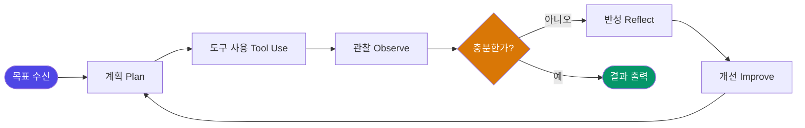

요즘 AI 엔지니어링 자료를 정리하다 보면 한 가지 흐름이 계속 눈에 걸린다.

더 크고 강력한 모델을 만드는 것이 AI 경쟁의 전부라고 믿었던 시대가 조용히 저물고 있다는 것. 이제 에이전트의 성패는 모델 자체가 아니라, 그것을 감싸는 '하네스(harness)'를 얼마나 정교하게 설계했느냐에서 갈리는 것 같다.

---

> **핵심 요약**
> AI 개발의 무게중심은 사전학습 스케일링에서 **추론-시간 스케일링과 에이전틱 AI**로 이동하고 있다.
> "Agent = Model + Harness"가 업계 표준 프레임으로 자리잡았고, 에이전트 성능의 결정 변수는 모델 교체가 아니라 **하네스 설계**로 보인다.
> 실수를 반복하지 못하도록 루프를 설계하는 쪽이 다음 시대의 주도권을 쥐지 않을까 싶다.

---

## 1. 패러다임의 전환: 사전학습 스케일링에서 하네스 엔지니어링으로

AI 개발의 역사는 지금까지 하나의 공식이 지배해 왔다. 더 많은 데이터, 더 많은 파라미터, 더 많은 컴퓨팅 — 이른바 **사전학습 스케일링 법칙(pre-training scaling law)**이다.

모델이 커질수록 성능이 좋아진다는 믿음이 수년간 업계의 투자 논리를 지탱해 왔다.

근데 이 공식에 균열이 보이기 시작했다.

Andrej Karpathy는 2025년 중반 [**"컨텍스트 엔지니어링(context engineering)"**](https://x.com/karpathy/status/1937902205765607626)이라는 표현을 밀면서, 모델에게 무엇을 어떻게 제공하느냐가 모델 크기만큼 중요하다는 관점을 공론화했다. 컨텍스트 엔지니어링이란 모델이 주어진 맥락(context window) 안에서 최선의 판단을 내리도록 입력 구조, 도구 정의, 메모리 설계를 체계적으로 짜는 일이다.

이 흐름은 Ghostty 창업자이자 HashiCorp 공동창업자인 **Mitchell Hashimoto**가 [자신의 AI 도입기](https://mitchellh.com/writing/my-ai-adoption-journey)에서 에이전트 루프 설계의 구체적인 방법을 공개하면서 실무적인 깊이를 얻었다. 그리고 2026년 2월, **OpenAI가 ['Harness Engineering'](https://openai.com/index/harness-engineering/)을 정식 엔지니어링 분과로 공식화**하면서 흐름이 굳어졌다.

개인적으로 이 계보에서 중요한 건 명칭이 아니라 방향이라고 본다. AI 개발의 무게중심이 **모델을 만드는 곳(사전학습)**에서 **모델을 운용하는 방식(추론-시간 스케일링과 에이전틱 설계)**으로 옮겨가고 있다는 신호다.

결국 더 큰 모델을 만드는 군비경쟁은 다른 경쟁으로 진화했다. 모델이 '생각하는 시간'을 늘리고, 도구를 쓰고, 긴 과제를 스스로 수행하는 **에이전트를 누가 더 잘 설계하느냐**의 경쟁이다.

---

## 2. 업계 표준 프레임: Agent = Model + Harness

**하네스(Harness)란** 모델을 둘러싼 실행 환경 전체 — 도구 정의, 메모리 관리, 루프 제어, 오류 처리, 평가 체계 — 를 묶어 부르는 말이다. 오늘날 AI 에이전트 개발의 공통 언어가 된 등식이 있다.

```
Agent = Model + Harness
```

자동차에 비유하면 이해가 빠르다. 모델은 엔진이고, 하네스는 차체·브레이크·계기판·피트크루다.

엔진 출력이 아무리 좋아도 브레이크가 없으면 서킷을 완주하지 못한다. 반대로 같은 엔진이라도 차를 어떻게 세팅하느냐에 따라 기록이 완전히 달라진다.

실제로도 그런 것 같다. 같은 프론티어 모델을 쓰더라도 하네스 설계에 따라 에이전트 성능이 근본적으로 달라진다는 보고가 쌓이고 있다. Claude Code, Pi, Letta처럼 따로 만들어진 하네스들이 대형 툴 결과의 디스크 영속화, 컴팩션 경계 안전성 같은 **같은 설계로 수렴**하고 있다는 [분석](https://martinfowler.com/articles/harness-engineering.html)도 있다. 유행이 아니라 검증된 공학 패턴이라는 뜻으로 읽힌다.

미니멀리즘 쪽 증거도 흥미롭다. Vercel은 에이전트의 툴 80%를 덜어냈더니 오히려 성능이 좋아졌다고 한다. 적을수록 낫다.

### 에이전트 작동의 기본 루프

에이전트는 한 번에 쭉 실행되지 않는다. 이런 순환 구조 안에서 돈다.



**계획(Plan) → 도구 사용(Tool Use) → 관찰(Observe) → 반성(Reflect) → 개선(Improve)**. 이 루프가 에이전트를 단일 응답 생성기가 아니라 자율적인 작업 수행자로 만들어 준다.

그럼 이 루프는 어떻게 조향할까? Martin Fowler 사이트에 실린 Birgitta Böckeler의 [프레임워크](https://martinfowler.com/articles/harness-engineering.html)를 빌리면 두 갈래다. 규칙과 컨텍스트를 미리 넣어주는 **feedforward(가이드)**, 그리고 린터·테스트·훅으로 사후에 잡아내는 **feedback(센서)**. 좋은 하네스는 이 둘을 같이 설계한다.

---

## 3. 루프 엔지니어링의 실천: 실수를 시스템으로 봉인하라

하네스 엔지니어링의 핵심 실천 원리는 Hashimoto의 말 한마디로 압축된다.

> *"에이전트가 실수할 때마다, 다시는 그 실수를 못 하도록 시스템을 엔지니어링하라."*

에이전트를 더 똑똑하게 만들자는 얘기가 아니다. 실수가 반복될 수 없는 구조적 제약을 시스템 안에 심자는 얘기다.

버그를 발견하면 테스트를 추가한다 — 소프트웨어 공학의 오래된 원칙이 AI 에이전트 운용으로 확장된 셈이다.

### Loop Engineering의 3대 구현체

실무에서 루프 엔지니어링은 세 가지 표준 구현체로 수렴하고 있는 것 같다.

| 구현체 | 핵심 아이디어 | 성립 조건 |
|---|---|---|
| [**Ralph Wiggum Loop**](https://ghuntley.com/ralph/) (Geoffrey Huntley) | `while` 루프로 매 이터레이션 fresh context 실행. git과 progress 파일이 메모리 레이어 | 상세한 스펙 + 명확한 종료 기준(exit criteria) |
| [**Initializer-Executor**](https://www.anthropic.com/engineering/effective-harnesses-for-long-running-agents) (Anthropic) | 초기화 에이전트가 durable environment(초기화 스크립트·진행 파일)를 1회 구축, 이후 executor 세션들이 세션 간 공유 메모리로 사용 | 디스크에 영속화된 상태 설계 |
| **Dynamic Workflows** | 계획 자체가 오케스트레이션 코드로 이동 — 중단 후 재개 가능한 결정론적 제어 흐름 | 관측 가능한 단계 분해 |

셋의 공통분모는 분명하다.

**장기 실행의 핵심은 컨텍스트 윈도우가 아니라 디스크에 영속화된 상태**이고, 루프의 성패는 모델 성능이 아니라 종료 기준 설계에 달렸다는 것. 하네스를 편집 가능한 파일 컴포넌트로 쪼개고 관측 데이터로 하네스 자체를 자동 진화시키는 [연구](https://arxiv.org/abs/2604.25850)까지 나와 있다.

### Spec-Driven 개발의 부상

이 흐름이 개인 방법론을 넘어 표준 도구로 자리잡는 과정을 보여주는 사례가 [**GitHub Spec-Kit**](https://github.com/github/spec-kit)이다.

Spec-driven 개발은 에이전트에게 바로 일을 시키는 대신, 먼저 사양(spec)을 쓰고 → 계획(plan)으로 쪼개고 → 실행 가능한 태스크(tasks)로 구체화한 뒤 에이전트를 투입하는 방식이다. 이 체인이 에이전트-애그노스틱 마크다운으로 표준화됐다는 건, 어떤 모델을 쓰든 같은 워크플로를 재사용할 수 있다는 뜻이다.

다만 역할(페르소나)별로 파일을 주고받는 무거운 핸드오프 구조는 오버헤드 때문에 실패 사례로 자주 언급된다. 위임 구조는 플랫할수록 좋은 것 같다.

---

## 4. 검증과 병렬화: 생성이 아니라 검토가 병목이다

에이전트가 코드를 쏟아내는 시대에 검증 쪽 합의는 세 가지로 정리된다.

1. **Definition-of-Done은 기계가 체크 가능한 계약이어야 한다** — 모든 완료 조건이 관측 가능해야 한다.
2. **작성자 에이전트는 오염돼 있다(compromised)** — 자기 작업의 검증은 반드시 세션을 분리한 별도 에이전트가 해야 한다(adversarial review).
3. **검증자는 크지 않아도 되지만, 달라야 한다** — 같은 모델이 자기 출력을 평가하면 self-evaluation bias에 빠진다.

병렬화 쪽 수렴도 뚜렷하다. 병렬 에이전트 도구들은 전부 **worktree(또는 컨테이너) 격리 + 태스크별 브랜치 + 리뷰 후 병합**이라는 같은 설계에 도달했다.

그리고 업계의 실전 합의 하나 — 1인 개발자가 감당 가능한 동시 작업은 **4~8 worktree** 정도라고 한다. 그 이상에서는 에이전트가 아니라 **사람의 리뷰가 병목**이 된다.

> 스케일의 제약이 연산에서 인간 검토 대역폭으로 옮겨갔다. "AI가 똑똑해졌다"보다 "AI가 검증 가능한 루프 안에 들어갔다"가 가치 창출을 더 정확히 설명하는 것 같다.

어쨌든 생태계가 커지면서 보안도 새 전선이 됐다. 인기 메모리 플러그인이 무인증 로컬 HTTP API를 `0.0.0.0`에 바인딩해 보안 감사에서 HIGH 판정을 받은 사례가 있다. 서드파티 플러그인이 늘수록 하네스의 공격 표면도 커진다. 하네스 엔지니어링에는 처음부터 보안 감사가 들어가야 하지 않을까 싶다.

---

## 5. 에이전트 경제학: 비즈니스 현장의 실증

하네스 엔지니어링은 개념 놀음에 머물지 않는다. 자본 배분과 기업 경쟁이라는 가장 민감한 영역에서 이미 효과가 확인되고 있다.

### 자동화 패러다임의 세대 교체

| 구분 | 과거의 자동화 | 현재의 AI 자동화 |
|---|---|---|
| **자동화 대상** | 논리적 절차로 설명 가능한 일 | 충분한 데이터로 검증 가능한 일 |
| **설계 방식** | 규칙 기반 프로그래밍 | 루프 안에서의 학습·평가·반복 |
| **한계 요인** | 예외 케이스, 규칙의 불완전성 | 검증 루프의 정밀도, 평가 기준의 명확성 |
| **성능 향상 방법** | 규칙 추가·수정 | 하네스 재설계, 평가 데이터 확충 |

과거의 자동화는 인간이 '어떻게 하는지'를 코드로 옮길 수 있는 영역에서만 굴러갔다. 지금의 AI는 '무엇이 좋은 결과인지'를 데이터로 검증할 수만 있으면 자동화가 된다.

이 차이가 적용 범위를 기하급수적으로 넓힌다.

### 재무·반도체 — 에이전트 적용의 최적 지형

법인카드·지출관리 시장에서 경쟁을 돌파한 **Ramp**가 재무용 AI 에이전트 기업으로 전환을 선언하며 대형 밸류에이션 투자 유치에 성공했다. 재무 데이터는 검증 기준이 명확하고 반복 실행 가능한 루프를 짜기 좋다 — 에이전트가 먼저 뿌리내리기 좋은 땅이다.

반도체 설계 자동화(EDA)도 같은 조건이다. 복잡성과 비용이 극단적으로 높고, 검증 기준(시뮬레이션·테스트)이 명확하고, 반복 루프가 이미 존재한다.

두 영역의 공통점은 우연이 아닌 것 같다. **검증 가능한 루프가 이미 있는 곳에서 에이전트의 가치가 가장 먼저 실현된다.**

> *"미래에는 PC를 직접 조작하는 에이전트를 두게 될 것이다. 그 수를 선택하고 운용하는 것이 새로운 노동 패러다임이다."*

기업의 소프트웨어 구독 항목에 '에이전트 수'가 들어가는 시대가 오면, 몇 개의 에이전트를 어떤 루프로 굴릴지 정하는 능력이 핵심 경영 역량이 되지 않을까.

---

## FAQ: 하네스 엔지니어링에 대해 가장 많이 묻는 질문

**Q. 하네스 엔지니어링과 프롬프트 엔지니어링은 어떻게 다른가?**

프롬프트 엔지니어링이 모델에게 보내는 단일 입력(프롬프트)의 품질을 다듬는 일이라면, 하네스 엔지니어링은 에이전트가 반복 실행하는 루프 전체 — 도구 설계, 메모리 관리, 오류 처리, 평가 체계, 서브에이전트 조율 — 를 시스템으로 설계하는 일이다. 전자가 단발 최적화라면, 후자는 지속적인 시스템 설계다.

**Q. 어떤 모델을 써도 하네스가 더 중요하다는 주장의 근거는?**

같은 기반 모델에서 하네스 설계만 바꿔도 성능이 유의미하게 달라진다는 사례가 현장에서 반복 보고되고 있다. 평가 기준(eval), 컨텍스트 구성, 도구 호출 체계를 손보면 모델 교체 없이도 결과가 좋아진다. 반대로 하네스 없이 모델만 올리면 같은 실수가 반복되는 경우가 많다.

---

## 결론: 루프를 설계하는 자가 다음 시대를 이끈다

하네스 엔지니어링은 단순한 기술 트렌드가 아니라, AI 개발의 **책임 소재를 모델 제조사에서 시스템 설계자로 옮기는** 전환으로 보인다.

더 강한 모델이 나오기를 기다리는 수동적인 자세로는 이 시대를 앞서가기 어렵다. 지금 가진 모델이 같은 실수를 반복하지 못하도록 루프를 설계하고, 검증하고, 다듬는 능력 — 이게 다음 시대의 핵심 역량이라고 본다. 물론 이 판도 빠르게 변하니 지금의 정리가 틀릴 수 있다. 다만 방향 자체는 꽤 일관돼 보인다.

**한줄 코멘트.**

모델은 엔진이고 하네스는 차다. 경주에서 이기는 건 엔진이 아니라 차를 세팅하는 팀이다.

---

## 참고 자료

- [Harness engineering: leveraging Codex in an agent-first world](https://openai.com/index/harness-engineering/) — OpenAI, 2026-02
- [Effective harnesses for long-running agents](https://www.anthropic.com/engineering/effective-harnesses-for-long-running-agents) — Anthropic Engineering
- [Harness engineering for coding agent users](https://martinfowler.com/articles/harness-engineering.html) — Birgitta Böckeler, martinfowler.com
- [Agentic Harness Engineering: Observability-Driven Automatic Evolution of Coding-Agent Harnesses](https://arxiv.org/abs/2604.25850) — arXiv:2604.25850
- [Ralph Wiggum as a "software engineer"](https://ghuntley.com/ralph/) — Geoffrey Huntley
- [My AI Adoption Journey](https://mitchellh.com/writing/my-ai-adoption-journey) — Mitchell Hashimoto
- [github/spec-kit](https://github.com/github/spec-kit) — GitHub 공식 Spec-Driven Development 툴킷
- [Andrej Karpathy — context engineering](https://x.com/karpathy/status/1937902205765607626) — X(Twitter), 2025-06
