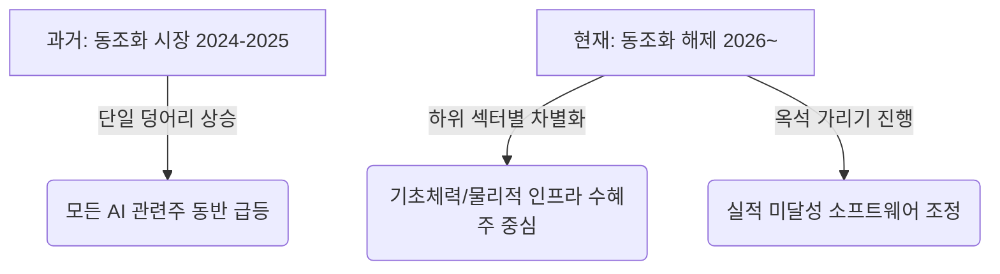

---
layout: post
title: "동조화가 깨진 AI 시장: 패러다임 전환기 속 미국 중심의 정밀한 선별 투자 전략"
description: "AI 시장의 동조화가 깨지고 패러다임 전환기가 찾아왔습니다. 미국 중심의 AI 패권 전망 속에서 포트폴리오를 재조정하고 하위 섹터별로 정밀하게 선별 투자하는 전략을 소개합니다."
keywords: "인공지능 투자, AI 시장 동조화, 포트폴리오 리밸런싱, 선별 투자 전략, 미국 AI 패권, AI 하위 섹터, AI 빌드아웃, 빅테크 기업"
date: 2026-07-02
categories: [Investment, AI]
tags: [인공지능 투자, AI 시장 동조화, 포트폴리오 리밸런싱, 선별 투자 전략, 미국 AI 패권, AI 하위 섹터, AI 빌드아웃, 빅테크 기업]
sitemap:
  changefreq: weekly
  priority: 1.0
---

# 동조화가 깨진 AI 시장: 패러다임 전환기 속 미국 중심의 정밀한 선별 투자 전략

세상의 투자자라면 이제 인공지능(AI)을 고민하지 않을 수 없으며, 시장에는 늘 크고 작은 **인공지능 투자** 기회가 존재해 왔습니다. 하지만 최근 **AI 시장 동조화** 현상이 완전히 깨지기 시작하면서, 장기적인 낙관론을 가진 투자자들에게도 정교한 **포트폴리오 리밸런싱**이 요구되는 중대한 전환점에 직면했습니다. 

단순히 'AI 테마'라는 이름 아래 모든 관련주가 함께 오르던 시대는 가고, 기술의 진보와 시장의 지각변동에 발맞춘 현명한 대응이 필요한 때입니다. 본 가이드에서는 패러다임 전환기에 직면한 투자자들을 위해 **미국 AI 패권** 전망 속에서 하위 섹터별로 정밀하게 **선별 투자 전략**을 수립하고 실행하는 방법을 단계별로 소개합니다.

<!-- Google AdSense: Article Top Banner -->
<div class="adsense-placeholder-top" style="min-height: 90px; background: #f9f9f9; text-align: center; padding: 10px; margin: 20px 0; border: 1px dashed #ccc;">
  <small style="color: #999;">Advertisement (Google AdSense Ready)</small>
</div>

---

## 1단계: 덩어리 투자의 종말과 AI가 가속화하는 시장 효율성 이해하기

성공적인 **인공지능 투자**를 위해 가장 먼저 선행되어야 할 것은 현재 시장의 구조적 변화를 정확하게 인지하는 것입니다.

2024년과 2025년까지만 해도 AI 관련주들은 거대한 하나의 덩어리로 묶여 함께 움직이는 경향이 뚜렷했습니다. 엔비디아의 급등이 밸류체인 전반의 동반 상승을 이끌었고, AI 테마로 분류되기만 하면 기업의 기초체력(Fundamental)과 무관하게 주가가 우상향하는 '동조화 투자'가 지배적이었습니다.

그러나 올해 1월을 기점으로 이 횡단적 상관관계가 완전히 깨져버렸습니다. **AI 하위 섹터**들이 제각기 다른 방향으로 움직이기 시작한 것입니다.



### 💡 시장 효율성 극대화의 원인
이러한 흐름은 투자자들이 질적으로 진일보한 AI 기술을 고도의 시장 분석 도구로 직접 활용하여 하위 섹터를 정교하게 분석하기 시작하면서 발생한 현상입니다. 수많은 투자자가 AI 엔진과 고성능 알고리즘을 사용해 다양한 하위 섹터들의 실적 지표, 기술적 우위, 밸류에이션을 아주 똑똑하게 분석하고 분해하기 시작했습니다. 

결과적으로 **AI 기술 자체가 자산 가격의 효율성을 극대화**하고 있는 역설적인 상황이 벌어지고 있습니다. 시장의 정보 비대칭성이 빠르게 해소되면서 고평가된 거품은 걷히고, 진짜 실적을 내는 기업들만 차별화되는 구조적 변화가 일어난 것입니다. 

장기적인 관점에서 AI 산업의 거대한 성장 동력을 강하게 낙관할지라도, 지금은 기존의 단순 적립식 혹은 테마식 투자를 멈추고 대대적인 **포트폴리오 리밸런싱**을 감행해야 하는 시점입니다.

---

## 2단계: 지정학적 재편과 미국 중심의 AI 패권 자산 배분하기

글로벌 패권 경쟁의 양상은 '총성 없는 전쟁'에서 '보호무역과 관세 장벽'으로, 이어 '반도체 공급망 통제'로 흐르더니 이제는 최종 단계인 'AI 패권'으로 수렴하고 있습니다. 

이 글로벌 기술 패권 전쟁에서 가장 핵심적인 승부처는 단연 **미국**입니다. 따라서 AI 전략 산업에 투자할 때는 글로벌 표준을 수립하고 세계 질서를 주도하는 **빅테크 기업**과 미국 핵심 공급망에 속한 인프라 기업을 포트폴리오의 중심축에 두어야 합니다.

| 패권 발전 단계 | 핵심 특징 및 변화 지점 | 글로벌 표준 주도국 | 포트폴리오 반영 여부 |
| :--- | :--- | :--- | :---: |
| **1단계: 소프트웨어 수출** | 전통적인 SaaS 중심의 글로벌 솔루션 공급 | 미국 (빅테크 중심) | 필수 반영 |
| **2단계: 인프라 수출** | 클라우드 인프라(IaaS/PaaS) 글로벌 점유율 장악 | 미국 (하이퍼스케일러) | 필수 반영 |
| **3단계: AI 기술/추론 수출** | LLM 모델 라이선스 및 에이전틱 AI API 공급망 통제 | 미국 (AI 선두 기업) | 적극 확대 |

역사적으로 미국은 혁신 기술의 패권을 쥐고 글로벌 수출 지형을 바꾸어 왔습니다. 과거에는 전통적인 소프트웨어(SaaS) 수출국이었던 미국이 클라우드 인프라(IaaS/PaaS) 수출국으로 도약했고, 이제는 전 세계를 대상으로 한 AI 기술 자체의 최고 수출국이 되려 하고 있습니다. 미국의 빅테크 기업들과 유망 스타트업들은 초거대 언어 모델(LLM)과 추론 인프라 솔루션을 무기로 전 세계 시장의 디지털 혈관을 장악해 나가는 중입니다.

본격적인 지정학적 재편과 함께 **AI 빌드아웃**(Build-out, 인프라 대확장) 시대가 도래함에 따라, 이 거대한 파도의 중심에 있는 미국 핵심 기업들의 현금흐름 전망은 그 어느 때보다 안정적이고 견고한 국면에 접어들었습니다. 국가 차원의 안보 전략과 기업들의 천문학적인 설비투자(CAPEX)가 맞물려 장기 공급 계약이 체결되고 있기 때문입니다.

<!-- Google AdSense: In-Article Middle Banner -->
<div class="adsense-placeholder-middle" style="min-height: 250px; background: #f9f9f9; text-align: center; padding: 15px; margin: 25px 0; border: 1px dashed #ccc;">
  <small style="color: #999;">Advertisement (Google AdSense Ready - In-Article Native)</small>
</div>

---

## 3단계: `[인플레이션 * AI 확산 * 병목]` 프레임워크로 하위 섹터 선별하기

미시적 기술 패러다임에서도 급격한 변화가 일어나고 있습니다. 본질적으로 AI는 기존 소프트웨어 산업이 진화한 다음 단계(Next Step)입니다.

그동안 AI 개발의 주도권은 더 많은 데이터를 부어넣어 모델을 크게 만드는 '사전학습 스케일링(Pre-training Scaling)'에 있었습니다. 그러나 최근 들어 시장의 무게중심은 **추론 단계에서의 연산 성능을 높이는 '추론(Inference-time) 스케일링'**과 스스로 판단하고 행동하는 **'에이전틱 AI(Agentic AI)'**로 빠르게 이동하고 있습니다. 이에 따라 병목을 해결하기 위한 하드웨어 요구사항도 완전히 달라지고 있습니다.

이러한 기술 흐름에서 하위 섹터를 정교하게 분류하고 가치 사슬 내 **'병목(Bottleneck)'**을 찾아내어 투자 대상을 압축하는 3대 체크포인트를 제시합니다.

```
                                  [인공지능 투자 분석 프레임워크]

         인플레이션 (Inflation)               AI 확산 (Diffusion)                 병목 현상 (Bottleneck)
  ┌──────────────────────────────┐  ┌──────────────────────────────┐  ┌──────────────────────────────┐
  │ 장기 고물가·고금리 환경 속에서│  │ 기업들이 AI 솔루션을 도입하여│  │ 기술이 확산되는 과정에서 마주│
  │ 생산성 향상을 통해 비용을     │  │ 매출 증가나 비용 절감 등 실질│  │ 하는 물리적 자원(전력, 냉각, │
  │ 절감할 수 있는가?            │  │ 적인 부가가치를 내는가?       │  │ 공급망)의 한계는 무엇인가?   │
  └──────────────────────────────┘  └──────────────────────────────┘  └──────────────────────────────┘
```

### ⚡ 1. 물리적 인프라 하위 섹터 (가장 강력한 수혜)
과거에는 고성능 GPU 중심의 AI 반도체 설계에 투자가 집중되었다면, 이제는 엄청난 연산 처리를 견디기 위한 물리 인프라로 수혜의 범위가 확산되고 있습니다. 이 영역은 공급망 병목이 가장 직접적으로 발생하고 단기 실적이 견고하게 나오는 분야입니다.
* **전력망(Grid) 장비**: 막대한 전력 소모를 해결하기 위한 송배전 시스템, 변압기
* **냉각 솔루션**: 전례 없는 수준의 발열을 제어하기 위한 액체 냉각(Liquid Cooling) 장치 및 설비
* **EDA(전자설계자동화) 및 IP**: 반도체 미세공정 한계를 극복하기 위해 반도체 설계 복잡성을 제어하고 설계 기간을 단축해 주는 AI/ML 기반 설계 툴

### 📱 2. 응용 및 소프트웨어 계층 (철저한 핀포인트 검증 필요)
최종 소비자와 기업에 서비스를 제공하는 '응용 및 소프트웨어 계층(Application Layer)'은 상황이 다릅니다. 이 영역은 기업들이 AI 도입을 통해 실제로 매출 증가나 비용 절감과 같은 구체적인 수익성을 증명하기까지 시차가 존재합니다. 
* **선별 팁**: 단순한 AI 탑재 홍보성 기업을 배제하고, 기업 고객의 예산을 실제로 흡수하여 마진율을 유지하는 지배적 기업에 한해 핀포인트로 선별 투자해야 합니다.

---

## 4단계: 포트폴리오 리밸런싱 실행 체크리스트

변화된 매크로 환경과 기술 동향에 발맞춰 개인 투자자가 실천해야 할 포트폴리오 재배정 로드맵입니다.

- [ ] **동일 가중 지수형 투자 축소**: AI 관련주를 무작위로 묶어둔 ETF나 테마성 펀드의 비중을 점진적으로 줄입니다.
- [ ] **미국 AI 패권 중심 자산 재조정**: 포트폴리오의 중추를 장기 CAPEX(설비투자) 성장의 직간접적 수혜를 입는 미국 핵심 **빅테크 기업**으로 이동시킵니다.
- [ ] **물리 병목 해결 기업 편입**: 전력망 인프라, 전력 효율 제어를 위한 냉각 시스템 선도 기업을 편입하여 포트폴리오의 하단을 방어합니다.
- [ ] **소프트웨어 옥석 가리기**: 분기별 실적 발표에서 실제 AI 도입 후 매출 가이드라인을 상향한 기업에 압축 투자(Stock-picking)합니다.

---

## 결론: 정교한 종목 선별(Stock-picking)의 시대

과거의 AI 투자가 시장의 전반적인 상승세에 올라타는 '베타(Beta) 투자'였다면, 앞으로의 AI 투자는 철저하게 개별 기업의 펀더멘탈과 차별적 경쟁력을 발굴하는 **'알파(Alpha) 투자'**여야 합니다. 모든 AI 기업이 호재를 공유하며 함께 오르던 동조화 시대는 완전히 끝났습니다.

AI 자체가 시장의 가격 효율성을 높이고, 기술적 무게중심이 추론(Inference-time)과 에이전틱 AI, 그리고 전력·냉각 등의 물리적 인프라로 다변화되고 있습니다. 이러한 거대한 전환기 속에서 흔들리지 않는 지배력을 지닌 미국의 핵심 우량 기업을 엄선하고, 하위 섹터별 수익화 속도를 냉철하게 판별하는 **정교한 종목 선별(Stock-picking)**만이 시장을 넘어서는 견고한 초과 수익률을 약속할 것입니다.

<!-- Google AdSense: Article Bottom Banner -->
<div class="adsense-placeholder-bottom" style="min-height: 90px; background: #f9f9f9; text-align: center; padding: 10px; margin: 20px 0; border: 1px dashed #ccc;">
  <small style="color: #999;">Advertisement (Google AdSense Ready)</small>
</div>

## TL;DR
# 동조화가 깨진 AI 시장: 패러다임 전환기 속 미국 중심의 정밀한 선별 투자 전략 세상의 투자자라면 이제 인공지능(AI)을 고민하지 않을 수 없으며, 시장에는 늘 크고 작은 AI 투자 기회가 존재해 왔습니다. 하지만 최근 AI 시장의 동조화(Correlation) 현상이 완전히 깨지기 시작하면서, 장기적인 낙관론...

- Intent: how_to
- Geo focus: 미국
- Core topics: 인공지능 투자, AI 시장 동조화, 포트폴리오 리밸런싱

## Next Step
관련 주제 확장 글을 이어서 읽어보세요.
- Quality gates: unique-angle, clear-structure, source-attribution-if-needed, readability-pass
