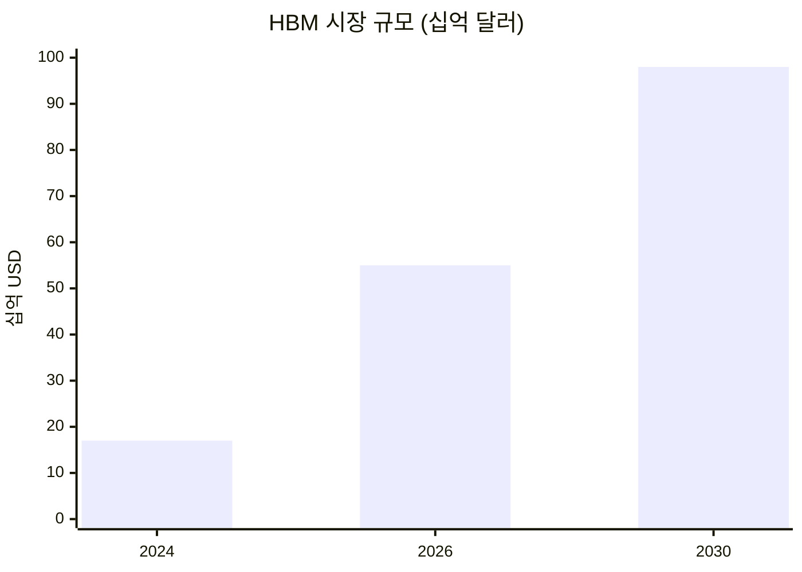
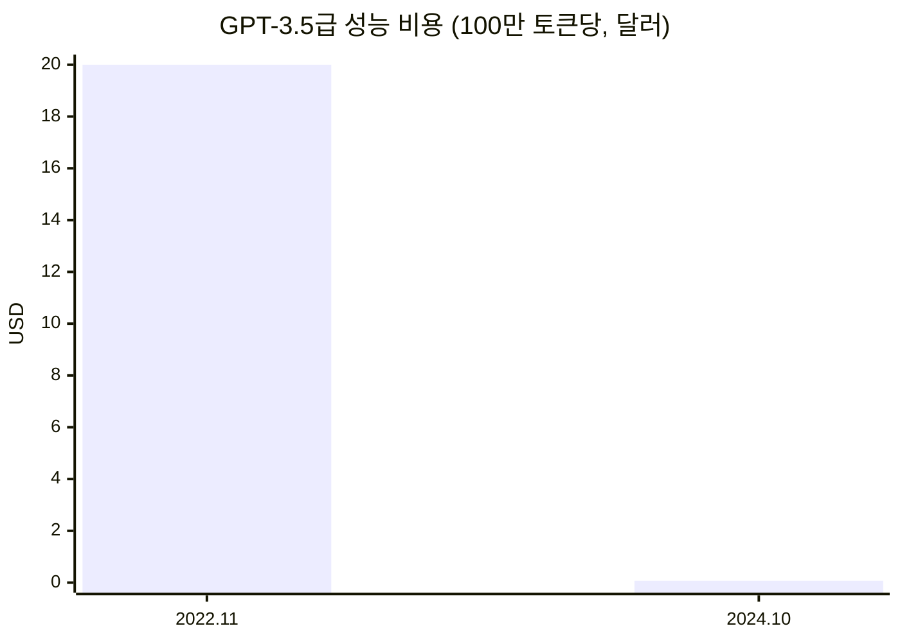
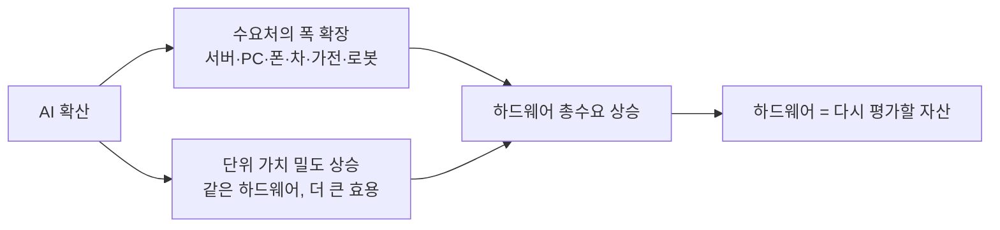

> **핵심 요약**
> AI를 쓰면서 점점 더 많은 메모리와 저장공간이 필요하다는 체감은 개인적 착각이 아니라 구조적 현상이다. 추론(inference)은 메모리를 먹고, 일관된 에이전트는 계층적 컨텍스트를 쌓으며, 그 수요처는 서버·PC를 넘어 자동차·가전·로봇으로 번지고 있다. 그리고 가장 흥미로운 반전 — 모델이 좋아질수록 **같은 하드웨어가 만들어내는 가치가 올라간다.** 오늘의 하드웨어 가치와 내일의 하드웨어 가치는 같지 않다.

AI로 작업을 하다 보면 이상한 감각이 든다. 램이 더 필요하고, 저장공간이 더 필요하다. 처음엔 내 환경 탓인 줄 알았는데, 숫자를 들여다보니 이건 나 혼자의 문제가 아니라 산업 전체가 같은 방향으로 밀려가는 흐름이었다. 개인적으로는 이게 단순한 "AI 붐"의 부산물이 아니라, **하드웨어라는 자산을 다시 평가해야 하는 이유**라고 보고 있어서 생각을 정리해 둔다.

---

## 1. 추론은 메모리를 먹는다

학습(training)이 화제의 중심이던 시절이 있었다. 지금은 아니다. Deloitte는 2026년 추론이 전체 AI 연산의 약 3분의 2를 차지하고, 추론 인프라 지출이 처음으로 학습을 넘어설 것으로 본다([Deloitte TMT Predictions 2025](https://www.deloitte.com/us/en/insights/industry/technology/technology-media-and-telecom-predictions/2025/gen-ai-on-smartphones.html)). 추론은 배포되는 워크로드다. 배포된다는 건, 곳곳에서 돌아간다는 뜻이고, 돌아가려면 메모리가 있어야 한다.

그 결과가 지금의 메모리 슈퍼사이클이다. SK하이닉스의 2026 시장 전망에 따르면 HBM 시장은 2024년 170억 달러에서 2030년 980억 달러로 커지고, DRAM 매출에서 HBM이 차지하는 비중은 18%에서 50%로 올라간다([SK hynix Newsroom](https://news.skhynix.com/2026-market-outlook-focus-on-the-hbm-led-memory-supercycle/)). 심지어 2028년이면 HBM 시장 하나가 2024년 DRAM 시장 전체를 넘어설 것으로 본다.

<figcaption>HBM 시장 규모 전망. 2024년 170억 달러 → 2030년 980억 달러. 출처: SK hynix / BofA.</figcaption>

메모리가 AI 하드웨어에서 얼마나 큰 비중인지 보면 감이 온다. SemiAnalysis 분석으로는 최신 AI 가속기에서 **메모리가 제조원가(BOM)의 약 3분의 2**를 차지하고, GB200 슈퍼칩에서는 HBM 값만 약 4,800달러로 이전 세대 H100 한 대의 제조원가 전체보다 비싸다([SemiAnalysis](https://newsletter.semianalysis.com/p/ai-server-cost-analysis-memory-is)). 랙 단위로 보면 격차가 더 극적이다. NVIDIA GB200 NVL72 한 랙은 약 30TB의 통합 메모리를 싣는데([NVIDIA](https://www.nvidia.com/en-us/data-center/gb200-nvl72/)), 전통적인 CPU 서버가 보통 1TB 안팎인 것과 비교하면 대략 한 자릿수 배 차이다.

이 수요는 소비자 메모리까지 압박한다. TrendForce는 2026년 2분기 DRAM 계약가격이 전 분기 대비 58~63%, NAND는 70~75% 오를 것으로 봤고, 공급사들이 수익성 높은 서버·HBM 쪽으로 생산능력을 재배치하면서 스마트폰·노트북용 메모리가 밀려나고 있다고 진단했다([TrendForce](https://www.trendforce.com/insights/memory-wall)). Bank of America는 2026년을 "1990년대 호황에 버금가는 슈퍼사이클"로 표현했다(위 SK하이닉스 자료 재인용).

IDC의 진단이 이 장의 요지를 가장 압축한다.

> "반도체 산업은 구조적 임계점을 넘었다. AI는 더 이상 수요의 촉매가 아니라 **수요의 토대**다."
> — Jeff Janukowicz, IDC Research VP ([IDC](https://www.idc.com/resource-center/blog/semiconductor-market-to-surge-past-the-trillion-dollar-threshold-ai-infrastructure-drives-market-growth/))

---

## 2. 일관된 에이전트는 컨텍스트를 쌓는다 — 저장장치의 이야기

메모리가 "지금 돌리는" 비용이라면, 저장장치는 "일관되게 돌리기 위한" 비용이다. 에이전트가 어제 한 일을 기억하고, 내 선호를 반영하고, 방대한 참고자료를 뒤지려면 다양한 컨텍스트를 여러 계층으로 쌓아둬야 한다. 대화 이력, 벡터 저장소, RAG 코퍼스, 그리고 긴 문맥을 유지하는 KV 캐시까지.

이게 데이터 총량을 밀어 올린다. IDC의 Global DataSphere는 전 세계 데이터 생성량이 2025년 약 181제타바이트(ZB)에서 2028년 약 394ZB로 늘어난다고 보며, 생성형 AI를 핵심 동인으로 꼽는다([IDC DataSphere](https://my.idc.com/getdoc.jsp?containerId=US53363625)). 특히 RAG·에이전트가 다루는 비정형 데이터는 2024년 5.5ZB에서 2028년 10.5ZB로 늘 것으로 본다.

기술적으로도 흔적이 뚜렷하다. 긴 문맥과 다중 사용자는 KV 캐시라는 메모리 싱크를 만든다 — 70B 모델을 128K 문맥으로 돌리면 가중치를 올리기도 전에 KV 캐시만으로 수십 GB가 들어간다([The KV Cache Wars](https://kenhuangus.substack.com/p/the-kv-cache-wars), 엔지니어링 추정치). 산업은 이 컨텍스트를 값비싼 HBM에서 더 싼 저장 계층으로 내려보내는 인프라를 만들기 시작했다. NVIDIA가 KV·에이전트 컨텍스트 전용 계층 저장소인 CMX(Context Memory Storage)를 내놓은 것이 대표적이다([NVIDIA CMX](https://www.nvidia.com/en-us/data-center/ai-storage/cmx/)). 벡터 데이터베이스 시장도 2023년 16.6억 달러에서 2030년 73.4억 달러로 연 23.7% 성장할 것으로 전망된다([Grand View Research](https://www.grandviewresearch.com/industry-analysis/vector-database-market-report)).

정리하면 이렇다. **똑똑함은 메모리로, 일관됨은 저장장치로 값을 치른다.** 에이전트가 진짜 비서처럼 쓰일수록 둘 다 늘어난다.

---

## 3. 클라우드만의 이야기가 아니다 — 로컬이 필요한 이유

"그거 다 클라우드에서 돌리면 되는 거 아니냐"고 할 수 있다. 그런데 로컬에서 돌려야만 하는 일이 분명히 있다. 시크릿 키나 API 키를 다루는 보안 민감 작업, 오프라인이나 로컬 스케줄로 돌아가야 하는 작업, 왕복 지연을 견딜 수 없는 작업 — 이런 건 데이터와 연산을 기기 안에 둬야 한다.

Qualcomm은 일찌감치 "AI의 미래는 하이브리드"라며, 비용·지연·프라이버시·보안·개인화를 이유로 추론이 기기와 엣지로 내려올 수밖에 없다고 주장했다([Qualcomm 백서](https://www.qualcomm.com/content/dam/qcomm-martech/dm-assets/documents/Whitepaper-The-future-of-AI-is-hybrid-Part-1-Unlocking-the-generative-AI-future-with-on-device-and-hybrid-AI.pdf)). 온디바이스는 민감한 데이터를 여러 주체를 거치는 데이터 파이프라인에 태우지 않고 로컬에 붙잡아 둔다 — 정확히 보안 민감 작업이 필요로 하는 성질이다.

그리고 이 흐름은 이미 기기의 하드웨어 하한을 끌어올리고 있다. Microsoft의 Copilot+ PC는 **16GB 램 + 40 TOPS NPU + 256GB SSD**를 최소 사양으로 못박았고([Microsoft](https://www.microsoft.com/en-us/windows/learning-center/copilot-plus-pcs-windows-pcs-differences)), Apple은 Apple Intelligence를 위해 맥의 기본 램을 8GB에서 16GB로 올렸다([Macworld](https://www.macworld.com/article/2441215/apple-intelligence-forces-apple-to-finally-give-us-what-we-want-more-ram.html)). 로컬 LLM은 대략 4비트 양자화 기준 파라미터 10억 개당 0.6GB 정도가 필요해서, 7~8B 모델 하나를 돌리는 것만으로도 수 GB가 기본으로 깔린다. 이게 "AI PC" 계층에서 16GB가 사실상 바닥이 된 이유다.

수요 규모도 작지 않다. Counterpoint는 2024~2027년 누적으로 10억 대가 넘는 생성형 AI 스마트폰이 출하될 것으로 본다([Counterpoint](https://counterpointresearch.com/en/insights/over-1-billion-generative-ai-smartphones-to-be-shipped-cumulatively-during-cy-2024-2027)). 클라우드가 사라지는 게 아니라, **엣지가 새 층으로 추가되는 것**이다.

---

## 4. 수요처가 폭발한다 — 서버·PC를 넘어서

지금은 서버와 PC가 AI 하드웨어 수요의 중심이다. 하지만 조금만 시야를 넓히면, 연산과 메모리를 품는 물건의 종류 자체가 폭발하려 하고 있다.

**자동차부터.** Micron과 S&P Global Mobility 자료에 따르면 오늘날 평균적인 차 한 대는 램과 낸드를 합쳐 약 90GB를 쓰는데, 2026년이면 약 278GB, 고급 차종은 최대 2TB, 2030년에는 최대 4TB까지 늘어난다([Micron](https://www.micron.com/about/blog/applications/automotive/new-research-shows-cars-need-more-memory-than-a-rocket)). Micron CEO는 한발 더 나가, 완전자율(L4) 차량은 메모리 탑재량이 16GB에서 300GB 이상 DRAM으로 뛸 수 있고, 로봇도 비슷한 수준을 요구할 것이라고 말했다([TrendForce](https://www.trendforce.com/news/2026/03/23/news-micron-reportedly-expects-future-autonomous-cars-to-require-300gb-dram-cautious-on-hbf-outlook)). 자동차 반도체 시장 자체가 2025년 774억 달러에서 2030년 1,331억 달러로 커지는데, 그중 ADAS·자율주행이 가장 빠르게(연 15.6%) 자란다([MarketsandMarkets](https://www.marketsandmarkets.com/Market-Reports/automotive-semiconductor-195.html)).

**그다음은 사실상 모든 것.** 연결된 IoT 기기는 2024년 185억 대에서 2030년 390억 대로 늘고([IoT Analytics](https://iot-analytics.com/number-connected-iot-devices)), Counterpoint는 2030년까지 전체 IoT 모듈 출하의 25% 이상이 AI를 내장할 것으로 본다([Counterpoint](https://counterpointresearch.com/en/insights/ai-embedded-cellular-modules-to-cross-25-of-all-iot-module-shipments-by-2030)). 가전, 스마트홈, 산업 기계, 그리고 로봇까지. 휴머노이드 로봇 시장은 Goldman Sachs가 2035년 TAM 380억 달러(이전 전망의 6배 상향)로, Citi는 2035년까지 로봇 13억 대로 전망한다([Goldman Sachs](https://www.goldmansachs.com/insights/articles/the-global-market-for-robots-could-reach-38-billion-by-2035), [Citi GPS](https://www.citifirst.com.hk/home/upload/citi_research/rsch_pdf_30297368.pdf)).

한눈에 보면, AI 하드웨어 수요는 더 이상 한두 카테고리에 갇혀 있지 않다.

| 영역 | 하드웨어 수요 신호 | 출처 |
|------|------------------|------|
| AI 서버 | 랙당 통합 메모리 **~30TB** (일반 서버 ~1TB의 한 자릿수 배) | NVIDIA |
| AI PC | 최소 **16GB 램 + 40 TOPS NPU** | Microsoft Copilot+ |
| 스마트폰 | 2024–27 누적 생성형 AI 폰 **10억 대+** | Counterpoint |
| 자동차 | 대당 메모리 **~90GB → 278GB(2026) → 최대 4TB(2030)** | Micron / S&P |
| 로봇 | L4급 로봇 **~300GB DRAM** 요구 전망 | Micron CEO |
| IoT 전반 | 2030년 **390억 대**, 그중 **25%+** AI 내장 | IoT Analytics / Counterpoint |

NVIDIA의 젠슨 황이 이 국면을 한 문장으로 요약했다.

> "AI는 이제 인프라다. 그리고 이 인프라는 인터넷이나 전기처럼 공장을 필요로 하며, 모든 국가·모든 산업·모든 기업을 휩쓸 것이다."
> — Jensen Huang, COMPUTEX 2025 ([NVIDIA](https://blogs.nvidia.com/blog/computex-2025-jensen-huang))

인프라가 된다는 건, 수요가 특정 제품 카테고리에 갇히지 않는다는 뜻이다. 물건이 늘어나는 만큼 메모리와 저장장치가 따라 들어간다.

---

## 5. 반전 — 같은 하드웨어, 오르는 가치

여기까지는 "AI가 커지니 하드웨어도 더 필요하다"는, 어찌 보면 당연한 이야기다. 개인적으로 진짜 흥미로운 지점은 여기서부터다.

**모델이 좋아질수록, 같은 하드웨어가 만들어내는 가치가 올라간다.**

숫자로 보자. Stanford HAI의 AI Index 2025에 따르면, 2022년 5,400억 파라미터의 PaLM이 내던 MMLU 수준의 성능을, 2024년에는 38억 파라미터의 Phi-3-mini가 낸다 — **2년 만에 약 142배의 파라미터 축소**다([Stanford HAI](https://hai.stanford.edu/news/ai-index-2025-state-of-ai-in-10-charts)). Meta의 Llama 3 8B는 출시 시점에 이전 세대 플래그십인 Llama 2 70B에 필적했다([Meta](https://ai.meta.com/blog/meta-llama-3/)). 9배 작은 모델이 1년 전 최상위 모델을 따라잡은 것이다. 4비트 양자화까지 얹으면 Phi-3-mini는 약 1.8GB로 스마트폰 위에서 돈다([Phi-3 Technical Report](https://arxiv.org/pdf/2404.14219)).

| 같은 MMLU 수준을 내는 데 필요한 모델 크기 | 파라미터 | 변화 |
|---|---|---|
| 2022 · PaLM | **540B** | 기준 |
| 2024 · Phi-3-mini | **3.8B** | **약 142배 축소** |

비용 곡선은 더 극적이다. GPT-3.5 수준의 성능을 내는 데 드는 값이 2022년 11월 100만 토큰당 20달러에서 2024년 10월 0.07달러로 떨어졌다 — **약 18개월 만에 280배**다(위 Stanford HAI 자료).

Epoch AI는 특정 성능을 내는 데 필요한 연산이 대략 8개월마다 반감한다고 본다([Epoch AI](https://epoch.ai/blog/algorithmic-progress-in-language-models)).

이게 왜 하드웨어 투자의 관점을 바꾸는가. **똑같은 16GB 램이라도, 그 위에서 돌 수 있는 모델이 좋아지면 그 16GB로 뽑아낼 수 있는 가치가 매년 올라가기 때문이다.** 재작년의 16GB와 올해의 16GB는 물리적으로 같지만, 그 위에 얹히는 지능의 밀도가 다르다. 하드웨어는 그대로인데 하드웨어가 담아내는 효용이 커지는 것 — 이건 지금의 하드웨어 가치와 미래의 하드웨어 가치가 달라질 수 있다는 뜻이다.

---

## 균형을 위한 반론 — 그리고 그 반론이 다시 논지를 강화하는 방식

정직하게, 이 논지에는 명백한 반론이 있다. 메모리는 지독하게 사이클을 타는 산업이고, 가격이 오르면 공급이 증설되며 언젠가 과잉으로 돌아선다. 그리고 모델 효율이 좋아진다는 건, 뒤집으면 **같은 일을 더 적은 하드웨어로** 할 수 있다는 뜻이기도 하다. 효율 개선이 오히려 하드웨어 수요를 줄이는 디플레이션 요인일 수 있다는 것이다.

그런데 여기서 제번스의 역설(Jevons paradox)이 작동한다. 단위당 비용이 싸지고 단위당 가치가 오르면, 그 기술은 이전엔 경제성이 없던 곳까지 침투한다. 추론 비용이 280배 싸졌기 때문에 오히려 냉장고에도, 자동차에도, 스마트 초인종에도 AI가 들어가는 것이다. **효율 개선은 총수요를 줄이는 게 아니라, 침투 범위를 넓혀 총수요를 키운다.** 5장에서 본 "같은 하드웨어, 오르는 가치"는 바로 이 폭발적 침투의 방아쇠다. 가치 밀도가 오를수록 배치할 이유가 늘어난다.

그러니 내 결론은 이렇다. 하드웨어 사이클의 단기 등락은 여전히 존재하고, 그 변동성은 존중해야 한다. 하지만 **한 단계 위에서 보면, AI는 메모리와 저장장치가 담기는 물건의 종류 자체를 늘리면서 동시에 그 하드웨어가 만들어내는 가치의 밀도를 높이고 있다.** 수요처의 폭과 단위 가치가 동시에 오르는 구조 — 이게 내가 하드웨어를 "이미 오른 테마"가 아니라 "다시 평가해야 할 자산"으로 보는 이유다.

---

*이 글은 공개된 산업 리서치와 1차 자료를 바탕으로 정리한 개인적 분석이며, 특정 종목의 투자 권유가 아닙니다. 인용한 시장 전망치는 조사기관·정의에 따라 편차가 크므로, 원문 출처를 함께 확인하시길 권합니다.*

## 참고 문헌

- SK hynix Newsroom, *2026 Market Outlook: HBM-led Memory Supercycle* — https://news.skhynix.com/2026-market-outlook-focus-on-the-hbm-led-memory-supercycle/
- IDC, *반도체 시장 1조 달러 돌파 전망(AI 슈퍼사이클)* — https://www.idc.com/resource-center/blog/semiconductor-market-to-surge-past-the-trillion-dollar-threshold-ai-infrastructure-drives-market-growth/
- TrendForce, *Memory Wall: AI Compute Sparks Memory Supercycle* — https://www.trendforce.com/insights/memory-wall
- SemiAnalysis, *AI Server Cost Analysis — Memory Is The Biggest Loser* — https://newsletter.semianalysis.com/p/ai-server-cost-analysis-memory-is
- NVIDIA, *GB200 NVL72* — https://www.nvidia.com/en-us/data-center/gb200-nvl72/
- Deloitte, *TMT Predictions 2025 (Gen AI on devices)* — https://www.deloitte.com/us/en/insights/industry/technology/technology-media-and-telecom-predictions/2025/gen-ai-on-smartphones.html
- IDC, *Global DataSphere Forecast 2025–2029* — https://my.idc.com/getdoc.jsp?containerId=US53363625
- NVIDIA, *CMX Context Memory Storage* — https://www.nvidia.com/en-us/data-center/ai-storage/cmx/
- Grand View Research, *Vector Database Market* — https://www.grandviewresearch.com/industry-analysis/vector-database-market-report
- Qualcomm, *The Future of AI is Hybrid (백서)* — https://www.qualcomm.com/content/dam/qcomm-martech/dm-assets/documents/Whitepaper-The-future-of-AI-is-hybrid-Part-1-Unlocking-the-generative-AI-future-with-on-device-and-hybrid-AI.pdf
- Microsoft, *Copilot+ PC 요구 사양* — https://www.microsoft.com/en-us/windows/learning-center/copilot-plus-pcs-windows-pcs-differences
- Macworld, *Apple Intelligence와 16GB 기본 램* — https://www.macworld.com/article/2441215/apple-intelligence-forces-apple-to-finally-give-us-what-we-want-more-ram.html
- Counterpoint Research, *생성형 AI 스마트폰 10억 대(2024–2027)* — https://counterpointresearch.com/en/insights/over-1-billion-generative-ai-smartphones-to-be-shipped-cumulatively-during-cy-2024-2027
- Micron, *Cars Need More Memory Than a Rocket* — https://www.micron.com/about/blog/applications/automotive/new-research-shows-cars-need-more-memory-than-a-rocket
- TrendForce, *Micron: 자율주행차 300GB DRAM 전망* — https://www.trendforce.com/news/2026/03/23/news-micron-reportedly-expects-future-autonomous-cars-to-require-300gb-dram-cautious-on-hbf-outlook
- MarketsandMarkets, *Automotive Semiconductor Market* — https://www.marketsandmarkets.com/Market-Reports/automotive-semiconductor-195.html
- IoT Analytics, *Number of Connected IoT Devices* — https://iot-analytics.com/number-connected-iot-devices
- Counterpoint Research, *AI-embedded 모듈 25%(2030)* — https://counterpointresearch.com/en/insights/ai-embedded-cellular-modules-to-cross-25-of-all-iot-module-shipments-by-2030
- Goldman Sachs, *Humanoid Robots $38B by 2035* — https://www.goldmansachs.com/insights/articles/the-global-market-for-robots-could-reach-38-billion-by-2035
- Citi GPS, *The Rise of AI Robots* — https://www.citifirst.com.hk/home/upload/citi_research/rsch_pdf_30297368.pdf
- NVIDIA, *COMPUTEX 2025 Keynote (Jensen Huang)* — https://blogs.nvidia.com/blog/computex-2025-jensen-huang
- Stanford HAI, *AI Index 2025 — State of AI in 10 Charts* — https://hai.stanford.edu/news/ai-index-2025-state-of-ai-in-10-charts
- Microsoft, *Phi-3 Technical Report (arXiv 2404.14219)* — https://arxiv.org/pdf/2404.14219
- Meta, *Introducing Llama 3* — https://ai.meta.com/blog/meta-llama-3/
- Epoch AI, *Algorithmic Progress in Language Models* — https://epoch.ai/blog/algorithmic-progress-in-language-models
