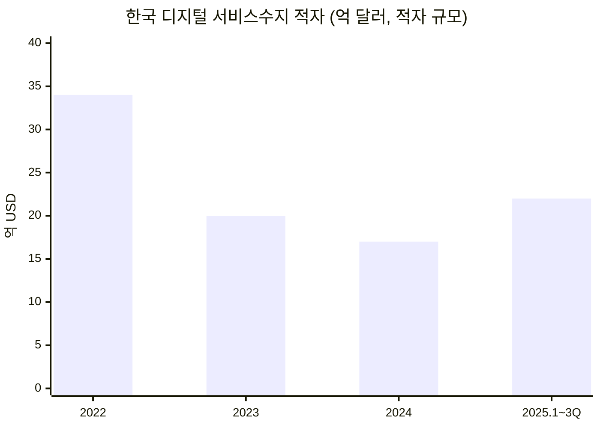
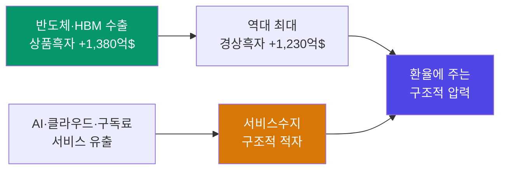
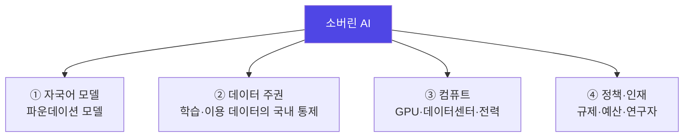

이번 달 카드 명세서에 찍힌 달러 결제를 세어 봤다. ChatGPT, Claude, 그리고 코딩 도구 몇 개. 다 합치니 매달 수백 달러가 조용히 태평양을 건너가고 있었다.

처음엔 "나는 좀 유별난 얼리어답터니까" 싶었다. 그런데 숫자를 들여다보니, 이건 나 혼자의 카드값 문제가 아니라 나라 전체의 국제수지 문제로 번지고 있는 흐름이었다. 개인적으로는 이게 단순한 "AI 붐"의 부산물이 아니라, **소버린 AI(주권 AI)가 왜 국가 경쟁력이자 경제 문제인지**를 가장 선명하게 보여주는 창이라고 보고 있어서 생각을 정리해 둔다.

---

> **핵심 요약**
> 한국은 2025년 반도체 슈퍼사이클로 역대 최대 경상흑자(1,230.5억 달러)를 냈지만, 그렇게 번 달러의 일부를 매달 미국 AI 구독료로 되돌려보내는 구조에 들어섰다. 미국 빅테크 지급액은 4년 만에 두 배(84억→168억 달러)가 됐고, 한국은행은 2026년부터 생성 AI 결제를 별도로 들여다보기 시작했다. 소버린 AI — 자국의 모델·데이터·컴퓨트를 스스로 쥐는 것 — 는 그래서 자존심 문제가 아니라 무역수지·데이터 주권·반도체 자립이 걸린 국가 전략 문제다. 한국은 HBM이라는 강력한 지렛대를 쥐고 있지만, 정작 그 지렛대가 받쳐야 할 로직·GPU·컴퓨트 자립에서는 아직 미국의 60% 수준에 머물러 있다.

---

## 1. 매달 조용히 빠져나가는 달러 — 숫자로 보면

먼저 감이 아니라 숫자다. 한국은 이미 세계에서 손꼽히는 AI 서비스 '소비국'이다.

SensorTower 집계로 ChatGPT의 한국 다운로드당 매출은 미국에 이어 세계 2위이고, 2025년 1~10월 한국에서 발생한 ChatGPT 매출은 약 2억 달러로 전 세계의 5.4% — 미국 다음 2위였다([한국경제](https://www.hankyung.com/article/2025120786891)). 다운로드 순위는 21위에 불과한데 매출은 세계 2위라는 건([더프리뷰/센서타워](https://www.thepreview.co.kr/news/articleView.html?idxno=99663)), 한국 사용자의 유료 결제 밀도가 세계 최고 수준이라는 뜻이다. 국내 ChatGPT 월 이용자는 2,162만 명을 넘었다([ZDNet](https://zdnet.co.kr/view/?no=20251112172528)).

문제는 이 결제가 대부분 '서비스 수입'으로 잡혀 국경 밖으로 나간다는 점이다. 한국은행 자료를 보면 미국 빅테크에 나가는 지급액(클라우드·유튜브·넷플릭스·광고·소프트웨어 구독)은 2020년 84억 달러에서 2024년 168억 달러로 **4년 만에 두 배**가 됐고, 2025년은 1~3분기에만 137억 달러로 연 200억 달러 초과 페이스다([한국경제](https://www.hankyung.com/article/2025120786971)). 여기에 생성 AI 구독료가 새 통로로 얹히기 시작한 것이다.

그래서 한동안 줄던 디지털 서비스수지 적자가 다시 벌어지고 있다.

<figcaption>디지털 서비스수지 적자 추이. 2022년 34억 달러 정점 후 줄다가 2025년 다시 확대. 출처: 한국은행 국제수지(한국경제 재인용).</figcaption>

더 넓게 보면, 2025년 지식재산권·지식서비스 무역수지 적자는 약 102.5억 달러로 12년 만에 최대였고, 그중 컴퓨터·모바일 소프트웨어 저작권 적자만 42억 달러로 1년 새 13억 달러가 늘었다([SBS](https://news.sbs.co.kr/news/endPage.do?news_id=N1008484080)). 매달 자동으로 빠져나가는 구독료가 쌓여 만든 '구조적 외화 유출'이다.

한국은행이 2026년부터 생성 AI 지급액을 따로 떼어 모니터링하기로 한 것도([한국경제](https://www.hankyung.com/article/2025120786971)) 이 흐름을 심상치 않게 봤다는 신호로 읽힌다.

---

## 2. 근데 경상수지는 역대 최대 흑자 아닌가?

여기서 정직하게 짚을 게 있다. "AI 구독료 때문에 나라 곳간이 빈다"고 하면 그건 과장이다.

2025년 한국 경상수지는 오히려 **1,230.5억 달러 흑자로 역대 최대**였다([테크데일리](https://www.techdaily.co.kr/news/articleView.html?idxno=27721)). 반도체 슈퍼사이클 덕에 상품수지가 1,380.7억 달러 흑자를 냈기 때문이다. 그럼 문제가 없는 걸까?

그렇지는 않은 것 같다. 뜯어보면 **상품(반도체) 흑자가 서비스(AI·디지털) 적자를 덮고 있는** 구조이기 때문이다. 서비스수지는 구조적 적자가 이어져 2025년 12월에만 36.9억 달러 적자를 냈고, 한국은행 스스로 이를 '구조적 적자'라 부르며 지속 점검 대상으로 올렸다(위 테크데일리).

한 문장으로 요약하면 이렇다. **우리가 HBM을 팔아 번 달러를, 그 일부를 다시 미국 AI 구독료로 되돌려보내고 있다.**

환율은 어떤가. 원·달러는 2024년 연평균 약 1,420원으로 이미 역대 최고였고([뉴데일리](https://biz.newdaily.co.kr/site/data/html/2025/12/28/2025122800014.html)), 2026년 7월 현재 1,550원 안팎으로 2009년 글로벌 금융위기 이후 최약세 구간에 있다([Trading Economics](https://ko.tradingeconomics.com/south-korea/currency)). 물론 환율은 금리차·자본유출 등 훨씬 큰 변수들이 움직이는 것이고, AI 구독료 하나로 환율이 밀린다고 말하면 틀린 얘기다. 다만 여행수지·로열티에 더해 매달 자동결제되는 디지털·AI 서비스 적자가 '달러를 꾸준히 사서 내보내는' 상시 수요로 깔린다는 점은, 원화 약세를 떠받치는 바닥짐 중 하나로 보는 게 합리적일 것 같다.

즉, AI 구독은 지금 당장 나라를 흔드는 급류는 아니지만, 서서히 배 밑에 물이 차는 종류의 문제에 가깝다. 이걸 막는 근본 해법이 소버린 AI다.

---

## 3. 소버린 AI란 무엇인가 — 그리고 왜 '국가 경쟁력'인가

**소버린 AI(Sovereign AI)란, 한 나라가 자국의 데이터·인프라·인재로 AI의 핵심 역량을 스스로 통제할 수 있는 상태를 말한다.** 남의 모델을 빌려 쓰는 게 아니라, 내 언어·내 데이터·내 반도체 위에서 도는 AI를 갖는 것이다.

왜 국가 경쟁력인가. AI가 전기나 인터넷 같은 '기반 인프라'가 되고 있기 때문이다. 전기를 100% 수입에 의존하는 나라와 발전소를 가진 나라의 협상력이 다르듯, AI 지능을 통째로 빌려 쓰는 나라는 가격·정책·차단 리스크를 고스란히 남의 손에 맡기게 된다. 구독료가 오르면 오르는 대로, 특정 기능이 막히면 막히는 대로 끌려갈 수밖에 없다.

소버린 AI를 세우려면 대략 네 개의 기둥이 필요하다.

| 기둥 | 무엇이 필요한가 | 한국의 현재 |
|---|---|---|
| **모델** | 한국어·한국 맥락에 강한 파운데이션 모델 | 독자 모델 사업 진행 중(3장 뒤에서 상술) |
| **데이터** | 학습·프롬프트 데이터가 국외로 새지 않는 통제 | 딥시크 사건이 드러낸 취약점(4장) |
| **컴퓨트** | GPU·데이터센터·전력 자급 | 엔비디아 의존, 국산 NPU 태동기(5장) |
| **정책** | 예산·규제·인재 확보 | 예산 급증했으나 규모의 격차 존재(6장) |

정리하면, 소버린 AI는 "우리도 챗GPT 같은 거 하나 만들자"는 자존심의 문제가 아니라, **모델·데이터·컴퓨트·정책을 얼마나 내 손에 쥐느냐**의 문제다. 그리고 지금 한국은 이 네 기둥에서 각각 사정이 꽤 다르다.

---

## 4. 미국만의 문제가 아니다 — 중국 AI라는 두 번째 축

소버린 AI를 '미국 의존 탈피'로만 읽으면 절반만 본 것이다. 데이터 주권 관점에서는 중국 AI가 오히려 더 날카로운 문제를 던졌다.

2025년 초 중국 딥시크(DeepSeek)가 국내에서 폭발적으로 쓰이던 시기, 개인정보보호위원회는 딥시크가 이용자가 AI 프롬프트에 입력한 내용까지 중국·미국 소재 5개 기업으로 이전하면서 이를 제대로 알리지 않았다고 판단하고 시정·개선을 권고했다([대한민국 정책브리핑](https://www.korea.kr/briefing/policyBriefingView.do?newsId=156673380)). 특히 프롬프트 입력값이 중국 기업으로 전송된 정황이 확인됐고, 정부는 이미 넘어간 데이터의 파기와 신규 이전 차단을 요구했다([뉴시스](https://www.newsis.com/view/NISX20250424_0003153087)). 딥시크는 2025년 2월 국내 앱마켓에서 신규 다운로드를 잠정 중단했다.

흥미로운 건 그다음이다. 신규 다운로드가 막힌 뒤에도 딥시크는 한동안 국내 생성 AI 앱 사용량 5위권을 유지했다([AI타임스](https://www.aitimes.com/news/articleView.html?idxno=168729)). 값싸고 성능 좋은 모델은, 데이터가 어디로 가는지와 무관하게 사람들이 계속 쓴다는 얘기다.

여기서 핵심은 미국이냐 중국이냐의 진영 문제가 아니다. **내가 입력한 프롬프트 — 회사 기밀일 수도, 개인 고민일 수도 있는 그 텍스트 — 가 내 나라 밖 어느 서버로 가서 어떻게 쓰이는지 통제할 수 없다**는 게 문제의 본질이다. 소버린 AI가 데이터 주권을 한 기둥으로 세우는 이유가 여기 있다.

---

## 5. 하드웨어 — 한국의 가장 큰 강점이자 가장 큰 구멍

이제 가장 한국다운 대목이다. AI의 몸통인 반도체에서, 한국은 세계 최강의 무기 하나와 뼈아픈 구멍을 동시에 갖고 있다.

**강점은 메모리, 특히 HBM이다.** AI 가속기에서 메모리는 제조원가의 상당 부분을 차지하는데, SK하이닉스는 HBM 시장의 약 62%를 쥐고 엔비디아 공급 물량의 상당 부분을 책임진다([Astute](https://www.astutegroup.com/news/general/sk-hynix-holds-62-of-hbm-micron-overtakes-samsung-2026-battle-pivots-to-hbm4/), [삼일PwC](https://www.pwc.com/kr/ko/insights/industry-focus/samilpwc_ai-semiconductor.pdf)). 엔비디아가 GPU를 아무리 팔아도, 그 안에 들어가는 HBM은 결국 한국에서 산다. 골드러시의 곡괭이와 삽 중, 한국은 '가장 비싼 삽'을 쥐고 있는 셈이다.

**구멍은 로직, 즉 연산 그 자체다.** AI 가속기 시장에서 엔비디아 점유율은 약 90%로 추정되고, 한국을 포함한 전 세계가 GPU를 사실상 엔비디아 한 곳에 의존한다(위 삼일PwC). 문제는 반도체 시장에서 비메모리(로직)가 메모리의 약 3배 규모라는 점이다. 그런데 과기정통부(2024) 평가 기준, 메모리를 뺀 한국의 고성능·저전력 AI 반도체 기술 수준은 <strong>1위 미국의 60%</strong>에 그친다(위 삼일PwC). 가장 큰 시장에서 가장 뒤처져 있는 것이다.

| 구분 | 한국의 위치 | 함의 |
|---|---|---|
| **HBM 메모리** | SK하이닉스 세계 1위(약 62%) | AI 붐의 최대 수혜, 강력한 협상 카드 |
| **GPU/AI 가속기** | 엔비디아 90% 의존, 국산 비중 미미 | 컴퓨트 자립의 최대 병목 |
| **파운드리(로직)** | 선단 공정 경쟁 중이나 격차 | 국산 칩 양산의 기반 |
| **AI 반도체 기술(메모리 제외)** | 미국의 약 60% 수준 | 자립까지 갈 길이 멀다 |

다만 완전한 불모지는 아니다. 국산 NPU(신경망처리장치)가 구호를 넘어 실물 단계로 넘어오고 있다. 리벨리온은 자사 NPU '아톰(ATOM)'을 KT클라우드에 올려 국산 AI 반도체 최초의 대규모 클라우드 상용화를 만들었고, SK텔레콤 '에이닷' 통화요약 같은 실서비스에도 적용됐다([블로터](https://www.bloter.net/news/articleView.html?idxno=603055)). 퓨리오사AI는 2세대 칩 'RNGD'를 내놨고, 리벨리온·퓨리오사·딥엑스·모빌린트 등 국내 4대 AI 반도체 기업이 NPU 양산 단계에 진입했다([아시아경제](https://view.asiae.co.kr/article/2026062915173519601)). 리벨리온과 퓨리오사는 해외에서도 'K-엔비디아' 후보로 주목받기 시작했다([뉴시스](https://www.newsis.com/view/NISX20260617_0003672407)).

그래도 냉정히 보면, 추론용 NPU에서 틈을 여는 단계지 엔비디아의 학습용 GPU 아성을 흔드는 단계는 아니다. 강점(HBM)은 확실한데 그 강점을 받쳐줄 컴퓨트 자립은 이제 막 첫 삽을 뜬 것 — 이게 한국 하드웨어의 정직한 좌표다.

---

## 6. 정부는 지금 무엇을 하고 있나

다행히 손 놓고 있는 건 아니다. 정부는 소버린 AI를 국정 과제로 올려 두 갈래로 밀고 있다.

**하나는 모델이다.** 과기정통부의 '독자 AI 파운데이션 모델' 사업은 처음 5개 정예팀을 뽑은 뒤 단계평가를 거쳐, 현재 LG AI연구원·SK텔레콤·업스테이지·모티프테크놀로지스 4팀 경쟁 체제로 좁혀졌다([korea.kr](https://www.korea.kr/briefing/policyBriefingView.do?newsId=156745273)). 목표는 프론티어 모델 성능의 95% 이상 달성, 선정팀엔 GPU·데이터와 'K-AI 기업(국가대표)' 명칭을 지원한다.

**다른 하나는 컴퓨트다.** 2026년 국가 GPU 확충 예산은 약 2조 805억 원으로 전년(1.4조)보다 크게 늘었고, NIPA의 AI 관련 예산은 7,000~8,000억 원대에서 3조 1,000억 원으로 약 4배가 됐다([ZDNet](https://zdnet.co.kr/view/?no=20260312182846), [이코노미조선](https://economychosun.com/site/data/html_dir/2026/05/09/2026050900015.html)). 여기에 반도체 초과세수 약 5조 원을 소버린 AI에 투입하는 방안도 추진 중이다([한국경제](https://www.hankyung.com/article/2026070228011)). 다만 목표 기금 규모, 초과세수 산정 방식, 거버넌스 구조 같은 핵심 세부 사항은 아직 확정되지 않았다는 지적도 있다([The Korea Pulse](https://pulse.koreasignals.com/posts/korea-to-create-future-response-fund-from-semiconductor-tax-windfall/)).

숫자만 보면 든든한데, 규모를 국제 기준에 대면 이야기가 달라진다.

| 항목 | 한국(독자모델 팀) | 참고: OpenAI |
|---|---|---|
| 팀당 GPU | 약 700~800개 | GPT-4 약 1만, GPT-5 약 2만+ |
| 국가 GPU 예산(2026) | 약 2.08조 원 | 빅테크 개별 CAPEX 수십조 원대 |
| 조달 GPU | 엔비디아 블랙웰·베라루빈 | (자체 칩·엔비디아 병행) |

두 가지가 눈에 걸린다. 첫째, 팀당 700~800개 GPU는 OpenAI 한 모델이 쓰는 물량의 10분의 1도 안 된다([한국경제](https://www.hankyung.com/article/2026070228011)). 둘째, 그 GPU마저 대부분 엔비디아 블랙웰·베라루빈이다. **모델 주권을 세우려는 사업의 연산을 정작 미국 GPU에 의존**하는, 소버린 안의 비(非)소버린이 남아 있는 셈이다. (참고로 5조 원 추경은 아직 '추진 중'이지 확정 예산이 아니다.)

---

## 7. 그래서, 지금 무엇을 어떻게 할 수 있나

그럼 현실적으로 뭘 할 수 있고, 하면 어떻게 될까? 개인적으로 가정해 본 그림은 이렇다. 완주(모든 걸 자립)와 포기(전부 수입) 사이에서, 한국은 '강점 지렛대' 전략이 가장 승산 있어 보인다.

**첫째, 이미 쥔 HBM을 협상 카드로 쓴다.** 한국은 엔비디아가 아쉬운 게 있는 몇 안 되는 나라다. HBM 공급이라는 지렛대를 GPU 우선 할당·기술 이전·국내 데이터센터 투자 유치와 묶는 것 — 없는 걸 만들기 전에, 있는 걸로 협상하는 게 순서인 것 같다.

**둘째, 전면전 대신 '추론'에 집중한다.** 학습용 GPU에서 엔비디아를 이기려는 정면승부는 비현실적이다. 대신 실제 서비스가 가장 많이 도는 추론 시장에서 국산 NPU(리벨리온·퓨리오사)에 공공 수요를 몰아주고, 정부 GPU 조달에 국산 NPU 최소 비중을 못박아 초기 시장을 열어 주는 방식이 현실적이다. 성능 100점을 기다리기보다, 80점짜리를 실전에 굴리며 키우는 쪽이다.

**셋째, 모델은 '전부'가 아니라 '핵심 주권 영역'부터.** 모든 분야에서 GPT를 이기는 만능 모델은 지금 예산으로 불가능하다. 다만 국방·행정·의료·금융처럼 데이터가 절대 국외로 나가면 안 되는 영역에선, 성능이 조금 뒤처져도 '국내에서 도는 우리 모델'이 필요하다. 소버린 AI의 실익은 여기서 먼저 나온다.

이렇게 하면 어떻게 될까? 낙관도 비관도 아닌 중간값으로 보면, 한국은 **'AI 전 계층 자립국'이 되긴 어렵지만 'AI 핵심 부품·특화 주권국'은 될 수 있는** 위치다. 메모리라는 목줄을 쥐고, 추론 반도체에서 틈새를 확보하고, 민감 영역 모델을 국산화하는 조합이다. 대신 대가가 있다. 매년 수조 원대 컴퓨트 투자와 그만큼의 전력·데이터센터, 그리고 무엇보다 이 판을 5년 이상 끌고 갈 인재와 정책의 일관성이 필요하다. 물론 이 판단도 틀릴 수 있다. 그래도 방향은 분명해 보인다.

---

## 결론: 삽은 우리가 쥐었는데, 곡괭이는 아직

한국은 AI 골드러시에서 가장 비싼 삽(HBM)을 파는 나라다. 그런데 정작 금을 캐는 곡괭이(GPU·모델·컴퓨트)는 대부분 수입해 쓴다. 삽을 팔아 번 돈으로 곡괭이를 빌리는 구조가 계속되면, 붐이 커질수록 오히려 남는 게 줄어들 수 있다.

소버린 AI는 이 구조를 바꾸자는 국가 프로젝트다. 전부를 자립할 순 없어도, 메모리라는 지렛대로 협상하고, 추론 반도체에서 틈을 벌리고, 민감 영역 모델을 국산화하는 것 — 이 세 가지를 얼마나 일관되게 밀어붙이느냐가, 앞으로 10년 한국이 'AI 부품 공급국'에 머물지 'AI 특화 주권국'으로 올라설지를 가른다.

**한줄 코멘트.**

가장 비싼 삽을 쥐고도 곡괭이를 빌려 쓰면, 광산이 커질수록 손에 남는 금은 오히려 줄어든다.

---

*이 글은 공개된 정부 자료와 언론·시장 리서치를 바탕으로 정리한 개인적 분석이며, 특정 정책·기업·종목에 대한 투자 권유가 아닙니다. 인용한 수치는 조사 시점(대부분 2025~2026년)과 기관·정의에 따라 편차가 있으니 원문 출처를 함께 확인하시길 권합니다. 특히 5조 원 추경 등 일부 정책은 확정이 아닌 추진 단계입니다.*

참고 자료 (20) — 한국경제 · 더프리뷰 · ZDNet Korea · SBS · 테크데일리 · 뉴데일리 · Trading Economics · 대한민국 정책브리핑 · 뉴시스 · AI타임스 · 삼일PwC경영연구원 · Astute Group · 블로터 · 아시아경제 · korea.kr · 이코노미조선

<ul>
<li><a href="https://www.hankyung.com/article/2025120786891">달러유출 통로 된 플랫폼 구독료…생성AI 포함땐 디지털 적자 눈덩이</a> — 한국경제</li>
<li><a href="https://www.hankyung.com/article/2025120786971">생성 AI 구독료와 디지털 서비스수지 적자(한국은행 국제수지)</a> — 한국경제</li>
<li><a href="https://www.thepreview.co.kr/news/articleView.html?idxno=99663">챗GPT 한국 다운로드 21위인데 매출 세계 2위(센서타워)</a> — 더프리뷰</li>
<li><a href="https://zdnet.co.kr/view/?no=20251112172528">챗GPT 국내 월 이용자 2,125만 명 돌파</a> — ZDNet Korea</li>
<li><a href="https://news.sbs.co.kr/news/endPage.do?news_id=N1008484080">지식서비스 무역적자 102.5억 달러, 12년 만 최대(한국은행)</a> — SBS</li>
<li><a href="https://www.techdaily.co.kr/news/articleView.html?idxno=27721">2025년 경상수지 1,230.5억 달러 역대 최대·서비스수지 구조적 적자</a> — 테크데일리</li>
<li><a href="https://biz.newdaily.co.kr/site/data/html/2025/12/28/2025122800014.html">2024년 평균 원·달러 환율 1,420원 역대 최고</a> — 뉴데일리</li>
<li><a href="https://ko.tradingeconomics.com/south-korea/currency">USD/KRW 시세</a> — Trading Economics</li>
<li><a href="https://www.korea.kr/briefing/policyBriefingView.do?newsId=156673380">딥시크 관련 추진상황 및 향후 대응방향</a> — 대한민국 정책브리핑</li>
<li><a href="https://www.newsis.com/view/NISX20250424_0003153087">개인정보 무단 국외이전한 딥시크…정부 '즉각 파기' 권고</a> — 뉴시스</li>
<li><a href="https://www.aitimes.com/news/articleView.html?idxno=168729">신규 다운로드 금지된 딥시크, 여전히 사용량 5위권</a> — AI타임스</li>
<li><a href="https://www.pwc.com/kr/ko/insights/industry-focus/samilpwc_ai-semiconductor.pdf">K-반도체, AI에서 찾는 도약 기회(AI 반도체 리포트)</a> — 삼일PwC경영연구원</li>
<li><a href="https://www.astutegroup.com/news/general/sk-hynix-holds-62-of-hbm-micron-overtakes-samsung-2026-battle-pivots-to-hbm4/">SK hynix Holds 62% of HBM Market</a> — Astute Group</li>
<li><a href="https://www.bloter.net/news/articleView.html?idxno=603055">국산 NPU 리벨리온·퓨리오사·사피온, 엔비디아 GPU 어떻게 잡을까</a> — 블로터</li>
<li><a href="https://view.asiae.co.kr/article/2026062915173519601">국산 NPU, 구호에서 실물로…AI반도체 판이 바뀐다</a> — 아시아경제</li>
<li><a href="https://www.newsis.com/view/NISX20260617_0003672407">리벨리온·퓨리오사AI 등 K-반도체 글로벌 잭팟</a> — 뉴시스</li>
<li><a href="https://www.korea.kr/briefing/policyBriefingView.do?newsId=156745273">독자 AI 파운데이션 모델 사업 단계평가 결과</a> — korea.kr</li>
<li><a href="https://www.hankyung.com/article/2026070228011">초과세수 5조 투입…소버린 AI 개발한다</a> — 한국경제</li>
<li><a href="https://zdnet.co.kr/view/?no=20260312182846">2026년 국가 GPU 확충 예산 2조 805억 원</a> — ZDNet Korea</li>
<li><a href="https://economychosun.com/site/data/html_dir/2026/05/09/2026050900015.html">NIPA AI 예산 3조 1,000억 원으로 약 4배 증액</a> — 이코노미조선</li>
</ul>

