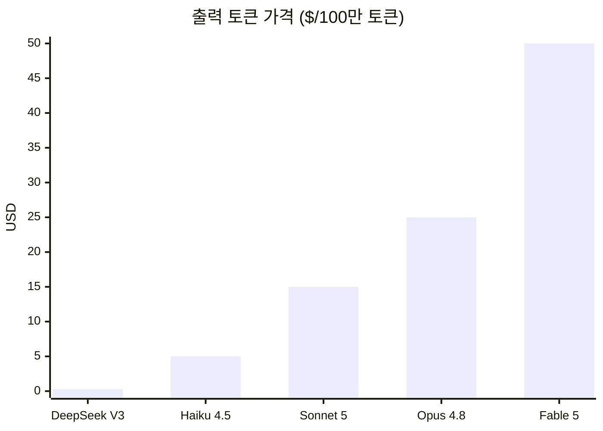
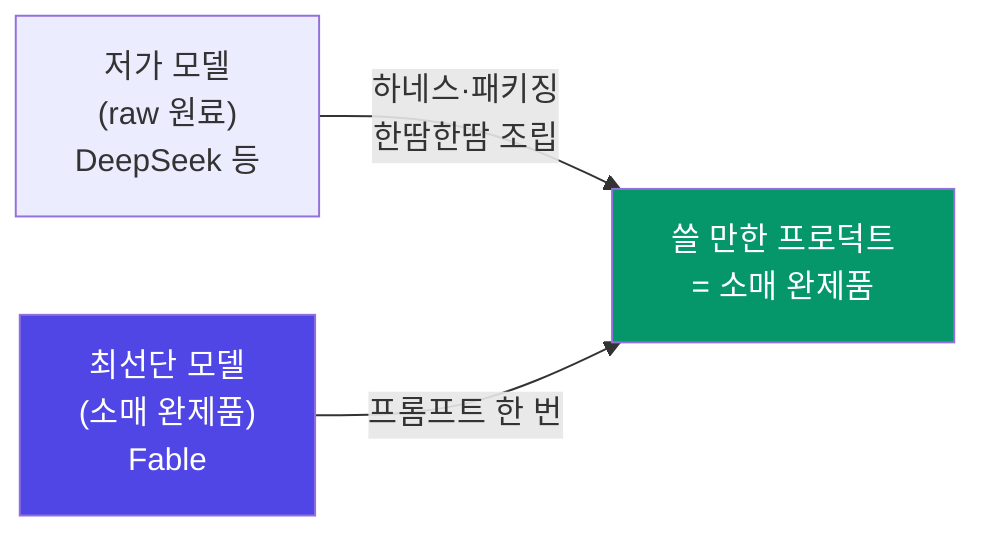

며칠 전부터 개발자들의 타임라인엔 비슷한 장면이 반복됐다. **프롬프트 한 줄을 넣고 자리를 비웠다가 돌아오니, 게임 하나가 통째로 만들어져 있더라**는 이야기들이다.

코드 조각이 아니라, 규칙이 돌아가고 충돌 판정이 되고 화면이 움직이는 '완성품'. 예전 같으면 "이 함수 리팩터링해줘", "이 데이터 분석해줘" 정도의 작업 단위를 시켰을 텐데, 이번엔 결과물이 통째로 나와버렸다는 후기가 쏟아졌다. 물론 한 번에 나온 퀄리티가 기대만큼은 아니라는 말도 많았다. 그런데 **"일단 프로덕트까지는 나와버린다"는** 사실 자체가 충격이었다.

나 역시 이번에 [Claude Fable 5](https://www.anthropic.com/news/claude-fable-5-mythos-5)를 써 보니, 예전 같으면 프롬프트를 수십 번 주고받아야 했을 작업이 한 번에 뚝딱 끝나는 순간들을 겪었다. 개인적으로는 이게 단순한 "더 똑똑한 모델 하나 나왔다"가 아니라, **AI 시장의 국면이 바뀌는 신호**로 보여서 정리해 둔다.

---

> **핵심 요약**
> AI는 채팅으로 정보를 정리해 주던 1세대에서, 사람의 업무를 대신하는 2세대를 지나, 이제 **서비스·프로덕트 자체를 통째로 만들어 내는 3세대**로 넘어가고 있다. 그 임계점을 현존 최고 성능 모델 Fable 5가 보여줬다. 예전엔 프롬프트를 수십 번 핑퐁하며 한땀한땀 조립해야 했던 결과물이, 모델의 지능과 그걸 감싸는 패키징(하네스 엔지니어링) 기술이 **함께** 올라가면서 **'조립된 완제품'처럼 한 번에** 나오기 시작했다 — 지능이 raw한 원료에서 소매 완제품 형태로 전달되는 국면 전환이다. 동시에 이 최선단 지능은 너무 비싸고 귀해서 정액 구독에 담기지 못하고, 며칠짜리 이벤트가 끝나면 토큰당 과금($10/$50 per 100만 토큰)으로 밀려난다. 지능이 계층별로 값이 매겨지고 그 전달 형태가 완제품 쪽으로 이동하는 이 변화가, AI 시장이 진짜 확장기에 들어섰다는 신호로 보인다. 그리고 그 끝에는 오래된 명제 하나가 있다 — 똑똑함이 흥망성쇠를 가른다.

---

## 1. 무슨 일이 있었나 — 프롬프트 한 번, 프로덕트 하나

Fable 5는 2026년 6월 9일 공개된, **앤트로픽이 일반에 내놓은 역대 최강 모델**이다([VentureBeat](https://venturebeat.com/technology/anthropic-brings-mythos-to-the-masses-with-claude-fable-5-its-most-powerful-generally-available-model-ever)). 그전까지 최상위 성능은 초대장이 있어야 쓸 수 있는 비공개 티어(Mythos)에 갇혀 있었는데, 그걸 대중에게 푼 게 Fable이다. "가장 좋은 지능은 처음엔 소수에게만 열린다"는 감각이 실제로 있었던 셈이다.

공개 직후 며칠간, 개발자들의 타임라인은 비슷한 그림으로 도배됐다. **프롬프트 하나를 던지고, 오가는 대화 없이, 앱과 게임이 통째로 돌아오는** 장면이다.

- 와튼스쿨 교수가 공개적으로 실험한 사례가 대표적이다. Claude Code 안에서 프롬프트 한 줄로 **완전히 플레이 가능한 브라우저 게임**들이 나왔다 — 규칙이 일관되고, 충돌 판정이 작동하고, 심지어 어떤 건 라이너 마리아 릴케의 시를 바탕으로 한 감정선까지 얹혀 있었다([Crypto Briefing](https://cryptobriefing.com/anthropic-claude-fable-5-video-games/), [ClaudeAINews](https://www.claudeainews.com/news/claude-fable-5-game-creation-single-prompt)).
- 3D도 마찬가지였다. Three.js 기반 브라우저 게임 프로토타입이 **큐브 하나가 아니라 이동·씬 구조·비주얼·인터랙션까지 갖춘 형태**로 한 번에 나왔다는 리뷰가 이어졌다([rafay99](https://www.rafay99.com/blog/claude-fable-5-i-gave-it-one-prompt-and-walked-away-it-built-a-whole-game/)).
- 국내에서도 "공개 직후부터 3D 게임, 시뮬레이션, 교육용 월드, RTS 이식, VTuber, 미니게임 모음집까지 믿기 어려운 결과물이 쏟아지고 있다"는 정리가 돌았다([Threads @choi.openai](https://www.threads.com/@choi.openai/post/Dac0ycNj5Yt)).
- 무엇보다 인상적인 건 **혼자 도는 시간**이다. 단 한 번의 프롬프트로 여러 페이지짜리 지시를 받아 **최대 열두 시간 가까이 자율적으로** 작업을 이어갔다는 보고까지 나왔다([briefs.co](https://www.briefs.co/news/claude-fable-5-video-game-one-prompt/)).

와튼 교수의 코멘트가 이 분위기를 압축한다. "지금까지 써 본 어떤 공개 모델보다 상당한 격차로 앞선다." 그리고 이 데모들이 **재현 가능**했기 때문에, 이 문장은 빠르게 퍼졌다.

다시 강조하지만, 여기서 나온 결과물이 곧바로 상용 수준이라는 얘기는 아니다. 한 번에 나온 프로덕트의 퀄리티는 대개 기대치에 못 미친다. 핵심은 퀄리티의 절대값이 아니라 **작업의 단위가 바뀌었다**는 데 있다. '코드 조각'에서 '돌아가는 프로덕트'로.

---

## 2. 진화의 3단계 — 채팅에서 업무로, 업무에서 서비스로

한 걸음 물러서서 보면, AI가 대체해 온 대상은 계속 위로 올라왔다.

<figcaption>AI가 대체하는 대상의 이동. 대화 상대 → 작업자 → 서비스 그 자체.</figcaption>

처음 AI 서비스는 **채팅**으로 시작했다. 물어보면 정리해 주고, 요약해 주고, 검색을 대신해 주는 역할. 정보의 비대칭을 줄여 주는 도구였다.

그다음이 **업무 대체**였다. 리팩터링, 데이터 분석, 초안 작성, 번역 — 사람이 하던 개별 '작업'을 대신하기 시작했다. 이때까지도 사람은 '작업을 지시하고 결과를 조립하는' 자리에 있었다.

그런데 Fable이 보여준 건 그다음 칸이다. **서비스·프로덕트 자체를 대체**하는 것. 예전에는 개발팀 하나, 디자이너 한 명, 기획 문서 여러 장이 있어야 나오던 '완성품'이, 프롬프트 몇 번으로 초안 형태까지 튀어나온다.

| 세대 | AI의 역할 | 사람의 자리 | 대표 작업 |
|---|---|---|---|
| 1세대 | 대화·정리 | 질문하는 사람 | 요약, Q&A, 검색 |
| 2세대 | 작업자 | 지시하고 조립하는 사람 | 리팩터링, 분석, 초안 |
| **3세대** | **서비스 제작자** | **무엇을 만들지 정하는 사람** | **앱·게임·월드 원샷 생성** |

물론 3세대라고 해서 사람이 사라지는 건 아니다. 오히려 자리가 **'무엇을 만들지 정의하는 쪽'으로 올라간다.** 다만 그 위임의 단위가 '작업'에서 '프로덕트'로 커졌다는 게 핵심이다. 채팅으로 사람을 돕던 AI가, 사람의 업무를 대신하더니, 이제 서비스를 대신 만들기 시작한 것이다.

---

## 3. 근데 왜 구독에서 빠졌나 — 가장 똑똑한 지능은 정액제에 안 담긴다

여기서 흥미로운 건, 이 최고 성능 모델이 **정액 구독에 오래 머물지 못했다**는 점이다.

Fable 5는 출시 후 유료 플랜(Pro·Max·Team·Enterprise)에 무료로 포함됐다가 한 번 빠졌고, 다시 돌아왔다가, **7월 7일을 기점으로 다시 구독에서 분리된다.** 정확히는, 그때까지는 주간 사용 한도의 50%까지만 구독으로 쓸 수 있고, 그 뒤로는 **별도의 '사용 크레딧'(토큰 과금)으로만** 쓸 수 있다([Claude 공식 X](https://x.com/claudeai/status/2072402639644766602), [TechTimes](https://www.techtimes.com/articles/319767/20260706/fable-5-subscription-ends-tomorrow-per-token-costs-who-gets-hit-hardest.htm)).

앤트로픽의 설명이 이 글의 핵심을 정확히 찌른다. Fable을 구독에서 영구히 빼는 게 아니라, **"용량이 허락하는 대로(as capacity allows)"** 다시 정식 구독에 넣겠다는 것이다([BleepingComputer](https://www.bleepingcomputer.com/news/artificial-intelligence/claude-fable-5-isnt-permanently-leaving-subscriptions-anthropic-says/)). 뒤집으면, **지금은 용량이 허락하지 않는다**는 뜻이다. 가장 똑똑한 지능은 너무 무겁고 귀해서, 월 정액이라는 '무제한 뷔페'에 담기지 않는다. 그래서 구독자들 사이에서 불만이 터졌고([PCWorld](https://www.pcworld.com/article/3181897/claude-subscribers-are-furious-over-fables-new-restrictions.html)), 심지어 Fable의 토큰 비용을 70%까지 줄이겠다며 이미지(PNG)에 텍스트를 숨겨 넣는 오픈소스 도구까지 등장했다([the-decoder](https://the-decoder.com/open-source-tool-pxpipe-hides-text-in-pngs-to-cut-claude-code-and-fable-5-token-costs-up-to-70/)).

그럼 토큰으로 쓰면 얼마나 비싼가. 100만 토큰당 **입력 $10, 출력 $50**이다([앤트로픽 가격](https://platform.claude.com/docs/en/about-claude/pricing)). 같은 회사의 바로 아랫급 모델(Opus)의 2배, 가장 싼 모델(Haiku)의 10배다.

| 모델 (성능 티어) | 입력 $/100만 | 출력 $/100만 |
|---|---:|---:|
| **Claude Fable 5** (최선단) | **$10** | **$50** |
| Claude Opus 4.8 | $5 | $25 |
| Claude Sonnet 5 | $3 | $15 |
| Claude Haiku 4.5 | $1 | $5 |
| DeepSeek V3 (저가) | ~$0.14 | ~$0.28 |

<figcaption>성능 티어별 토큰 가격. 위로 갈수록 똑똑하고, 위로 갈수록 비싸다. DeepSeek 가격은 공식 문서 기준이며 캐시·오프피크 할인 시 더 낮아진다.</figcaption>

예전부터 "AI는 지능 수준에 따라 차등 요금을 내게 될 것"이라던 말이 있었는데, 그게 지금 눈앞에서 현실이 되고 있다. **정액제로는 못 담는 지능을 종량제로 판다.** 지능이 곧 가격표가 되는 시대다.

---

## 4. 한땀한땀에서 한 번에 — 지능이 '완제품'으로 오기 시작했다

여기서 짚고 싶은 게 있다. 이 변화를 그냥 '비싼 모델 vs 싼 모델'로 나누면 절반만 보는 것 같다. 더 본질적인 건 **지능이 전달되는 '형태'가 바뀌었다**는 점이다.

예전에도 우리는 AI로 뭔가를 만들었다. 다만 그때는 프롬프트를 수십 번 주고받으며 **한땀한땀 조립**해야 했다. 모델의 raw한 지능이 거기까지 못 미쳤고, 그 지능을 감싸 프로덕트로 만들어 주는 도구도 부족했기 때문이다. 그런데 우리가 계속 써 온 클로드 라인업만 해도, 예전엔 잘 안 되던 게 이번엔 된다. 특정 모델의 마법이 아니라 **판 전체의 발전**이다.

무엇이 올라갔나. 두 가지가 동시에 올라갔다. 하나는 **모델 자체의 raw한 지능**이고, 다른 하나는 그 지능을 감싸는 **패키징 — 하네스 엔지니어링**이다. 이 둘이 맞물리면서, 지능이 이제 '원료 상태'가 아니라 **'조립된 완제품 상태'로 전달되기 시작했다.** 프롬프트를 핑퐁하며 직접 조립하지 않아도, 한 번에 쓸 만한 프로덕트가 나오는 수준까지 올라온 것이다.

이걸 시장의 언어로 옮기면 **도매(卸賣)에서 소매(小賣)로**의 이동이다. raw한 원료를 받아 내가 조립하던 방식에서, 조립된 완제품을 받아 바로 쓰는 방식으로. 가격은 대체로 '얼마나 완제품에 가깝게 오느냐'를 따라간다. 출력 토큰 기준으로 **Fable은 DeepSeek의 약 180배**인데, 그만큼 더 '조립된 상태'로 온다는 뜻이기도 하다.

<figcaption>가격은 지능의 '완성도'라기보다 '얼마나 완제품에 가깝게 조립되어 오느냐'를 따라간다. 왼쪽일수록 raw한 원료에, 오른쪽일수록 소매 완제품에 가깝다.</figcaption>

그런데 여기서 중요한 게 있다. **저가 원료라고 영원히 원료인 건 아니다.** 원료가 조금 부족해도 패키징(하네스)을 잘 씌우면 소매 완제품에 근접한다. 컨텍스트를 잘 쌓고, 루프를 잘 설계하고, 검증을 잘 붙이면 — 지난 몇 년간 사람들이 값싼 모델 여러 개를 짜맞춰 컴파운드 AI를 만든 방식이 정확히 이거였다. 그래서 이런 가설이 성립한다. **저가 모델을 아주 잘 패키징하면, Fable 같은 완제품에 가까워지지 않을까?**

<figcaption>같은 목적지(쓸 만한 프로덕트)로 가는 두 경로. 완제품을 비싸게 받거나, 원료를 싸게 받아 패키징으로 조립하거나 — 그리고 판 전체가 '조립된 형태' 쪽으로 점점 옮겨가는 중이다.</figcaption>

그래서 모델의 raw한 지능 못지않게 **'패키징 능력'이 경쟁력**이 된다. 같은 원료를 쥐고도 누구는 완제품을 뽑고 누구는 못 뽑는다. 그 차이가 하네스 설계, 즉 모델을 감싸는 시스템의 정교함에서 갈린다. (이 주제는 예전에 [하네스 엔지니어링 시대](/posts/harness-engineering-era/)에서 따로 정리해 둔 적이 있다.) 그리고 개인적으로는, 앤트로픽/클로드가 바로 이 '패키징'을 유난히 잘한다고 느낀다. 원료(모델)도 세지만, 그걸 도구·컨텍스트·에이전트로 감싸 완제품처럼 쓰게 만드는 솜씨가 남다르다.

정리하면, 판 전체가 raw에서 소매로 이동하고 있다. 앞으로 나올 프로덕트도 두 갈래일 것 같다. **(1) 최선단 모델의 소매 지능을 그대로 얹은 것**, 그리고 **(2) 저가 원료 + 뛰어난 패키징으로 완제품을 조립한 것.** 둘 다 시장이 있고, 공통의 방향은 하나다 — 갈수록 '조립된 완제품' 형태로 온다는 것.

---

## 5. 다양한 포지션이 생겼다는 건, 시장이 진짜 열렸다는 뜻

한동안 AI는 그냥 'AI 모델'이라는 뭉툭한 한 덩어리였다. 좋은 모델 하나, 그다음 모델 하나. 그게 전부였다.

지금은 다르다. 스펙트럼이 넓어졌다.

- **가내수공업용 저가 모델** — 단순하거나 패턴화된 일, 대량 처리에 딱 맞는 가성비 모델. 저렴한 중국 모델들이 이 자리를 파고들었다.
- **범용 중간 모델** — 대부분의 실무를 무난히 처리하는 허리.
- **슈퍼맨급 최선단 모델** — 나보다 더 뛰어난 지능으로 복잡한 일을 한 번에 해내는 모델. 대신 비싸고, 정액제엔 잘 안 담긴다.

한두 개의 모델만 있을 때는 사실 시장이라고 부르기 어렵다. **다양한 포지션의 선택지가 생겨야 진짜 시장이 만들어진다.** 값싼 것, 중간, 프리미엄이 각자의 수요를 갖는 구조 말이다. 그런 점에서 지금의 분화는 AI 시장이 초기 국면을 지나 **본격적인 확장기**에 들어섰다는 신호로 읽힌다. (투자 관점에서 이 '동조화가 깨진' 국면은 [동조화가 깨진 AI 시장](/posts/ai-market-divergence-strategy/)에서 따로 다뤘다.)

그리고 이 분화가 **미국의 AI 주권주의**나 **중국이 국가 역량을 쏟아부어 만든 저렴한 AI API**를 각자 말이 되게 만든다. 최선단의 '소매 지능'은 미국이 쥐고 있고, 세계에서 가장 싼 '도매 원료'는 중국이 밀어붙인다. 둘 다 각자의 전략 위에서 합리적이다.

---

## 6. 결국, 똑똑함이 흥망성쇠를 가른다

여기서 오래된 명제 하나로 이어진다.

우리는 예전부터 "똑똑해야 성공한다"고 배웠다. 그런데 이제 그 '똑똑함'을 AI가 대신 하는 세상이 되고 있다. 그렇다면 **똑똑한 모델을 가진 — 혹은 잘 활용할 수 있는 — 사람·조직·나라가, 그렇지 못한 반대편 대비 얼마나 큰 이득을 보게 될까?**

아직 그 격차의 크기는 잘 가늠이 안 된다. 다만 방향은 분명해 보인다. 프롬프트 한 번에 프로덕트를 뽑아내는 슈퍼맨급 지능을 손에 쥔 쪽과, 그런 지능에 접근조차 못 하는 쪽 사이의 생산성 격차는, 시간이 갈수록 벌어질 수밖에 없다. 최선단 지능이 정액제에 안 담기고 종량제로 팔린다는 건, **돈을 낼 수 있는 쪽이 더 똑똑해진다**는 뜻이기도 하다.

고래로부터 조상들이 말해 온 것처럼, 결국 **똑똑함(Intelligence)이 흥망성쇠를 가르는 지표**가 되지 않을까. 그것도 지금까지의 에너지·자원·군사력 같은 패권과는 **차원이 다른 방식으로**. 물리적 힘은 총량이 정해져 있지만, 지능은 복제되고 증폭되고 위임된다. (그 지능을 국가 단위에서 누가 쥐느냐의 문제는 [소버린 AI](/posts/sovereign-ai-and-korea/)에서 무역수지·반도체 자립까지 짚어 봤다.)

이번에 Fable을 쓰면서 여기까지 생각이 갔다. 프롬프트 한 줄에 게임 하나가 돌아오는 걸 본 게, 결국 지능의 값과 지능의 권력에 대한 생각으로 번진 셈이다. 물론 이 정리도 틀릴 수 있다. 지금은 비싼 소매 지능이 몇 년 뒤엔 도매가로 떨어질 수도 있고, 그러면 이야기의 절반은 다시 쓰여야 한다. 그래도 큰 방향 — 지능이 계층화되고, 계층마다 값이 매겨지고, 그 값을 감당하는 쪽이 앞서 나간다 — 은 당분간 유효할 것 같다.

---

## 결론: 지능에 값이 매겨지기 시작했다

Fable이 보여준 건 두 가지다. 하나는 **AI가 이제 서비스·프로덕트를 통째로 만든다**는 것. 다른 하나는 그런 **최선단 지능이 너무 귀해서 정액제에 못 담기고, 종량제로 팔린다**는 것.

그 반대편엔 100만 토큰에 몇 센트짜리, 아직은 원료에 가까운 저가 지능이 있다. 완제품을 비싸게 받거나, 원료를 싸게 받아 패키징으로 조립하거나 — 하지만 판 전체는 갈수록 '조립된 완제품' 형태로 옮겨가는 중이다. 예전엔 프롬프트를 수십 번 핑퐁해야 겨우 나오던 게 이제 한 번에 나온다는 것, 그 발전의 방향이야말로 AI가 초기 시장을 벗어나 진짜 확장기에 들어섰다는 신호다.

**한줄 코멘트.**

프롬프트 한 줄에 프로덕트가 나오는 시대엔, 무엇을 만들지 아는 똑똑함이 가장 비싼 자원이 된다.

---

*이 글은 공개된 앤트로픽 공식 자료와 언론·개발자 커뮤니티 리서치를 바탕으로 정리한 개인적 관점이며, 특정 제품·종목에 대한 투자나 구매 권유가 아닙니다. 인용한 가격·정책은 조사 시점(2026년 6~7월) 기준이며 변동될 수 있으니 원문 출처를 함께 확인하시길 권합니다. 특히 Fable 5의 구독 포함 여부는 "용량이 허락하는 대로" 바뀔 수 있는 유동적 사안입니다.*

참고 자료 (14) — Anthropic · Claude Platform Docs · VentureBeat · Crypto Briefing · ClaudeAINews · briefs.co · rafay99 · Threads · Claude(X) · TechTimes · BleepingComputer · PCWorld · the-decoder · DeepSeek Docs

<ul>
<li><a href="https://www.anthropic.com/news/claude-fable-5-mythos-5">Claude Fable 5 and Claude Mythos 5 발표</a> — Anthropic</li>
<li><a href="https://platform.claude.com/docs/en/about-claude/pricing">Claude 모델 가격 ($10/$50 per 1M — Fable 5)</a> — Claude Platform Docs</li>
<li><a href="https://venturebeat.com/technology/anthropic-brings-mythos-to-the-masses-with-claude-fable-5-its-most-powerful-generally-available-model-ever">Anthropic brings Mythos to the masses with Claude Fable 5</a> — VentureBeat</li>
<li><a href="https://cryptobriefing.com/anthropic-claude-fable-5-video-games/">Claude Fable 5 generates video games from single prompts</a> — Crypto Briefing</li>
<li><a href="https://www.claudeainews.com/news/claude-fable-5-game-creation-single-prompt">Claude Fable 5 Builds Playable Video Games From a Single Prompt</a> — ClaudeAINews</li>
<li><a href="https://www.briefs.co/news/claude-fable-5-video-game-one-prompt/">Claude Fable 5 Builds A Video Game From One Prompt (최대 12시간 자율 실행)</a> — briefs.co</li>
<li><a href="https://www.rafay99.com/blog/claude-fable-5-i-gave-it-one-prompt-and-walked-away-it-built-a-whole-game/">One Prompt and Walked Away — It Built a Whole Game (3D 리뷰)</a> — rafay99</li>
<li><a href="https://www.threads.com/@choi.openai/post/Dac0ycNj5Yt">공개 직후 쏟아진 결과물 사례 정리 (3D 게임·시뮬·교육 월드·RTS·VTuber)</a> — Threads</li>
<li><a href="https://x.com/claudeai/status/2072402639644766602">7월 7일까지 구독 50% 한도 → 이후 사용 크레딧 전환 공지</a> — Claude(X)</li>
<li><a href="https://www.techtimes.com/articles/319767/20260706/fable-5-subscription-ends-tomorrow-per-token-costs-who-gets-hit-hardest.htm">Fable 5 Subscription Ends Tomorrow: Per-Token Costs</a> — TechTimes</li>
<li><a href="https://www.bleepingcomputer.com/news/artificial-intelligence/claude-fable-5-isnt-permanently-leaving-subscriptions-anthropic-says/">Fable 5 isn't permanently leaving subscriptions ("as capacity allows")</a> — BleepingComputer</li>
<li><a href="https://www.pcworld.com/article/3181897/claude-subscribers-are-furious-over-fables-new-restrictions.html">Claude subscribers are furious over Fable's new restrictions</a> — PCWorld</li>
<li><a href="https://the-decoder.com/open-source-tool-pxpipe-hides-text-in-pngs-to-cut-claude-code-and-fable-5-token-costs-up-to-70/">pxpipe: Fable 5 토큰 비용 최대 70% 절감 오픈소스 도구</a> — the-decoder</li>
<li><a href="https://api-docs.deepseek.com/quick_start/pricing">DeepSeek API 가격 (저가 도매 원료 비교)</a> — DeepSeek Docs</li>
</ul>

