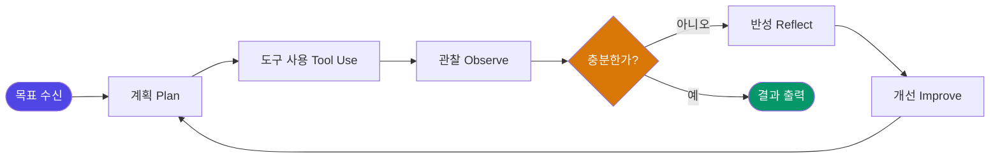

더 크고 강력한 모델을 만드는 것이 AI 경쟁의 전부라고 믿었던 시대는 조용히 막을 내리고 있다. 이제 에이전트의 성패는 모델 자체가 아니라, 그것을 감싸는 '하네스(harness)'를 얼마나 정교하게 설계했느냐에서 갈린다.

---

> **핵심 요약**
> AI 개발의 무게중심은 사전학습 스케일링에서 **추론-시간 스케일링과 에이전틱 AI**로 이동하고 있다.
> "Agent = Model + Harness"가 업계 표준 프레임으로 자리잡았으며, 에이전트 성능의 결정 변수는 모델 교체가 아닌 **하네스 설계**다.
> 실수를 반복하지 못하도록 루프를 설계하는 자가 다음 시대의 주도권을 쥔다.

---

## 1. 패러다임의 전환: 사전학습 스케일링에서 하네스 엔지니어링으로

AI 개발의 역사는 지금까지 하나의 공식에 지배돼 왔다. 더 많은 데이터, 더 많은 파라미터, 더 많은 컴퓨팅 — 이른바 **사전학습 스케일링 법칙(pre-training scaling law)**이다. GPT-3에서 GPT-4로, Llama 2에서 3로, 모델이 커질수록 성능이 향상된다는 믿음은 수년간 업계의 투자 논리를 지탱해왔다.

그러나 2025년 말을 기점으로 이 공식에 균열이 생기기 시작했다.

Andrej Karpathy는 2025년 12월 **"컨텍스트 엔지니어링(context engineering)"** 이라는 개념을 제시하며, 모델에게 무엇을 어떻게 제공하느냐가 모델 자체의 크기만큼 중요하다는 주장을 공론화했다. 컨텍스트 엔지니어링이란 AI 모델이 주어진 맥락(context window) 안에서 최적의 판단을 내릴 수 있도록 입력 구조, 도구 정의, 메모리 설계 등을 체계적으로 구성하는 실천이다.

이 흐름은 개발자 도구 회사 Ghostty의 창업자이자 시스템 엔지니어링 분야의 실증주의자인 **Mitchell Hashimoto**가 에이전트 루프 설계의 구체적 방법론을 공개하며 실무적 깊이를 얻었다. 그리고 2026년 2월, **OpenAI가 'Harness Engineering'을 정식 엔지니어링 분과로 공식화**하면서 이 흐름은 산업 표준의 지위를 획득했다.

이 계보는 단순한 명칭의 변화가 아니다. AI 개발의 무게중심이 **모델을 만드는 곳(사전학습)**에서 **모델을 운용하는 방식(추론-시간 스케일링과 에이전틱 설계)**으로 이동하고 있음을 알리는 구조적 선언이다.

더 큰 모델을 만드는 군비경쟁은 이제 다른 경쟁으로 진화했다. 모델이 '생각하는 시간(추론 연산)'을 늘리고, 도구를 활용하며, 장기 과제를 자율적으로 수행하는 **에이전트를 누가 더 잘 설계하느냐**의 경쟁이다.

---

## 2. 업계 표준 프레임: Agent = Model + Harness

**하네스(Harness)란** 모델을 둘러싼 실행 환경 전체 — 도구 정의, 메모리 관리, 루프 제어, 오류 처리, 평가 체계 — 를 총칭하는 개념이다. 오늘날 AI 에이전트 개발의 공통 언어가 된 등식이 있다.

```
Agent = Model + Harness
```

이 프레임이 의미하는 바는 명확하다. 동일한 기반 모델(GPT-4o, Claude 3.7, Gemini 2.0 등)을 사용하더라도, 하네스를 얼마나 정교하게 설계했느냐에 따라 에이전트의 성능은 근본적으로 달라진다. 모델은 더 이상 차별화의 유일한 축이 아니다.

### 에이전트 작동의 기본 루프

에이전트는 단선적으로 실행되지 않는다. 다음과 같은 순환 구조 안에서 작동한다.



**계획(Plan) → 도구 사용(Tool Use) → 관찰(Observe) → 반성(Reflect) → 개선(Improve)**의 루프는 에이전트가 단일 응답 생성기를 넘어 자율적 작업 수행자로 기능하게 하는 핵심 구조다.

이 구조에서 역할 분리의 원칙이 도출된다.

> *"에이전트는 생각을 해야 하고, 코드는 실행을 해야 합니다."* — Mitchell Hashimoto

에이전트가 추론·판단을 담당하고, 코드(도구)가 실행을 담당하는 분업 구조는 하네스 설계의 철학적 토대다. 에이전트가 직접 파일을 수정하거나 명령을 실행하는 것이 아니라, 판단을 내리고 그 판단을 실행할 도구를 호출하는 방식이다.

에이전트의 궁극적 비전은 여기서 더 나아간다.

> *"에이전트는 소프트웨어 회사를 대체해야 합니다. 즉, 영어든 어떤 언어든 인간이 제시한 목표와 요구사항을 받아들여, 계속해서 반복 실행될 수 있는 결정론적 코드로 바꿔야 합니다."*

인간의 자연어 목표를 결정론적 코드로 번역하는 번역기 — 이것이 에이전트가 도달해야 할 지점이다. 그리고 그 번역의 품질은 모델의 파라미터 수가 아닌, 하네스가 번역 과정을 얼마나 안정적으로 제어하느냐에 달려 있다.

---

## 3. 루프 엔지니어링의 실천: 실수를 시스템으로 봉인하라

하네스 엔지니어링의 핵심 실천 원리는 Hashimoto의 말 한마디로 압축된다.

> *"에이전트가 실수할 때마다, 다시는 그 실수를 못 하도록 시스템을 엔지니어링하라."*

이는 에이전트를 더 똑똑하게 만드는 접근이 아니다. 실수가 반복될 수 없는 구조적 제약을 시스템 안에 내장하는 접근이다. 버그를 발견하면 테스트를 추가하는 소프트웨어 공학의 원칙이, AI 에이전트 운용의 영역으로 확장된 것이다.

### Loop Engineering의 3대 구현체

실무에서 루프 엔지니어링은 세 가지 축을 중심으로 구현된다.

| 구현체 | 핵심 기능 | 의의 |
|---|---|---|
| **반복 실행 가능한 루프 설계** | 동일 입력에 동일 결과를 보장하는 멱등(idempotent) 루프 구조 | 에이전트 실행의 예측 가능성 확보 |
| **GitHub Spec-Kit** | spec → plan → tasks 체인을 에이전트-애그노스틱 마크다운으로 표준화 | 특정 모델·도구에 종속되지 않는 워크플로 |
| **전체 사이클 스킬화** | 브레인스토밍 → 스펙 → 구현 → 서브에이전트 실행 → 2단계 코드 리뷰 | 개발 사이클의 자동화·재현 가능성 |

### Spec-Driven 개발의 부상

이 중 **GitHub Spec-Kit**은 루프 엔지니어링이 개인 방법론을 넘어 표준 도구로 정착하는 과정을 보여주는 상징적 사례다.

Spec-driven 개발이란 에이전트에게 직접 작업을 지시하는 대신, 먼저 사양(spec)을 작성하고 → 계획(plan)으로 분해하고 → 실행 가능한 태스크(tasks)로 구체화한 뒤 에이전트를 투입하는 방식이다. 이 체인이 에이전트-애그노스틱 마크다운으로 표준화됐다는 것은, Claude를 쓰든 GPT를 쓰든 동일한 워크플로를 재사용할 수 있음을 의미한다.

전체 개발 사이클을 스킬(재사용 가능한 프로시저)로 구성하면, 브레인스토밍 단계부터 서브에이전트 실행, 2단계 코드 리뷰까지 일관된 품질 게이트가 유지된다. 이는 단순한 자동화가 아니라 **반복 불가능한 실수를 구조적으로 차단하는 시스템**이다.

---

## 4. 가치의 원천: '똑똑한 AI'가 아니라 '검증 가능한 루프'

AI의 실질적 가치가 어디서 발생하는지에 대한 인식이 바뀌고 있다. 핵심 명제는 다음과 같다.

> **AI는 실제 세계의 장비, 실험, 평가 기준, 인간 검증 루프 안에 들어갈 때 가치가 커진다.**

"AI가 똑똑해졌다"는 서술보다 "AI가 검증 가능한 루프 안에 들어갔다"는 서술이 실질적 가치 창출을 더 정확하게 설명한다. 이 구분은 AI 자동화의 본질을 이해하는 데 결정적이다.

### 자동화 패러다임의 세대 교체

| 구분 | 과거의 자동화 | 현재의 AI 자동화 |
|---|---|---|
| **자동화 대상** | 논리적 절차로 설명 가능한 일 | 충분한 데이터로 검증 가능한 일 |
| **설계 방식** | 규칙 기반 프로그래밍 | 루프 안에서의 학습·평가·반복 |
| **한계 요인** | 예외 케이스, 규칙의 불완전성 | 검증 루프의 정밀도, 평가 기준의 명확성 |
| **성능 향상 방법** | 규칙 추가·수정 | 하네스 재설계, 평가 데이터 확충 |

과거의 자동화 시스템은 인간이 '어떻게 하는지'를 명시적으로 코드화할 수 있는 영역에서만 작동했다. 지금의 AI는 '무엇이 좋은 결과인지'를 데이터로 검증할 수 있다면 자동화할 수 있다. 이 차이가 AI 자동화의 적용 범위를 기하급수적으로 확장한다.

그리고 이 확장의 품질을 결정하는 것은 바로 하네스 — 구체적으로는 평가 기준(eval)의 설계, 인간 검증 루프의 설계, 도구 호출 체계의 정밀도다. 모델을 교체해도 해결되지 않는 문제들이 하네스 재설계로 해결되는 경우가 이를 방증한다.

---

## 5. 에이전트 경제학: 비즈니스 현장의 실증

하네스 엔지니어링은 학문적 개념에 머물지 않는다. 실물 경제의 가장 민감한 영역 — 자본 배분과 기업 경쟁 — 에서 이미 그 효과가 검증되고 있다.

### AI 예산 배분의 성숙

기업의 AI 지출 접근 방식이 달라지고 있다.

> *"AI 지출을 기계적으로 승인하거나 전면적으로 거부하는 것이 아니라, 기업이 인력, 소프트웨어, 공급업체에 적용하는 것과 동일한 엄격함을 바탕으로 예산을 할당하는 것입니다."*

이는 AI가 더 이상 실험적 예산 항목이 아니라, ROI와 검증 기준이 명확한 **정규 운영 투자**로 분류되고 있음을 의미한다. 기업들은 이제 "어떤 모델을 쓸 것인가"가 아니라 "어떤 루프 안에서, 어떤 평가 기준으로 AI를 운용할 것인가"를 묻는다.

### Ramp: 에이전트가 산업을 재편하는 실물 증거

법인카드·지출관리 시장에서 Brex와의 경쟁을 돌파한 **Ramp**는 이제 재무용 AI 에이전트 기업으로의 전환을 선언하며 **440억 달러(약 44B USD) 밸류에이션으로 투자 유치**에 성공했다. 이는 에이전트가 특정 산업의 핵심 인프라로 자리잡을 수 있다는 투자자의 집합적 판단이다. 재무 데이터는 검증 기준이 명확하고, 반복 실행 가능한 루프를 설계하기 용이하다는 점에서 에이전트 적용의 최적 영역 중 하나다.

### EDA 스타트업: 반도체 설계의 AI화

반도체 설계 자동화(EDA, Electronic Design Automation) 스타트업 역시 주목받는 투자 영역으로 부상하고 있다. 반도체 설계는 복잡성과 비용이 극단적으로 높고, 검증 기준(시뮬레이션·테스트)이 명확하며, 반복 실행 가능한 루프가 이미 존재한다 — AI 에이전트 적용의 이상적 조건이다. AI와 머신러닝을 통한 EDA 자동화는 하네스 엔지니어링의 가치가 실물 산업에서 발현되는 또 다른 현장이다.

### 미래의 노동 패러다임

> *"미래에는 PC를 직접 조작하는 에이전트를 두게 될 것이다. 그 수를 선택하고 운용하는 것이 새로운 노동 패러다임이다."*

이 전망은 공상이 아니다. 기업의 소프트웨어 구독 항목에 '에이전트 수'가 포함되는 시대가 오면, 몇 개의 에이전트를 어떤 루프로 운용할지를 결정하는 능력이 핵심 경영 역량이 된다. 인력 관리와 에이전트 운용이 동일한 프레임으로 평가받는 시대다.

---

## FAQ: 하네스 엔지니어링에 대해 가장 많이 묻는 질문

**Q. 하네스 엔지니어링과 프롬프트 엔지니어링은 어떻게 다른가?**

프롬프트 엔지니어링이 모델에게 보내는 단일 입력(프롬프트)의 품질을 최적화하는 것이라면, 하네스 엔지니어링은 에이전트가 반복 실행하는 루프 전체 — 도구 설계, 메모리 관리, 오류 처리, 평가 체계, 서브에이전트 조율 — 를 시스템으로 설계하는 것이다. 프롬프트 엔지니어링이 단발 최적화라면, 하네스 엔지니어링은 지속적 시스템 설계다.

**Q. 어떤 모델을 써도 하네스가 더 중요하다는 주장의 근거는?**

동일한 기반 모델에서 하네스 설계만으로 벤치마크 성능이 유의미하게 달라진다는 사례가 산업 현장에서 반복 보고되고 있다. 평가 기준(eval) 설계, 컨텍스트 구성, 도구 호출 체계가 달라지면 모델 교체 없이도 결과가 개선된다. 반대로, 하네스 없이 모델만 업그레이드해도 같은 실수가 반복되는 경우가 다수다.

---

## 결론: 루프를 설계하는 자가 다음 시대를 이끈다

하네스 엔지니어링은 단순한 기술 트렌드가 아니다. AI 개발의 **책임 소재를 모델 제조사에서 시스템 설계자로 이전**시키는 구조적 전환이다.

더 강한 모델이 나오기를 기다리는 수동적 자세로는 이 시대를 앞서갈 수 없다. 지금 가진 모델이 동일한 실수를 반복하지 못하도록, 루프를 설계하고, 검증하고, 정교화하는 능력 — 이것이 다음 시대의 핵심 역량이다.

Karpathy의 컨텍스트 엔지니어링에서 출발해 Hashimoto의 루프 엔지니어링을 거쳐 OpenAI의 하네스 엔지니어링으로 이어지는 계보는, AI 지능화의 다음 단계가 파라미터 수가 아님을 분명히 한다. **얼마나 정밀하게 검증된 루프 위에서 에이전트를 작동시키느냐** — 그것이 AI 시대의 새로운 경쟁 축이다.

모델은 평준화된다. 하네스는 차별화된다.
