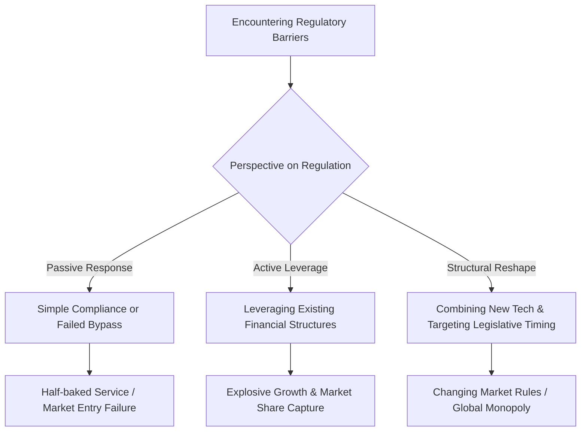

Here is the English translation of the article, optimized for natural flow, business tone, and SEO while maintaining the exact meaning and style of the original text.

# The Real Weapon That Decides Business Success: 'The Ability to Navigate Regulations'

Even Apple and Google, armed with the world's most powerful capital and technology, have been stuck offering half-baked services for years when faced with South Korea's offline payment infrastructure. The true variable that separates successful founders and C-level executives is not overwhelming technology or innovative products. It is the massive invisible barrier: 'the ability to navigate regulations.'

> **Key Takeaway**
> The biggest constraint in modern business is not technology, but regulation—and only those who overcome it can monopolize the market. The capacity to leverage regulations or reshape the playing field with new technology is a company's true competitive edge.

### The Invisible Barrier That Frustrates Even Big Tech

From the outside, payments might look like "just swiping a card," but behind the scenes lies a multi-layered web of regulations: licensing, settlements, network segregation, and foreign exchange controls.

Regulation is not merely a set of legal clauses; it is an invisible system that controls business entry and expansion.

Let's compare this complex concept to driving. If technology or a product is the powerful 'engine' of a sports car, regulations are the 'traffic lights and toll booths' on the road. No matter how fast your engine is, you cannot pass through the city center without an electronic toll collection device or by ignoring traffic signals. 

In reality, even global giants have struggled severely at these toll booths. 

Google attempted to enter the South Korean market starting in 2017 but failed to officially launch its offline payment service. Because locally issued cards cannot be registered, users are forced into workarounds like registering multi-currency cards such as the UK's Wise.

Apple Pay landed in South Korea in March 2023 but faced a physical barrier: an NFC terminal penetration rate of only around 10%. Compounded by the Financial Services Commission's warning not to pass Apple's 0.15% fee onto consumers or merchants, its expansion beyond Hyundai Card remains sluggish even two years later in March 2025.

Consequently, in the South Korean offline payment market, Samsung Pay holds about 42% of the NFC share, while Kakao Pay, Naver Pay, and Toss maintain their dominance in the online sector. 

As such, failure to perfectly navigate regulations and local infrastructure renders even the greatest global products half-baked.

### Two Strategies for Handling Regulations: Leverage or Reshape

How, then, do exceptional companies break through this barrier? One side thoroughly leverages the regulatory landscape, while the other reshapes the regulation itself.

US-based Ramp achieved hyper-growth not despite, but by standing upon the foundation of US financial regulations and the corporate card interchange structure.

Looking at Ramp's growth data, one can feel the immense explosive power of the corporate spend management market. At this rate, it is highly likely to soon establish itself fully as a core infrastructure for global B2B payments.
* Ramp Total Payment Volume (TPV): $22.3 billion in 2023 → $57.0 billion in 2024
* Corporate Valuation: Surged from $16 billion in June 2025 to $44 billion in June 2026 (achieving approx. $1.5 billion in annualized revenue)

Meanwhile, on the other side, there are those who view regulations as targets for complete reshaping. 

Stripe recognized that traditional cross-border payments are slow and expensive due to banking networks and regulations. To bypass this, they began laying down a new rail: stablecoins.

Timing it perfectly, the US implemented the 'GENIUS Act' (Federal Stablecoin Act) in July 2025, establishing a legislative framework that mandated dollar reserves and Anti-Money Laundering (AML) for stablecoins. Just as this new playing field opened up, Stripe acquired Bridge for $1.1 billion and pushed for commercialization through its own blockchain, Tempo.

| Strategic Direction | Representative Company | Core Approach | Results & Impact |
| :--- | :--- | :--- | :--- |
| **Regulatory Leverage** | Ramp | Utilized existing credit card structures and financial regulations as a robust lever for growth | Achieved $57B TPV (2024), $44B valuation (2026) |
| **Regulatory Reshape** | Stripe | Replaced the cross-border payment network itself with stablecoins, timed with US legislation (GENIUS Act) | Acquired Bridge for $1.1B, built global commerce backbone |

In other words, what others call a barrier, they use as a massive springboard. Observing such meticulous strategic maneuvers makes you realize that true innovation happens not within lines of code, but between the lines of the law.

### The Core Competency of a New Era: Beyond Capital and Technology

While the greatest constraints on business in the past were physical technologies like chips or energy, the paradigm seems to be shifting towards issues of licensing and regulatory compromise.

Regardless, underestimating regulatory risks invariably leads to fatal consequences. 

In South Korea, the Tmon-Wemakeprice crisis that erupted in July 2024 caused unsettled amounts to balloon to 818.8 billion KRW. This occurred because there was no institutional mechanism to prevent platforms from misappropriating settlement funds. 

In the same vein, financial authorities significantly revised the Electronic Financial Transactions Act in 2025, tightening regulatory reins by mandating that Payment Gateway (PG) companies separately manage 100% of unsettled funds.

The next point of interest is how global companies will break through this increasingly stringent regulatory landscape in South Korea.

Instead of establishing a direct corporate entity in Korea or confronting regulations head-on, Stripe chose to go through local processor partners. They ingeniously designed a system integration that allows overseas merchants to accept KRW (Korean Won) payments and Kakao Pay from Korean customers.

However, its partner, Ramp, does not yet support APAC or Korean Won issuance, effectively remaining unentered in the market. Interestingly, Ramp and Stripe are expanding their partnership, preparing to launch the industry's first stablecoin-based corporate card. 

How these giants, adept at navigating foreign regulations, will attempt to integrate into the system in the face of South Korea's massive barriers—the strengthened Electronic Financial Transactions Act and the Foreign Exchange Transactions Act—appears to be the new focal point to watch.

Personally, I believe there is only one most important question to ask when evaluating founders or executives in the future: "Can this person resolve and reshape regulations?"

Of course, I could be wrong. There is always the possibility that an overwhelming, unimaginable technological innovation could suddenly render existing regulations obsolete.

Ultimately, failing to handle regulations turns even the best products into half-baked offerings. But if one possesses the ability to read, negotiate, and reshape regulations, they will likely seize entire markets that others dare not even covet.

One-line comment: Business is a game that goes beyond building a great car—it's about designing and controlling the road's traffic signals to your advantage.

References (16) — TechCrunch · The Korea Times · Digital in Asia · Fortune · CNBC · The White House · Chambers and Partners · Asia News Network · Stripe · Ramp Support · PR Newswire

<ul>
<li><a href="https://techcrunch.com/2023/03/20/apple-pay-is-now-available-in-south-korea/">Apple Pay is now available in South Korea</a> — TechCrunch, 2023-03-20</li>
<li><a href="https://www.koreatimes.co.kr/business/banking-finance/20250314/two-years-in-apple-pay-struggles-to-gain-foothold-in-korea">Two years in, Apple Pay struggles to gain foothold in Korea</a> — The Korea Times, 2025-03-14</li>
<li><a href="https://asianews.network/south-koreas-top-financial-regulator-warns-apple-pay-against-shifting-fee-burden-to-consumers/">South Korea’s top financial regulator warns Apple Pay against shifting fee burden to consumers</a> — Asia News Network</li>
<li><a href="https://digitalinasia.com/asia-digital-payments-tracker/">Asia Digital Payments Tracker</a> — Digital in Asia</li>
<li><a href="https://techcrunch.com/2026/06/04/ramp-raises-750m-at-44b-valuation-as-investors-hunger-for-fintechs-with-an-ai-story/">Ramp raises $750M at $44B valuation</a> — TechCrunch, 2026-06-04</li>
<li><a href="https://fortune.com/2025/09/04/ramp-exclusive-revenue-billion-dollar-fintech-corporate-credit-card-glyman/">Ramp exclusive revenue billion dollar fintech corporate credit card</a> — Fortune, 2025-09-04</li>
<li><a href="https://fortune.com/crypto/2025/10/01/stripe-crypto-stablecoins-open-issuance-bridge-blockchain-tempo/">Stripe crypto stablecoins open issuance</a> — Fortune, 2025-10-01</li>
<li><a href="https://www.cnbc.com/2025/02/04/stripe-closes-1point1-billion-bridge-deal-prepares-for-stablecoin-push-.html">Stripe closes $1.1 billion Bridge deal</a> — CNBC, 2025-02-04</li>
<li><a href="https://www.whitehouse.gov/fact-sheets/2025/07/fact-sheet-president-donald-j-trump-signs-genius-act-into-law/">Fact Sheet: President signs GENIUS Act into law</a> — The White House, 2025-07-18</li>
<li><a href="https://www.koreatimes.co.kr/www/biz/2024/08/602_379642.html">Unpaid funds at Qoo10 affiliates</a> — The Korea Times, 2024-08</li>
<li><a href="https://practiceguides.chambers.com/practice-guides/fintech-2025/south-korea">Fintech 2025 South Korea</a> — Chambers and Partners</li>
<li><a href="https://practiceguides.chambers.com/practice-guides/fintech-2026/south-korea/trends-and-developments">Fintech 2026 South Korea Trends</a> — Chambers and Partners</li>
<li><a href="https://stripe.com/resources/more/payments-in-south-korea">How to accept payments in South Korea</a> — Stripe</li>
<li><a href="https://stripe.com/global">Global availability</a> — Stripe</li>
<li><a href="https://support.ramp.com/hc/en-us/articles/23760405789715-International-overview">International overview</a> — Ramp Support</li>
<li><a href="https://www.prnewswire.com/news-releases/ramp-and-stripe-deepen-partnership-to-accelerate-global-commerce-through-stablecoin-backed-cards-302449212.html">Ramp and Stripe deepen partnership</a> — PR Newswire</li>
</ul>

## TL;DR
Here is the English translation of the article, optimized for natural flow, business tone, and SEO while maintaining the exact meaning and style of the original text. # The Real...

- Intent: how_to
- Geo focus: us
- Core topics: 규제, 비즈니스 전략, 결제 인프라

## Next Step
관련 주제 확장 글을 이어서 읽어보세요.
- Quality gates: unique-angle, clear-structure, source-attribution-if-needed, readability-pass
