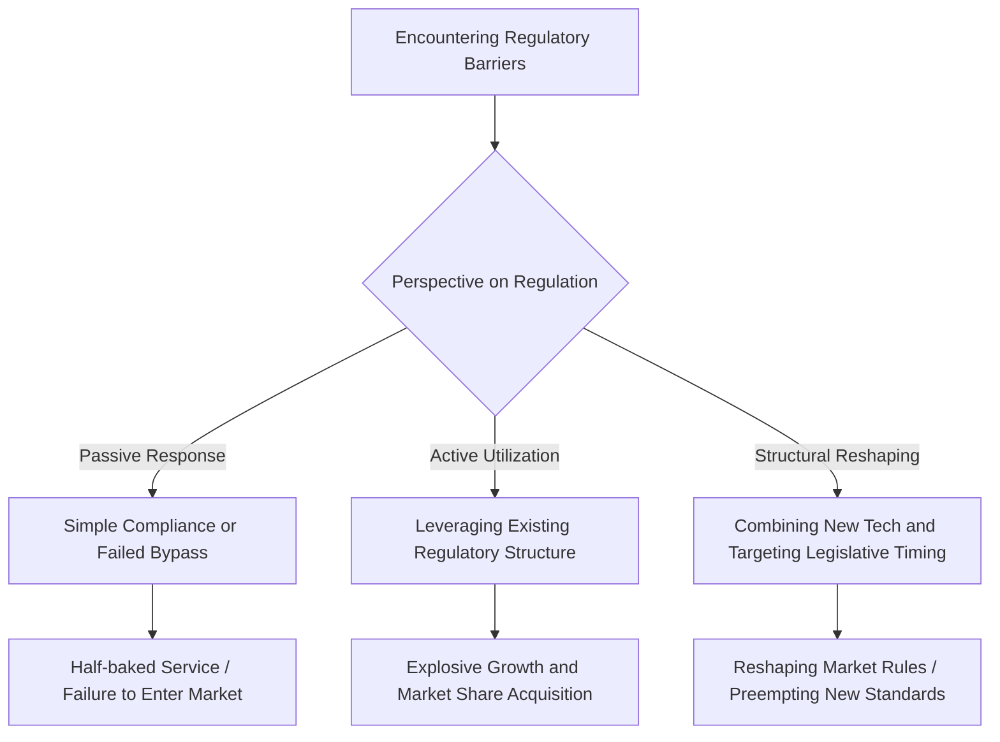

Even Apple and Google, with the world's most powerful capital and technological prowess, have remained half-baked services for years in the face of South Korea's offline payment infrastructure. One of the real variables that separates successful entrepreneurs and C-level executives could be the ability to navigate regulations—a massive, invisible barrier.

> **Executive Summary**
> The biggest constraint in modern business is not technology, but regulation, and only those who overcome it will monopolize the market. The ability to leverage regulations or reshape the playing field with new technology is a company's true competitive edge.

### The Invisible Barrier That Frustrates Even Big Tech

From the outside, a payment is "just swiping a card," but behind it lies a thick layer of regulations: licensing, settlement, network segregation, and foreign exchange controls.

Regulation is not just a simple legal provision; it is an invisible system that controls business entry and expansion.

Let's compare this complex concept to driving. If technology or a product is the powerful 'engine' of a sports car, regulations are the 'traffic lights and tollgates' on the road. No matter how fast the engine is, you cannot pass through the city center without an electronic toll collection device or if you ignore the traffic signal system. 

In reality, even global giants have struggled severely in front of these tollgates. 

Google has attempted to enter the South Korean market since 2017 but failed to officially launch its offline payment service. Because domestically issued cards cannot be registered, users are forced to bypass the system by registering multi-currency cards like the UK's Wise.

Apple Pay landed in South Korea in March 2023 but faced the physical barrier of an NFC terminal penetration rate of only about 10%. Compounded by the Financial Services Commission's warning not to pass Apple's 0.15% fee onto consumers or merchants, its expansion beyond Hyundai Card remains sluggish even two years later, in March 2025.

Ultimately, Samsung Pay dominates South Korea's offline payments, capturing about 42% of the NFC market, while Kakao Pay, Naver Pay, and Toss maintain their dominance in the online payment sector. 

Thus, if a company fails to perfectly navigate regulations and local infrastructure, even the most excellent global product will end up as a half-measure.

### Two Strategies for Navigating Regulations: Leverage or Reshape

So, how do outstanding companies break through this barrier? One side thoroughly leverages the regulatory landscape, while the other reshapes the regulations themselves.

In the US, Ramp achieved hyper-growth precisely by standing on the structure of US financial regulations and the corporate card interchange system.

Looking at Ramp's growth data, you can feel just how explosive the corporate spend management market is. At this rate, it seems likely to fully establish itself as the core infrastructure of global B2B payments in the near future.
* Ramp Total Payment Volume (TPV): $22.3 billion in 2023 → $57.0 billion in 2024
* Corporate Valuation: Surged from $16 billion in June 2025 to $44 billion in June 2026 (Achieved an annualized revenue run rate of approximately $1.5 billion)

Meanwhile, on the other side, there are those who view regulations as a target for total reshaping. 

Stripe recognized that traditional cross-border payments are slow and expensive due to banking networks and regulations. To bypass this, they began laying down a new rail called stablecoins.

Just in time, the US implemented the 'GENIUS Act' (Federal Stablecoin Act) in July 2025, establishing a legislative framework that mandates dollar reserves and Anti-Money Laundering (AML) compliance for stablecoins. Timing the opening of this market perfectly, Stripe acquired Bridge for $1.1 billion and pushed for commercialization through its proprietary blockchain, Tempo.

| Strategic Direction | Representative Company | Core Approach | Results and Impact |
| :--- | :--- | :--- | :--- |
| **Leverage** | Ramp | Used the existing credit card structure and financial regulations as a solid lever for growth | Achieved TPV of $57.0B (2024) and valuation of $44.0B (2026) |
| **Reshape** | Stripe | Replaced the cross-border payment network itself with stablecoins, perfectly timing the US legislation (GENIUS Act) | Acquired Bridge for $1.1B, built a global commerce backbone |

In other words, what others call barriers, they use as giant springboards. Looking at these meticulous strategic moves makes you realize that true innovation happens not within lines of technology code, but between the lines of legal codes.

### The Core Competency of a New Era: Beyond Money and Technology

If the biggest constraints of business in the past were physical technologies like chips or energy, the focus now seems to be shifting to issues of licensing and regulatory compromise.

Regardless, underestimating regulatory risks can lead to fatal consequences at any time. 

In South Korea, the TMON and WeMakePrice crisis that erupted in July 2024 caused unsettled amounts to balloon to 818.8 billion KRW. This was because there were no institutional measures to prevent platforms from misappropriating settlement funds. 

In the same vein, financial authorities heavily revised the Electronic Financial Transactions Act in 2025, mandating PG (Payment Gateway) companies to manage 100% of unsettled funds separately, thereby tightly gripping the reins of regulation.

What to watch next is how global companies will break through this increasingly stringent regulatory landscape in South Korea.

Instead of directly establishing a legal entity in South Korea or tackling the regulations head-on, Stripe opted to go through a local processor partner. They cleverly designed system integration so that overseas businesses can accept KRW payments or Kakao Pay from South Korean customers.

However, their partner Ramp does not yet support card issuance in the APAC region or in KRW, effectively remaining un-entered in the market. Interestingly, Ramp and Stripe are expanding their partnership to prepare the industry's first stablecoin-based corporate card. 

The new point of interest is how these giants, who expertly navigate foreign regulations, will attempt to integrate into the system in the face of the massive barriers of South Korea's strengthened Electronic Financial Transactions Act and Foreign Exchange Transactions Act.

Personally, I believe there is only one crucial question to ask when evaluating founders and executives in the future: "Can this person resolve and reshape regulations?"

Of course, I could be wrong. There is always the possibility that overwhelming technological innovation beyond imagination could instantly render existing regulations obsolete.

Ultimately, failure to manage regulations will leave even the best products as half-measures. However, if one possesses the ability to read, negotiate, and reshape regulations, I believe they will entirely capture a market that others wouldn't dare approach.

One-line comment: Business is a game that goes beyond building an excellent car; it is about designing and controlling even the road's traffic signal system to your advantage.

References (16) — TechCrunch · The Korea Times · Digital in Asia · Fortune · CNBC · The White House · Chambers and Partners · Asia News Network · Stripe · Ramp Support · PR Newswire

<ul>
<li><a href="https://techcrunch.com/2023/03/20/apple-pay-is-now-available-in-south-korea/">Apple Pay is now available in South Korea</a> — TechCrunch, 2023-03-20</li>
<li><a href="https://www.koreatimes.co.kr/business/banking-finance/20250314/two-years-in-apple-pay-struggles-to-gain-foothold-in-korea">Two years in, Apple Pay struggles to gain foothold in Korea</a> — The Korea Times, 2025-03-14</li>
<li><a href="https://asianews.network/south-koreas-top-financial-regulator-warns-apple-pay-against-shifting-fee-burden-to-consumers/">South Korea’s top financial regulator warns Apple Pay against shifting fee burden to consumers</a> — Asia News Network</li>
<li><a href="https://digitalinasia.com/asia-digital-payments-tracker/">Asia Digital Payments Tracker</a> — Digital in Asia</li>
<li><a href="https://techcrunch.com/2026/06/04/ramp-raises-750m-at-44b-valuation-as-investors-hunger-for-fintechs-with-an-ai-story/">Ramp raises $750M at $44B valuation</a> — TechCrunch, 2026-06-04</li>
<li><a href="https://fortune.com/2025/09/04/ramp-exclusive-revenue-billion-dollar-fintech-corporate-credit-card-glyman/">Ramp exclusive revenue billion dollar fintech corporate credit card</a> — Fortune, 2025-09-04</li>
<li><a href="https://fortune.com/crypto/2025/10/01/stripe-crypto-stablecoins-open-issuance-bridge-blockchain-tempo/">Stripe crypto stablecoins open issuance</a> — Fortune, 2025-10-01</li>
<li><a href="https://www.cnbc.com/2025/02/04/stripe-closes-1point1-billion-bridge-deal-prepares-for-stablecoin-push-.html">Stripe closes $1.1 billion Bridge deal</a> — CNBC, 2025-02-04</li>
<li><a href="https://www.whitehouse.gov/fact-sheets/2025/07/fact-sheet-president-donald-j-trump-signs-genius-act-into-law/">Fact Sheet: President signs GENIUS Act into law</a> — The White House, 2025-07-18</li>
<li><a href="https://www.koreatimes.co.kr/www/biz/2024/08/602_379642.html">Unpaid funds at Qoo10 affiliates</a> — The Korea Times, 2024-08</li>
<li><a href="https://practiceguides.chambers.com/practice-guides/fintech-2025/south-korea">Fintech 2025 South Korea</a> — Chambers and Partners</li>
<li><a href="https://practiceguides.chambers.com/practice-guides/fintech-2026/south-korea/trends-and-developments">Fintech 2026 South Korea Trends</a> — Chambers and Partners</li>
<li><a href="https://stripe.com/resources/more/payments-in-south-korea">How to accept payments in South Korea</a> — Stripe</li>
<li><a href="https://stripe.com/global">Global availability</a> — Stripe</li>
<li><a href="https://support.ramp.com/hc/en-us/articles/23760405789715-International-overview">International overview</a> — Ramp Support</li>
<li><a href="https://www.prnewswire.com/news-releases/ramp-and-stripe-deepen-partnership-to-accelerate-global-commerce-through-stablecoin-backed-cards-302449212.html">Ramp and Stripe deepen partnership</a> — PR Newswire</li>
</ul>

## TL;DR
# The Real Weapon That Determines Business Success or Failure: 'The Ability to Navigate Regulations' Even Apple and Google, with the world's most powerful capital and technologi...

- Intent: informational
- Geo focus: us
- Core topics: regulation, business strategy, payment infrastructure

## Next Step
Keep going with related deep dives on this topic.
- Quality gates: unique-angle, clear-structure, source-attribution-if-needed, readability-pass
