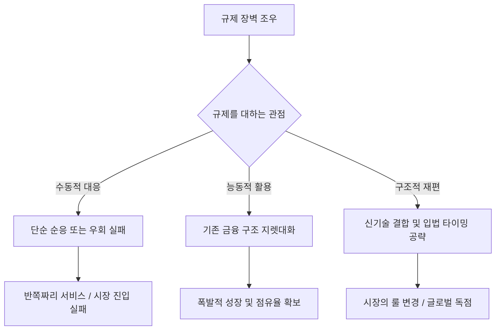

세계 최강의 자본과 기술력을 가진 애플과 구글조차 한국의 오프라인 결제 인프라 앞에서는 수년째 반쪽짜리 서비스에 머물고 있다. 성공한 창업가와 C레벨을 가르는 진짜 변수는 압도적인 기술이나 혁신적인 제품이 아닙니다. 바로 보이지 않는 거대한 장벽, '규제를 다루는 능력'입니다.

> **핵심 요약**
> 현대 비즈니스의 가장 큰 제약은 기술이 아니라 규제이며, 이를 극복하는 자만이 시장을 독점한다. 규제를 지렛대로 활용하거나 새로운 기술로 판을 재편하는 역량이 곧 기업의 진짜 경쟁력이다.

### 빅테크도 좌절하게 만드는 보이지 않는 장벽

밖에서 보면 결제는 "그냥 카드 긁는 것"이지만, 그 뒤에는 인허가, 정산, 망 분리, 외환 통제라는 겹겹의 규제가 쌓여 있다.

규제란 단순한 법 조항이 아니라, 비즈니스의 진입과 확장을 통제하는 보이지 않는 시스템이다.

어려운 개념을 운전에 비유해 보자. 기술이나 제품이 스포츠카의 강력한 '엔진'이라면, 규제는 도로의 '신호등과 요금소'다. 아무리 빠른 엔진을 달아도 하이패스 단말기가 없거나 신호 체계를 무시하면 도심을 통과할 수 없다. 

실제로 글로벌 거인들도 이 요금소 앞에서 심하게 고전했다. 

구글, 2017년부터 한국 진출 시도했으나 오프라인 결제 정식 출시 실패. 국내 발급 카드가 등록되지 않아 사용자는 영국 Wise 다통화카드 등을 우회 등록해야 하는 상황이다.

애플페이, 2023년 3월 한국 상륙했으나 NFC 단말기 보급률 약 10%라는 물리적 장벽에 직면. 애플이 부과하는 0.15% 수수료를 소비자나 가맹점에 전가하지 말라는 금융위원회의 경고까지 더해져, 2년이 지난 2025년 3월에도 현대카드 외의 확장이 더딘 상태다.

결국 한국 오프라인 결제는 삼성페이가 NFC의 약 42%를 점유하고, 온라인은 카카오페이·네이버페이·토스가 지배력을 유지하고 있다. 

이처럼 규제와 로컬 인프라를 완벽히 다루지 못하면 아무리 훌륭한 글로벌 제품이라도 반쪽이 되고 만다.

### 규제를 다루는 두 가지 전략: 지렛대로 쓰거나, 판을 바꾸거나

그렇다면 뛰어난 기업들은 이 장벽을 어떻게 돌파할까? 한쪽은 규제 지형을 철저히 활용하고, 다른 한쪽은 규제 자체를 재편한다.

**Q. 규제는 무조건 피하거나 부숴야 하는 장애물인가요?**
**A. 아닙니다. 뛰어난 창업자들은 기존 금융 규제 구조를 든든한 지렛대로 활용(Ramp)하거나, 입법 타이밍에 맞춰 신기술로 아예 시장의 룰을 재편(Stripe)합니다.**

미국의 Ramp는 미국 금융 규제와 코퍼레이트 카드 인터체인지 구조 안에서 오히려 그 구조를 딛고 초고속으로 성장했다.

Ramp의 성장 데이터를 보면 기업 지출 관리 시장의 폭발력이 얼마나 대단한지 체감할 수 있다. 이 추세라면 조만간 글로벌 B2B 결제의 핵심 인프라로 완전히 자리 잡지 않을까 싶다.
* Ramp 총결제액(TPV): 2023년 223억 달러 → 2024년 570억 달러
* 기업가치: 2025년 6월 160억 달러에서 2026년 6월 440억 달러로 급등 (연환산 매출 약 15억 달러 달성)

한편, 반대편에는 규제를 아예 재편 대상으로 보는 이들이 있다. 

Stripe는 전통적인 국경 간 결제가 은행망과 규제로 인해 느리고 비싸다는 점을 간파했다. 이를 우회하기 위해 스테이블코인이라는 새로운 레일을 깔기 시작했다.

때마침 미국은 2025년 7월 'GENIUS Act(연방 스테이블코인 법)'를 시행하며 스테이블코인의 달러 준비금과 자금세탁방지(AML)를 의무화하는 입법 프레임워크를 마련했다. Stripe는 이 판이 열리는 타이밍에 맞춰 11억 달러에 Bridge를 인수하고 자체 블록체인인 Tempo를 통해 상용화를 추진했다.

| 전략 방향 | 대표 기업 | 핵심 접근법 | 결과 및 파급력 |
| :--- | :--- | :--- | :--- |
| **규제 활용 (Leverage)** | Ramp | 기존 신용카드 구조와 금융 규제를 성장의 든든한 지렛대로 삼음 | TPV 570억 달러(2024), 기업가치 440억 달러(2026) 달성 |
| **규제 재편 (Reshape)** | Stripe | 미국 입법(GENIUS Act) 시점에 맞춰 국경 간 결제망 자체를 스테이블코인으로 대체 | Bridge 11억 달러 인수, 글로벌 상거래 백본 구축 |

즉, 남들이 장벽이라 부르는 것을 그들은 거대한 도약대로 쓴다. 이런 치밀한 전략적 움직임을 보면, 진짜 혁신은 기술 코드 안이 아니라 법전의 행간 사이에서 일어나는구나 싶다.

### 돈과 기술을 넘어선 새로운 시대의 핵심 역량

과거 비즈니스의 가장 큰 제약이 칩이나 에너지 같은 물리적 기술이었다면, 이제는 인허가와 규제 타협의 문제로 이동하는 것 같다.

어쨌든 규제 리스크를 얕보면 언제든 치명적인 결과로 이어진다. 

한국에서는 2024년 7월 터진 티몬·위메프 사태로 인해 미정산액이 8188억 원까지 불어난 바 있다. 플랫폼의 정산자금 유용을 막을 제도적 수단이 없었기 때문이다. 

같은 맥락에서 금융당국은 2025년 전자금융거래법을 대폭 개정해 PG사에 미정산자금 100% 별도 관리를 의무화하며 규제의 고삐를 강하게 쥐었다.

이어서 주목할 점은, 이렇게 빡빡해진 한국의 규제 지형을 글로벌 기업들이 어떻게 돌파하느냐다.

Stripe는 한국에 직접 법인을 세우거나 규제를 정면 돌파하는 대신, 현지 프로세서 파트너를 통하는 방식을 택했다. 해외 사업자가 한국 고객의 원화(KRW) 결제나 카카오페이 등을 받을 수 있도록 시스템 편입을 교묘하게 설계한 것이다.

다만, 파트너사인 Ramp은 아직 APAC이나 한국 원화 발급을 지원하지 않으며 사실상 미진출 상태다. 흥미롭게도 Ramp과 Stripe는 파트너십을 확대하며 업계 최초의 스테이블코인 기반 코퍼레이트 카드를 준비하고 있다. 

해외 규제를 능숙하게 넘나드는 이 거인들이, 향후 한국의 강화된 전자금융거래법과 외국환거래법이라는 거대한 장벽 앞에서는 과연 어떤 방식으로 시스템 편입을 시도할 것인지가 새로운 관전 포인트로 보인다.

개인적으로 앞으로 창업가나 경영자를 평가할 때 던져야 할 가장 중요한 질문은 단 하나라고 본다. "이 사람이 규제를 해결하고 재편할 수 있는가?"

물론 틀릴 수 있다. 상상을 초월하는 압도적인 기술 혁신이 어느 순간 기존의 규제를 무용지물로 만들어버릴 가능성도 존재한다.

결국 규제를 다루지 못하면 아무리 훌륭한 제품도 반쪽짜리가 되지만, 규제를 읽고 협상하며 재편하는 능력을 갖춘다면 남들이 감히 넘볼 수 없는 시장을 통째로 쥐게 될 것으로 생각된다.

한줄 코멘트. 사업이란 훌륭한 자동차를 만드는 것을 넘어, 도로의 신호 체계마저 내게 유리하게 설계하고 통제하는 게임이다.

참고 자료 (16) — TechCrunch · The Korea Times · Digital in Asia · Fortune · CNBC · The White House · Chambers and Partners · Asia News Network · Stripe · Ramp Support · PR Newswire

<ul>
<li><a href="https://techcrunch.com/2023/03/20/apple-pay-is-now-available-in-south-korea/">Apple Pay is now available in South Korea</a> — TechCrunch, 2023-03-20</li>
<li><a href="https://www.koreatimes.co.kr/business/banking-finance/20250314/two-years-in-apple-pay-struggles-to-gain-foothold-in-korea">Two years in, Apple Pay struggles to gain foothold in Korea</a> — The Korea Times, 2025-03-14</li>
<li><a href="https://asianews.network/south-koreas-top-financial-regulator-warns-apple-pay-against-shifting-fee-burden-to-consumers/">South Korea’s top financial regulator warns Apple Pay against shifting fee burden to consumers</a> — Asia News Network</li>
<li><a href="https://digitalinasia.com/asia-digital-payments-tracker/">Asia Digital Payments Tracker</a> — Digital in Asia</li>
<li><a href="https://techcrunch.com/2026/06/04/ramp-raises-750m-at-44b-valuation-as-investors-hunger-for-fintechs-with-an-ai-story/">Ramp raises $750M at $44B valuation</a> — TechCrunch, 2026-06-04</li>
<li><a href="https://fortune.com/2025/09/04/ramp-exclusive-revenue-billion-dollar-fintech-corporate-credit-card-glyman/">Ramp exclusive revenue billion dollar fintech corporate credit card</a> — Fortune, 2025-09-04</li>
<li><a href="https://fortune.com/crypto/2025/10/01/stripe-crypto-stablecoins-open-issuance-bridge-blockchain-tempo/">Stripe crypto stablecoins open issuance</a> — Fortune, 2025-10-01</li>
<li><a href="https://www.cnbc.com/2025/02/04/stripe-closes-1point1-billion-bridge-deal-prepares-for-stablecoin-push-.html">Stripe closes $1.1 billion Bridge deal</a> — CNBC, 2025-02-04</li>
<li><a href="https://www.whitehouse.gov/fact-sheets/2025/07/fact-sheet-president-donald-j-trump-signs-genius-act-into-law/">Fact Sheet: President signs GENIUS Act into law</a> — The White House, 2025-07-18</li>
<li><a href="https://www.koreatimes.co.kr/www/biz/2024/08/602_379642.html">Unpaid funds at Qoo10 affiliates</a> — The Korea Times, 2024-08</li>
<li><a href="https://practiceguides.chambers.com/practice-guides/fintech-2025/south-korea">Fintech 2025 South Korea</a> — Chambers and Partners</li>
<li><a href="https://practiceguides.chambers.com/practice-guides/fintech-2026/south-korea/trends-and-developments">Fintech 2026 South Korea Trends</a> — Chambers and Partners</li>
<li><a href="https://stripe.com/resources/more/payments-in-south-korea">How to accept payments in South Korea</a> — Stripe</li>
<li><a href="https://stripe.com/global">Global availability</a> — Stripe</li>
<li><a href="https://support.ramp.com/hc/en-us/articles/23760405789715-International-overview">International overview</a> — Ramp Support</li>
<li><a href="https://www.prnewswire.com/news-releases/ramp-and-stripe-deepen-partnership-to-accelerate-global-commerce-through-stablecoin-backed-cards-302449212.html">Ramp and Stripe deepen partnership</a> — PR Newswire</li>
</ul>

