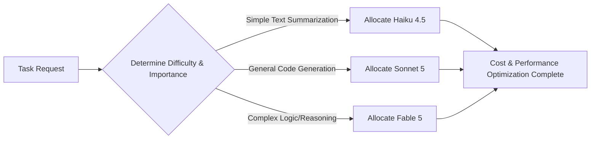

According to multiple media reports, the subscription inclusion period for Claude's top-tier model, Fable 5, has been extended to July 12, and it will transition to usage credits starting on the 13th. The generative AI market has now effectively ended the flat-rate buffet model and entered the "metered era of intelligence," where all usage is strictly billed.

> **Key Takeaway**
> AI intelligence has moved beyond a simple retail phase and is now being sold via a strict token metering system across all consumer and enterprise tiers. This is an unavoidable measure to handle the runaway speed of AI agents, and routing capabilities—distributing the appropriate model for each task—will become the core of survival moving forward.

 

### Entering the Metered Era of Intelligence

The metered era of intelligence refers to a cost structure where the use of AI models is strictly billed based on tokens, the unit of data processing.

The romantic era of exploiting AI almost endlessly for a single monthly fee is coming to an end. Major AI companies, led by Anthropic, have massively overhauled their billing policies.

From consumer subscriptions to enterprise workspaces and hyperscaler infrastructure, intelligence has begun to be sold by the meter across all levels.

 

### Omnidirectional Transition to Token Billing and Market Backlash

Anthropic recently fully implemented a token metering system across both enterprise and individual plans. Looking at the pricing table below reveals how granularly and steeply billing is designed based on model performance.

| Model Tier | Features | Input / Output Price (Per Million Tokens) |
| :--- | :--- | :--- |
| Fable 5 | Current highest-priced model | $10 / $50 |
| Opus 4.8 | Previous generation highest-priced | $5 / $25 |
| Sonnet 5 | Intro rate, $3 / $15 from September 1st | $2 / $10 |
| Haiku 4.5 | Fast and affordable model | $1 / $5 |

At this rate, as models become more sophisticated, enterprise token expenditures may go beyond imagination.

The fact that Fable 5's subscription inclusion period was extended by five days to July 12 is based on reports from multiple media outlets, including Forbes. The body of Anthropic's official redeployment notice still maintains the July 7 date. Either way, starting on the 13th, payments must be made with usage credits, and the unit price is $10 per million input tokens and $50 for output. Enterprise plans also transitioned last April from a flat-rate seat model to a structure combining pay-as-you-go token billing with a monthly spend commitment.

Market backlash is fierce. According to a report by The Information, Amazon currently pays Anthropic based on compute time, but this will change to token-based billing starting next year under a renewed contract, leading Amazon to consider alternatives like OpenAI out of concern for significantly increased costs. Palantir CEO Alex Karp criticized the token billing model on a CNBC broadcast, stating "something has gone completely wrong," pointing out that enterprise customers are paying usage fees without sufficient value recovery while exposing their IP, operational know-how, and competitive edge.

 

### Structural Limits of the Collapse of Unlimited Plans

So why are AI companies abandoning flat-rate plans despite market pushback? The reason is that a pricing model tailored to human speed physically cannot handle machine speed.

This can be compared to a restaurant. An all-you-can-eat buffet where humans eat with forks leaves the restaurant with a profit. However, if robots brought dump trucks and scooped up hundreds of plates of food per second, the restaurant would quickly go bankrupt.

According to calculations by Zed Industries, the existing subscription model was subsidizing AI agent (programmatic) usage by a staggering 15 to 30 times compared to API unit prices. In other words, from the platform's perspective, they likely had no choice but to close the buffet doors and install meters to prevent massive computing deficits.

Personally, it seems like a natural progression that the existing unlimited plans would collapse, unable to withstand the rampant proliferation of AI agents.

Of course, contrary to my expectations, chipset technology innovation could drastically lower computing costs, but for the time being, the strict metered system seems likely to solidify.

 

### Future Core Competency: Intelligence Routing Capability

The next point we need to consider is cost defense alternatives. Intelligence routing refers to the technology of determining the type and difficulty of a task and selectively distributing the most suitable and cost-effective AI model (intelligence).

Using the most expensive Fable 5 for simple document translation is like driving a heavy cargo truck to go to the neighborhood supermarket. In any case, in an environment where all intelligence is billed, efficient intelligence distribution capabilities will likely become the most important cost control weapon for individuals and enterprises.

Beyond the retail era of intelligence mentioned in the introduction, I feel we have now entered a phase of true optimization where precise control and distribution determine success or failure.

 

### Conclusion

Ultimately, the transition to a token-based billing system is an unavoidable trend of the times. Future AI utilization will go beyond simply "how much" is used; success or failure will be dictated by meticulous strategies to optimize tasks and deploy the appropriate intelligence.

 

**One-Line Comment.**
The era of unlimited buffet-style intelligence is over, and now, those who meter their AI usage like adjusting wattage for a lightbulb's purpose will survive.

References (7) — Anthropic · Forbes · Claude Platform Docs · IT Brief · The Next Web · CNBC · Zed Industries

<ul>
<li><a href="https://www.anthropic.com/news/redeploying-fable-5">Redeploying Claude Fable 5</a> — Anthropic, 2026-06-30</li>
<li><a href="https://www.forbes.com/sites/sandycarter/2026/07/07/claude-fable-5-extends-by-five-more-days-10-moves-to-make-now/">Claude Fable 5 Extends By Five More Days</a> — Forbes, 2026-07-07</li>
<li><a href="https://platform.claude.com/docs/en/about-claude/pricing">Pricing</a> — Claude Platform Docs</li>
<li><a href="https://itbrief.news/story/anthropic-shifts-enterprise-billing-to-token-based-pricing">Anthropic shifts enterprise billing to token-based pricing</a> — IT Brief</li>
<li><a href="https://thenextweb.com/news/amazon-anthropic-token-pricing-openai-alternative">Amazon’s new token-based pricing deal</a> — The Next Web</li>
<li><a href="https://www.cnbc.com/2026/07/01/palantir-karp-open-ai-anthropic-tokens.html">Palantir's Karp on OpenAI, Anthropic tokens</a> — CNBC, 2026-07-01</li>
<li><a href="https://zed.dev/blog/anthropic-subscription-changes">Anthropic Subscription Changes</a> — Zed Industries</li>
</ul>

## TL;DR
# The Metered Era of Intelligence: The End of Unlimited Plans and New Cost Competencies According to multiple media reports, the subscription inclusion period for Claude's top-t...

- Intent: comparison
- Core topics: generative AI, token billing, pay-as-you-go pricing

## Next Step
Keep going with related deep dives on this topic.
- Quality gates: unique-angle, clear-structure, source-attribution-if-needed, readability-pass
