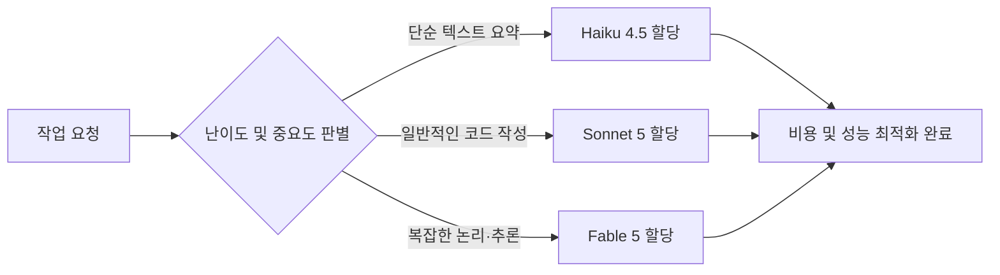

7월 13일, 클로드(Claude) 최상위 모델 Fable 5의 무료 혜택 연장 기간이 끝나며 철저한 종량제 과금기가 돌아가기 시작한다. 생성형 AI 시장은 이제 정액제 뷔페 모델을 사실상 종료하고, 모든 사용량에 비용을 매기는 '지능의 계량기 시대'로 진입했다.

> **핵심 요약**
> AI 지능이 단순한 소매 단계를 넘어 소비자·기업 전 층위에서 철저한 토큰 미터기 방식으로 판매되기 시작했다. 이는 폭주하는 에이전트 속도를 감당하기 위한 불가피한 조치이며, 향후 작업별 알맞은 모델을 배분하는 라우팅 역량이 생존의 핵심이 될 것이다.

 

### 지능의 계량기 시대 진입

지능의 계량기 시대란, AI 모델을 이용할 때 데이터 처리량인 토큰 단위로 철저하게 과금하는 비용 구조를 뜻한다.

과거 월 20달러면 무제한으로 AI를 부리던 낭만의 시기가 저물고 있다. 앤트로픽(Anthropic)을 위시한 주요 AI 기업들이 과금 정책을 대대적으로 개편했다.

소비자 구독부터 기업용 워크스페이스, 하이퍼스케일러 인프라에 이르기까지 전 층위에서 지능이 계량기로 팔리기 시작했다.

 

### 전방위적 토큰 과금 전환과 시장의 반발

앤트로픽은 최근 엔터프라이즈와 개인 요금제 전반에 걸쳐 토큰 미터기 방식을 전면 적용했다. 아래 가격표를 보면 비용 청구가 모델 성능에 따라 얼마나 세밀하고 가파르게 설계되었는지 알 수 있다.

| 모델 등급 | 특징 | 입력 / 출력 단가 (백만 토큰당) |
| :--- | :--- | :--- |
| Fable 5 | 현행 최고가 모델 | $10 / $50 |
| Opus 4.8 | 이전 세대 최고가 | $5 / $25 |
| Sonnet 5 | 인트로 요금 | $2 / $10 |
| Haiku 4.5 | 빠르고 저렴한 모델 | $1 / $5 |

이 추세라면 모델이 고도화될수록 기업들의 토큰 지출액은 상상을 초월하지 않을까 싶다. 

실제로 Fable 5는 7월 12일까지만 연장된 무료 혜택을 제공하고, 13일부터는 백만 토큰당 10달러의 크레딧을 온전히 소진해야만 접근할 수 있다. 기업 요금제 역시 지난 4월부터 시트 정액제에서 토큰 종량제와 월 지출 커밋을 결합한 구조로 강제 전환되었다.

시장의 반발은 거세다. 아마존조차 내년부터 앤트로픽과의 계약이 컴퓨팅 시간 기준에서 토큰 기반으로 바뀌자 비용 상승을 우려하며 오픈AI 등 대안을 알아보고 있다. 팔란티어 CEO 알렉스 카프(Alex Karp)는 방송에서 토큰 과금 모델에 대해 "뭔가 완전히 잘못됐다"며 기업이 충분한 가치 회수 없이 과도한 비용을 지불하고 있다고 비판했다.

 

### 무제한 요금제 붕괴의 구조적 한계

그렇다면 왜 AI 기업들은 시장의 반발을 무릅쓰고 정액제를 포기하는 것일까? 이유는 사람의 속도에 맞춰진 요금제가 기계의 속도를 물리적으로 감당할 수 없기 때문이다.

이를 식당에 비유할 수 있다. 사람이 포크로 떠먹는 무한리필 뷔페는 식당에 이윤이 남는다. 하지만 로봇이 덤프트럭을 끌고 와서 1초에 수백 접시씩 음식을 쓸어 담는다면 식당은 금방 파산할 것이다.

제드(Zed) 인더스트리스의 계산에 따르면, 기존의 구독 모델은 API 단가 대비 AI 에이전트(프로그래매틱) 사용을 무려 15~30배나 보조하고 있었다. 즉, 플랫폼 입장에서는 막대한 컴퓨팅 적자를 막기 위해 뷔페 문을 닫고 미터기를 달 수밖에 없었을 것이다.

개인적으로 기존의 무제한 요금제가 에이전트의 폭주를 버티지 못하고 무너지는 것은 당연한 수순으로 보인다. 

물론 내 예상과 다르게 칩셋 기술 혁신으로 컴퓨팅 비용이 획기적으로 낮아질 수도 있겠지만, 당분간은 촘촘한 계량기 체제가 굳어질 것 같다.

 

### 미래의 핵심 경쟁력: 지능 라우팅(Routing) 역량

이어서 우리가 고민해야 할 지점은 비용 방어 대안이다. 지능 라우팅(Routing)이란 작업의 종류와 난이도를 판별해 가장 적합하고 가성비 좋은 AI 모델(지능)을 선택적으로 배분하는 기술을 뜻한다.

간단한 문서 번역에 가장 비싼 Fable 5를 쓰는 것은 동네 슈퍼에 가는데 대형 화물 트럭을 모는 것과 같다. 어쨌든 모든 지능에 과금이 되는 환경에서는, 효율적인 지능 배분 역량이 개인과 기업의 가장 중요한 비용 통제 무기가 될 것으로 보인다.

도입부에서 언급한 지능의 소매 시대를 넘어, 이제는 정교한 통제와 배분이 성패를 가르는 진정한 최적화의 단계로 진입했구나 싶다.

 

### 결론

결국 토큰 기반 과금 체계로의 전환은 피할 수 없는 시대적 흐름이다. 앞으로의 AI 활용은 단순히 '얼마나 많이' 쓰느냐를 넘어, 작업을 최적화하고 알맞은 지능을 배치하는 치밀한 전략에 의해 성패가 좌우될 것이다.

 

**한줄 코멘트.**
무제한 뷔페식 지능의 시대는 끝났고, 이제는 전구의 용도에 맞춰 전력을 조절하듯 AI를 계량해 쓰는 자가 살아남는다.

참고 자료 (6) — Forbes · Claude Platform Docs · IT Brief · The Next Web · CNBC · Zed Industries

<ul>
<li><a href="https://www.forbes.com/sites/sandycarter/2026/07/07/claude-fable-5-extends-by-five-more-days-10-moves-to-make-now/">Claude Fable 5 Extends By Five More Days</a> — Forbes, 2026-07-07</li>
<li><a href="https://platform.claude.com/docs/en/about-claude/pricing">Pricing</a> — Claude Platform Docs</li>
<li><a href="https://itbrief.news/story/anthropic-shifts-enterprise-billing-to-token-based-pricing">Anthropic shifts enterprise billing to token-based pricing</a> — IT Brief</li>
<li><a href="https://thenextweb.com/news/amazon-anthropic-token-pricing-openai-alternative">Amazon’s new token-based pricing deal</a> — The Next Web</li>
<li><a href="https://www.cnbc.com/2026/07/01/palantir-karp-open-ai-anthropic-tokens.html">Palantir's Karp on OpenAI, Anthropic tokens</a> — CNBC, 2026-07-01</li>
<li><a href="https://zed.dev/blog/anthropic-subscription-changes">Anthropic Subscription Changes</a> — Zed Industries</li>
</ul>

