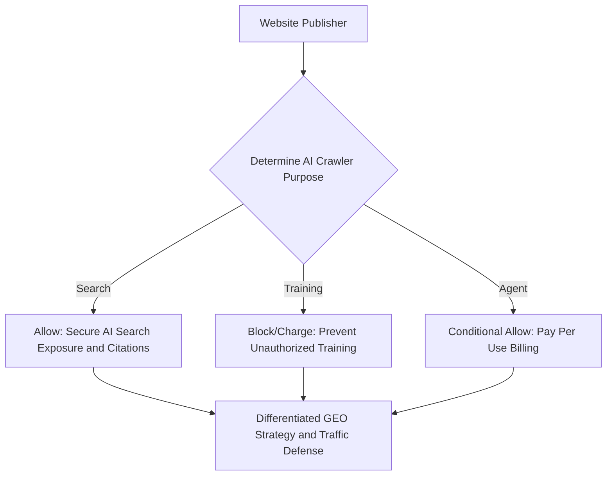

Based on actual measured data from May to June 2026, Anthropic's crawl-to-refer ratio reached approximately 4,580:1, while Google recorded about 5:1. This shows that the implicit exchange ratio of "free content provision for traffic compensation" that has sustained the web for the past 30 years has finally completely collapsed.

> A new economic order is opening up where strict metered billing is applied to both the inlet where AI models suck in data and the outlet where they emit intelligence. As the value of general-purpose knowledge declines, it seems that human's unique primary experiences and direct referral paths will be the only survival moats for long-tail publishers.

## The End of the Free Web and the Rise of Private Regulators

Websites no longer open their doors for free to AI bots that do not return traffic. As the implicit deal broke down, infrastructure companies, rather than laws or governments, stepped to the forefront.

Cloudflare surprisingly introduced a tripartite classification of crawler purposes and billing options on July 1, 2026.

Bots are now managed by being classified into Search (search citations), Agent (user proxy tasks), and Training (model training). Notably, starting September 15, 2026, Training and Agent crawlers will be blocked by default on ad-serving pages of newly onboarded domains. Web infrastructure providers are writing new rules as de facto private regulators before government regulations can reach them.

Looking at actual traffic contributions, these blocking measures are inevitable. As of May 2026, the combined web referral share of AI chatbots accounted for a mere 0.29% of total measurable traffic. If this trend continues, one might wonder if a structural starvation will occur where AI starves original content creators to death.

Who can actually put a fair value on content? 

Ultimately, it seems to be a trend where CDN providers, who control bots at the network edge, are laying down collective negotiation rails and billing infrastructure.

## The Meter of Intelligence: Tollbooths Erected on Both Input and Output Ends

This shift means that cost control mechanisms are being erected on both ends: the websites producing content (input) and the customers using AI (output).

| Billing Area | Before Change (Past) | After Change (Present/Future) | Core Infrastructure & Technical Standards |
| :--- | :--- | :--- | :--- |
| **Output Side (AI Intelligence)** | Unlimited subscription-based (human speed basis) | Token-based pay-as-you-go billing (machine speed basis) | APIs, Enterprise pay-as-you-go |
| **Input Side (Web Content)** | Free crawling and traffic compensation | Purpose-based bot blocking and licensing fees | RSL 1.0, x402 payment protocol |

In any case, unlimited data plans cannot withstand the speed of machines. 

The transition of the billing model for intelligence is like a restaurant changing from an all-you-can-eat buffet to a conveyor belt sushi restaurant that charges per plate. This is because a buffet pricing plan designed around human consumption capacity cannot handle AI agents that devour tens of thousands of plates in an instant.

On the input side of the web, clear price tags have begun to be attached to content, which used to be a free raw material. Large media outlets are exercising individual negotiating power, much like News Corp signing a 5-year, $250 million deal with OpenAI.

Meanwhile, a new technical standard has emerged for long-tail publishers. RSL (Really Simple Licensing) 1.0 is a standard that extends robots.txt to specify machine-readable content licensing pricing models such as subscriptions, pay-per-crawl, and pay-per-inference. More than 1,500 organizations, including the Associated Press, have stepped forward to assert their data rights by supporting this standard.

## Seismic Shifts in Discovery Infrastructure and the Publisher's Dilemma

In the same vein, the web's discovery infrastructure is undergoing a fundamental seismic shift. Cloudflare created 'Content Signals', an extension of robots.txt, to specify how AI uses content as use=immediate (immediate answers), reference (citations), and full (full text utilization).

This is where the dilemma for small and medium-sized publishers arises. If they allow crawls for training, they are exploited for free, but if they block them all, they face a high risk of being excluded even from the answers or citation sources of AI search engines.

In other words, a sophisticated GEO (Generative Engine Optimization) strategy has become essential, allowing search (citation) crawls to seize even narrowed exposure opportunities while blocking training crawls to prevent unpaid exploitation. Cloudflare is even preparing a 'Pay Per Use' model that combines the x402 protocol with stablecoins to charge not when a bot reads a page, but when the content actually creates value.

## Irreplaceable Value: Uniqueness, Experience, and Curation

Consequently, we must consider qualitative changes in content. The value of general-purpose information that AI can easily summarize and reprocess is rapidly converging to zero.

What will stand out in the future is irreplaceable uniqueness. Primary data such as first-hand accounts of failure, context only applicable within specific communities, and actual measured metrics obtained from operating systems cannot be easily fabricated by AI. Curation that involves human judgment—even just choosing a single link with a reason why this article should be read right now—remains scarce.

Personally, I believe the unique value of primary data held by my own channels or sites will command a premium over time. 

Of course, this outlook could also be completely wrong. This is because technological advancements might reach a level where they perfectly mimic even clumsy human nuances and personal anecdotes.

However, the era of harvesting traffic solely by relying on search engines is definitely coming to an end. Simply checking the boxes for excellent SEO or AEO (AI Answer Optimization) is not enough. You must secure independent discovery paths outside the search box, such as newsletters, social sharing, and user communities like GeekNews or Hacker News. The time has come for a direct, new alliance with readers to replace the broken implicit deal mentioned earlier.

## One-Line Comment.

The way for a website to survive in the age of intelligence is to hold the roster of true regular customers who will open the door and walk in on their own without going through the machine's meter.

References (6) — SEOmator · Cloudflare Blog · Technology Checker · TechCrunch · Press Gazette · Search Engine Land

<ul>
<li><a href="https://seomator.com/blog/crawl-to-refer-ratio-ai-crawlers-llm-bots">Measured crawl-to-refer ratio, May-June 2026</a> — SEOmator</li>
<li><a href="https://blog.cloudflare.com/content-independence-day-ai-options/">Cloudflare announces bot classification and default blocking policies</a> — Cloudflare Blog, 2026-07-01</li>
<li><a href="https://technologychecker.io/blog/search-engine-market-share">Combined referral traffic metrics of AI chatbots</a> — Technology Checker, 2026-05</li>
<li><a href="https://techcrunch.com/2026/07/01/cloudflares-new-policy-pushes-ai-companies-to-pay-for-publishers-content/">Pay Per Use billing and initial partners</a> — TechCrunch, 2026-07-01</li>
<li><a href="https://pressgazette.co.uk/platforms/news-publisher-ai-deals-lawsuits-openai-google/">News Corp and OpenAI licensing deal</a> — Press Gazette</li>
<li><a href="https://searchengineland.com/really-simple-licensing-461834">1,500+ organizations support RSL standard</a> — Search Engine Land</li>
</ul>

## TL;DR
# Two-Way Tollbooths in the AI Era: The Collapse of the Web's Free Trade and Survival Strategies Based on actual measured data from May to June 2026, Anthropic's crawl-to-refer...

- Intent: how_to
- Core topics: AI, web crawling, traffic compensation

## Quick Answers
### Who can actually put a fair value on content?
Ultimately, it seems to be a trend where CDN providers, who control bots at the network edge, are laying down collective negotiation rails and billing infrastructure.

## Next Step
Keep going with related deep dives on this topic.
- Quality gates: unique-angle, clear-structure, source-attribution-if-needed, readability-pass
