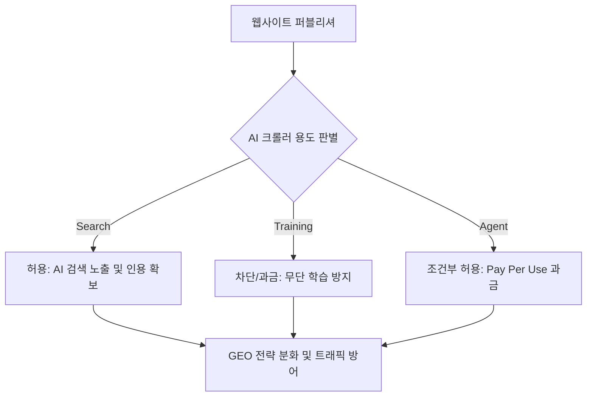

2026년 5~6월 실측 데이터 기준, 앤트로픽의 크롤-유입 비율(crawl-to-refer ratio)은 약 4,580:1에 달하지만 구글은 약 5:1을 기록했다. 지난 30년간 웹을 지탱해온 '콘텐츠 무상 제공과 트래픽 보상'이라는 암묵적 교환비가 마침내 완전히 붕괴했음을 보여준다.

> AI 모델이 데이터를 빨아들이는 입구와 지능을 내뿜는 출구 모두에 철저한 계량 과금이 적용되는 새로운 경제 질서가 열리고 있다. 범용 지식의 가치가 하락하는 가운데, 인간의 고유한 1차 경험과 직접적인 유입 경로만이 롱테일 퍼블리셔의 유일한 생존 해자가 될 것으로 보인다.

## 무료 웹의 종말과 사적 규제자의 등장

웹사이트들은 더 이상 트래픽을 돌려주지 않는 AI 봇들에게 무상으로 문을 열어두지 않는다. 암묵적 거래가 깨지자, 법이나 정부가 아닌 인프라 기업이 전면에 나섰다.

클라우드플레어, 2026년 7월 1일 크롤러 3대 용도 분류 및 과금 옵션 전격 도입.

이제 봇들은 Search(검색 인용), Agent(사용자 대리 작업), Training(모델 훈련)으로 나뉘어 관리된다. 특히 2026년 9월 15일부터 신규 온보딩되는 도메인의 광고 게재 페이지에서는 Training과 Agent 크롤러가 기본적으로 차단된다. 정부의 규제가 닿기 전에 웹 인프라 사업자가 사실상의 사적 규제자로서 새로운 규칙을 쓰고 있는 것이다.

실제 트래픽 기여도를 보면 이런 차단 조치는 필연적이다. 2026년 5월 기준 AI 챗봇들의 합산 웹 유입(referral) 비중은 전체 측정 가능 트래픽의 0.29%에 불과했다. 이 추세라면 AI가 콘텐츠 원작자를 굶겨 죽이는 구조적 고사가 일어나지 않을까 싶다.

과연 누가 콘텐츠에 정당한 가치를 매겨줄 수 있을까? 

결국 네트워크 앞단에서 봇을 통제하는 CDN 사업자가 집단 협상 레일과 과금 인프라를 깔아주는 흐름으로 보인다.

## 지능의 계량기: 입출력 양단에 세워지는 요금소

이러한 변화는 콘텐츠를 생산하는 웹사이트(입력)와 AI를 사용하는 고객(출력) 양단 모두에 비용 통제 장치가 세워지고 있음을 뜻한다.

| 과금 영역 | 변화 이전 (과거) | 변화 이후 (현재/미래) | 핵심 인프라 및 기술 표준 |
| :--- | :--- | :--- | :--- |
| **출력측 (AI 지능)** | 구독 기반 무제한 (사람 속도 기준) | 토큰 기반 종량 과금 (기계 속도 기준) | API, 엔터프라이즈 종량제 |
| **입력측 (웹 콘텐츠)** | 무상 크롤링 및 트래픽 보상 | 용도별 봇 차단 및 라이선스 과금 | RSL 1.0, x402 결제 프로토콜 |

어쨌든, 무제한 요금제는 기계의 속도를 견디지 못한다. 

지능의 과금 모델 전환이란 마치 식당이 무제한 뷔페식에서 접시당 과금하는 회전초밥집으로 바뀌는 것과 같다. 사람의 식사량을 기준으로 짠 뷔페 요금제는 순식간에 수만 접시를 먹어 치우는 AI 에이전트를 감당할 수 없기 때문이다.

웹의 입력측에서도 공짜 원료였던 콘텐츠에 명확한 가격표가 붙기 시작했다. 뉴스 코프(News Corp)가 오픈AI와 5년 2억 5천만 달러 규모의 딜을 맺은 것처럼 대형 매체는 개별 협상력을 발휘한다.

한편 롱테일 퍼블리셔들을 위해서는 새로운 기술 표준이 등장했다. RSL(Really Simple Licensing) 1.0이란 robots.txt를 확장하여 구독, pay-per-crawl, pay-per-inference 등 기계가독 형태의 콘텐츠 라이선스 가격 모델을 명시하는 표준이다. AP통신 등 1,500개 이상 기관이 이 표준을 지지하며 데이터 권리를 주장하고 나섰다.

## 발견 인프라의 지각변동과 퍼블리셔의 딜레마

같은 맥락에서 웹의 발견 인프라도 근본적인 지각변동을 겪고 있다. 클라우드플레어는 robots.txt를 확장한 'Content Signals'를 신설해, AI의 콘텐츠 활용 방식을 use=immediate(즉시 답변), reference(인용), full(전문 활용)로 명시하도록 했다.

여기서 중소규모 퍼블리셔의 딜레마가 발생한다. 훈련용 크롤을 허용하자니 무상으로 착취당하고, 모두 차단하자니 AI 검색 엔진의 답변이나 인용 출처에서마저 배제될 위험이 큰 것으로 보인다.

즉, 검색(인용) 크롤은 허용해 좁아진 노출 기회라도 챙기고, 훈련용 크롤은 차단해 무상 착취를 막는 정교한 GEO(생성형 엔진 최적화) 전략이 필수가 된 것이다. 클라우드플레어는 x402 프로토콜과 스테이블코인을 결합해 봇이 페이지를 읽을 때가 아니라 콘텐츠가 실제 가치를 만들 때 과금하는 'Pay Per Use' 모델까지 준비하고 있다.

## 대체 불가능한 가치: 고유성, 경험, 그리고 큐레이션

이어서 우리는 콘텐츠의 질적 변화를 고민해야 한다. AI가 쉽게 요약하고 재가공할 수 있는 범용 정보의 가치는 급격히 0에 수렴하고 있다.

앞으로 돋보이게 될 것은 대체 불가능한 고유성이다. 직접 겪은 실패담, 특정 커뮤니티에서만 통용되는 맥락, 시스템을 운영하며 얻은 실측 수치 같은 1차 데이터는 AI가 쉽게 지어낼 수 없다. 링크 하나를 고르더라도 왜 지금 이 글을 읽어야 하는지 사람의 판단이 들어간 큐레이션은 여전히 희소하다.

개인적으로, 내 채널이나 사이트가 가진 1차 데이터의 고유한 가치는 시간이 지날수록 프리미엄이 붙을 것 같다. 

물론 이런 전망도 완전히 틀릴 수 있다. 기술의 발전이 사람의 서툰 뉘앙스와 경험담마저 완벽히 모방하는 수준에 이를지도 모르기 때문이다.

다만, 검색 엔진에만 의존해 트래픽을 수거하던 시대는 확실히 저물고 있다. 훌륭한 SEO나 AEO(AI 답변 최적화) 체크리스트를 채우는 것만으로는 부족하다. 뉴스레터, 소셜 공유, 긱뉴스나 해커뉴스 같은 사용자 커뮤니티 등 검색창 바깥의 독자적 발견 경로를 확보해야만 한다. 초반에 언급했던 무너진 암묵적 거래를 대체할, 독자와의 직접적이고 새로운 연대가 필요한 때가 도래했다.

## 한줄 코멘트.

지능의 시대에 웹사이트가 살아남는 법은, 기계의 계량기를 거치지 않고도 스스로 문을 열고 들어올 진짜 단골손님의 명부를 쥐는 일이다.

참고 자료 (6) — SEOmator · Cloudflare Blog · Technology Checker · TechCrunch · Press Gazette · Search Engine Land

<ul>
<li><a href="https://seomator.com/blog/crawl-to-refer-ratio-ai-crawlers-llm-bots">2026년 5~6월 실측 크롤-유입 비율</a> — SEOmator</li>
<li><a href="https://blog.cloudflare.com/content-independence-day-ai-options/">Cloudflare 봇 분류 및 기본 차단 정책 발표</a> — Cloudflare Blog, 2026-07-01</li>
<li><a href="https://technologychecker.io/blog/search-engine-market-share">AI 챗봇 합산 referral 트래픽 지표</a> — Technology Checker, 2026-05</li>
<li><a href="https://techcrunch.com/2026/07/01/cloudflares-new-policy-pushes-ai-companies-to-pay-for-publishers-content/">Pay Per Use 과금 및 초기 파트너</a> — TechCrunch, 2026-07-01</li>
<li><a href="https://pressgazette.co.uk/platforms/news-publisher-ai-deals-lawsuits-openai-google/">News Corp 및 OpenAI 라이선싱 딜</a> — Press Gazette</li>
<li><a href="https://searchengineland.com/really-simple-licensing-461834">RSL 표준의 1,500개 기관 지지</a> — Search Engine Land</li>
</ul>

