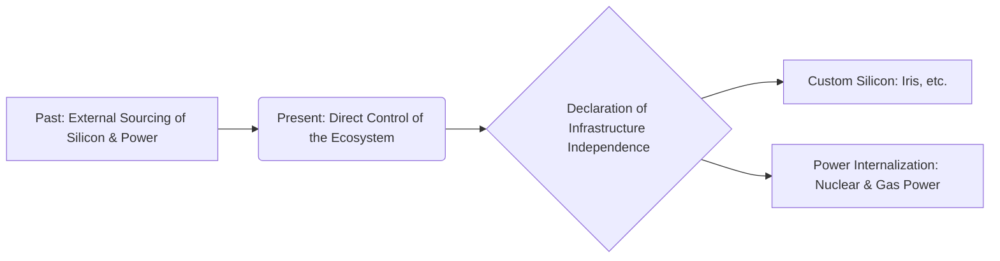

We are now in an era where a single refrigerator-sized AI server rack consumes the peak power of 65 households combined. The future supremacy of the AI industry seems to depend not on the volume of GPUs secured, but on how quickly and reliably massive amounts of power can be sourced.

> **Key Takeaways**
> The bottleneck for AI expansion has completely shifted from the semiconductor supply chain to power infrastructure.
> Extreme mismatches in infrastructure deployment speeds will determine the competitiveness of tech companies in the coming years.
> South Korea, simultaneously experiencing the benefits of HBM and a poverty of power grids, stands at a critical crossroads amid this massive flow of capital.

## A Paradigm Shift: 'Power' as the New Bottleneck of Intelligence

The 'bottleneck of intelligence' refers to the most fatal constraint preventing the physical expansion of AI models. Over the past three years, this bottleneck was unequivocally the chip, and the amount of GPUs secured directly dictated the pace of the entire semiconductor supply chain.

Now, that era is coming to an end. The new constraint on AI infrastructure expansion appears to have completely shifted to power facilities.

The core of the problem lies in the severe mismatch of infrastructure deployment speeds. A data center is typically built and fully operational within 18–24 months. However, the wait time for grid connection to feed power into those facilities ranges from 7–10 years—and up to 13 years in some cases—across major US and European hubs, while the average lead time for large transformers has already exceeded 128 weeks.

The paradox of having fully constructed buildings with no electricity flowing in—this is the bare reality of current AI infrastructure.

## Exploding Demand and the Energy Jevons Paradox

The slope of the demand curve is dizzyingly steep. Confronting such a phenomenon calls for a highly intuitive, everyday analogy. It is exactly like when fuel efficiency doubles, but people drive four times as much, causing total fuel consumption to skyrocket instead.

Why doesn't the total power consumption decrease when efficiency improves so much? It is because people constantly demand much heavier and more complex tasks, such as video generation, long-context reasoning, and agentic workloads. These tasks consume hundreds to thousands of times more energy than simple text responses.

Regarding power consumption, we must pay attention to the massive shift in demand across global infrastructure. At this rate, it feels as though the Earth's surplus electricity will dry up entirely in the near future.

According to the IEA, global data center power consumption is expected to nearly double from 485 TWh in 2025 to around 950 TWh in 2030, accounting for about 3% of total global electricity. In particular, the power consumption of AI-specialized data centers will triple over the same period.

Despite the energy per AI task improving by more than 10x every year, the total volume continues to explode—a textbook example of the Jevons paradox.

## Hyperscalers Becoming Power Companies and Declaring Infrastructure Independence

Big tech companies, unable to wait blindly for grid connections, have ultimately chosen the path of becoming power companies themselves. This is not a metaphor; they are literally buying and building power plants. Securing power has inherently become a core competitive advantage.

They seem to be stopping at nothing to reduce their reliance on transmission grids. As of May 2026, nuclear power deals by hyperscalers have exceeded 13 transactions and 9.8 GW. Microsoft has moved to restart the Three Mile Island nuclear plant by signing a 20-year PPA for 835 MW, while Meta and Amazon are also aggressively scooping up massive amounts of nuclear power.

Alongside the internalization of power, attempts to reduce reliance on external silicon are also intensifying. A prime example is Meta, which, in collaboration with Broadcom and TSMC, is beginning full-scale production of its custom AI chip 'Iris' starting this September.

Surging investments in on-site gas power generation and large-scale battery energy storage systems (BESS) alongside nuclear power fall into the same context. To prevent extreme data center load swings that exceed 50% per second, an estimated 20–25 GW of battery storage alone is expected to be deployed by 2030.

The most extreme example of pushing this approach to the limit is xAI. Colossus 1 in Memphis operates on a dedicated 150 MW substation completed in early 2025, hooked up to approximately 156 Tesla Megapacks (150 MW backup). With the installation of the dedicated substation, gas turbine usage was cut in half. The subsequent Colossus 2 targets gigawatt scale right out of the gate. In a joint venture with Solaris Energy, they plan to expand captive gas turbines, including seven 35 MW units in Southaven, and bring in an additional 168 Megapacks, ramping up to a total of over 1.1 GW by Q2 2027.

If a nuclear PPA is a method of locking in someone else's power plant through a long-term contract, this approach skips the grid queue entirely by directly building generation facilities and substations. Although the means differ, the destination is the same: they will not leave their power supply to someone else's timetable.

## The Movement of Capital: Investments Heading for the Bottleneck and Selective Market Revaluation

The capital expenditure (CAPEX) of hyperscalers has already breached a critical threshold. It surpassed $400 billion in 2025 and is projected to increase by another 75% in 2026. The combined investments of the top five tech companies now exceed global investments in oil and gas production.

Massive capital always tends to flow toward the narrowest chokepoints in the supply chain. If this trend continues, we will likely see an extended period of unprecedented earnings surprises from infrastructure equipment companies.

As of Q1 2026, GE Vernova's gas turbine backlog reached a staggering 100 GW. With data centers sweeping up $2.4 billion worth per quarter, gas turbine orders surged by 70% in 2025 alone. The price of new gas turbines is expected to soar to $600 per kW by the end of 2027. 

However, the financial market is not lifting the entire energy sector indiscriminately. It is strictly filtering and revaluing only those entities that prove their performance with hard numbers, such as gas turbines, power equipment, and nuclear startups intertwined with this demand.

| Category | Market Valuation Method | Representative Beneficiaries |
| :--- | :--- | :--- |
| **Bottleneck (Chokepoint)** | High margins permitted, performance-based revaluation | Power equipment, gas turbines, HBM, nuclear power |
| **Non-Bottleneck (Commodity)** | Treated as simple utilities, limited upside | General energy sector, simple applied software |

In any case, the festival where everything went up is over, shifting into a market where only stocks with proven earnings survive.

Where there is a bottleneck, there is a margin; where there is no bottleneck, things are merely reduced to ordinary utilities.

## The South Korean Market's Dilemma: Coexistence of Memory Benefits and Grid Risks

Meanwhile, amid this global infrastructure upheaval, South Korea faces two extreme sides simultaneously.

When power becomes the bottleneck, the standard of competition shifts. It is no longer about 'how fast it is,' but rather 'how much can be processed with the same power'—namely, performance per watt (power efficiency). Memory is crucial here because moving data consumes more power than the computation itself. Power is drawn every time data is fetched from off-chip memory, but HBM (High Bandwidth Memory) sits directly next to the compute chip, delivering high bandwidth over short distances to cut down those data movement costs. It acts as a lever to boost throughput per watt under a fixed power ceiling. This is exactly where South Korea is identified as a clear beneficiary.

The HBM shortage, which solidified over the past six months, is projected to last until at least the end of 2027. Clients are clamoring to double their orders for legacy DRAM as well as HBM, locking in multi-year Long-Term Agreements (LTAs) with fixed pricing or no upper/lower limits.

However, the fatal risk remains the power grid. The electricity required for the Yongin Semiconductor Cluster—combining Samsung Electronics' 15 GW and SK Hynix's 6.3 GW—is equivalent to more than 10 nuclear power plants, and this power must be drawn from outside the greater Seoul metropolitan area.

The true bottleneck here is not generation, but transmission. No matter where power plants are built, transporting that electricity to the cluster requires ultra-high voltage transmission grids and substations, which typically take over 10 years to construct. The exact same structural issue of grid connection delays seen earlier in the US and Europe is repeating in South Korea. The pace of building factories and the pace of delivering electricity operate on completely different timetables from the start.

Looking at the numbers brings the landscape into sharp focus. According to data from the Korea Data Center Council, 72.9% of the 85 private data centers are concentrated in the metropolitan area (as of 2024, a 3.4 percentage point decrease from 76.3% in 2022). Yet, what is more important than the number of facilities is the power. Based on the Ministry of Trade, Industry and Energy's 'Plan to Mitigate Data Center Concentration in the Metropolitan Area', 70% of data center power demand is clustered in the greater Seoul area, and this share will balloon into the 80% range by 2029.

However, the electricity required to meet that demand is simply not being approved. According to a tally by KHARN, a magazine specializing in HVAC, renewable energy, and green building, only 1.9% of power supply applications for metropolitan data centers received final approval based on the number of requests. This means that while demand rushes to the metropolitan area, the power supply there remains choked off.

Of course, they aren't just sitting idle. South Korea enacted the Special Act on the Expansion of the National Power Grid in March 2025 and implemented it in September of that year. Subsequently, the first National Power Grid Expansion Committee, chaired by the Prime Minister, designated 99 transmission line and substation projects as part of the national power grid, 10 of which are specifically for supplying power to high-tech strategic industries. The goals are a West Coast Energy Highway in the 2030s and a U-shaped Energy Highway in the 2040s.

What is noteworthy is that this is a transmission plan, not a generation plan. As pointed out earlier, South Korea's bottleneck was not power generation but power transmission, so the target itself is accurate. It is an attempt to compress a timetable that used to take more than a decade through legal and administrative exemptions.

If one axis is sending power to where demand is, the other axis runs in the opposite direction: moving demand to where the power is. Recent regional clusters are heading exactly in that direction.

A National AI Computing Center will be built in Solaseado, Haenam, South Jeolla Province. A Samsung SDS consortium (including Naver Cloud, Samsung C&T, Kakao, Samsung Electronics, KT, and the South Jeolla Provincial Government) was selected as the operator, with construction starting in July 2026 and operations beginning in the second half of 2028. GPU capacity will start at 15,000 units in 2028 and expand to 50,000 by 2030. This aligns with Samsung Group's 425 trillion won investment plan targeting the Honam region. The big picture links Gwangju as a semiconductor production hub and Haenam as a massive 210 MW AI data center.

Ulsan follows the same logic. SK Telecom and AWS are building a 103 MW AI data center in the Mipo National Industrial Complex. With an investment of around 7 trillion won, it is the largest facility outside the metropolitan area, capable of housing 60,000 GPUs, and both companies envision expanding this capacity to the gigawatt scale.

The common denominator in both cases is the logic behind the location. Even though talent and demand are concentrated in the metropolitan area, the data centers are heading to Haenam and Ulsan. It is because the electricity is there. The exact same forces that prompted hyperscalers to move next to nuclear power plants and gas fields have begun to operate domestically. Power dictates location.

Meanwhile, the load itself that needs to be accommodated keeps growing. In late July 2026, Naver, along with Nvidia and Brookfield, pushed forward an estimated 14 trillion won domestic AI data center, pitching it as Asia's largest AI computing hub ([The Korea Pulse](https://pulse.koreasignals.com/posts/naver-bets-on-an-ai-data-center-with-nvidia-and-brookfield/)). Demand, silicon, and capital have been aligned through this combination, but the remaining variable is no different from the previous two cases: where and when they will draw the electricity to handle that load.

Nevertheless, there remain concerns about whether this massive power grid risk can be resolved in time. It is a deformed situation for a country that makes its money from semiconductors to fail at adequately supplying the electricity needed to run them at full speed. In July 2026, semiconductor exports reached $41 billion, exceeding $40 billion for the second consecutive month and surpassing 40% of the month's total exports ([The Korea Pulse](https://pulse.koreasignals.com/posts/chips-carry-korea-july-semiconductor-exports-hold-above-41-billion/)), yet the electricity for the clusters producing those exports is stuck on a 10-year transmission timetable.

The key is not the plan, but the speed of execution. Designation and breaking ground are different, and breaking ground and completion are different again. If the 99 projects can actually accelerate the timetable, these concerns will be proven wrong—which, in itself, would be welcome news.

## One-Line Comment.

Ultimately, the game tilts not toward whoever bought the chips first, but whoever secured the electricity to run them first. The upper limit of intelligence is no longer defined by semiconductor nodes, but by the power grid.

References (18) — IEA · Enline Energy · Dev Sustainability · mGrid · Power Engineering · SMR Intel · Data Center Dynamics · Introl · SemiAnalysis · Financial News · KHARN · National Law Information Center · Ministry of Climate, Energy, and Environment · Daum News · AI Times · Financial Today · Maeil Shinmun

<ul>
<li><a href="https://www.iea.org/reports/key-questions-on-energy-and-ai/executive-summary">Key questions on energy and AI</a> — IEA</li>
<li><a href="https://enline.energy/articles/ai-data-center-grid-capacity-2026">AI Data Center Grid Capacity 2026</a> — Enline Energy</li>
<li><a href="https://www.devsustainability.com/p/ai-data-center-energy-in-2026">AI Data Center Energy in 2026</a> — Dev Sustainability</li>
<li><a href="https://mgrid.org/2026/04/22/ge-vernovas-gas-turbine-backlog-hits-100-gw-as-data-centers-drive-4-billion-in-q1-orders/">GE Vernova's gas turbine backlog hits 100 GW</a> — mGrid, Apr 22, 2026</li>
<li><a href="https://www.power-eng.com/gas/turbines/data-centers-drive-record-surge-in-ge-vernova-power-equipment-orders-as-turbine-slots-tighten-through-2030/">Data centers drive record surge in GE Vernova power equipment orders</a> — Power Engineering</li>
<li><a href="https://smrintel.com/nuclear-data-center-deals/">Nuclear Data Center Deals</a> — SMR Intel, May 2026</li>
<li><a href="https://www.datacenterdynamics.com/en/news/three-mile-island-nuclear-power-plant-to-return-as-microsoft-signs-20-year-835mw-ai-data-center-ppa/">Three Mile Island nuclear power plant to return as Microsoft signs 20-year 835MW AI data center PPA</a> — Data Center Dynamics</li>
<li><a href="https://www.fnnews.com/news/202607191820585123">Power Supply for Yongin Semiconductor Cluster Faces Uphill Battle</a> — Financial News, Jul 19, 2026</li>
<li><a href="https://www.kharn.kr/news/article.html?no=31267">Metropolitan Data Center Power Approval Rate at Mere 1.9%</a> — KHARN</li>
<li><a href="https://introl.com/blog/xai-memphis-colossus-100000-gpu-supercomputer-infrastructure">xAI Memphis Colossus: 100,000 GPU supercomputer infrastructure</a> — Introl</li>
<li><a href="https://newsletter.semianalysis.com/p/xais-colossus-2-first-gigawatt-datacenter">xAI's Colossus 2: First Gigawatt Datacenter</a> — SemiAnalysis</li>
<li><a href="https://www.datacenterdynamics.com/en/news/xai-to-deploy-telsa-megapacks-at-colossus-ii-supercomputing-site-in-memphis-tennessee/">xAI to deploy Tesla Megapacks at Colossus II supercomputing site in Memphis, Tennessee</a> — Data Center Dynamics</li>
<li><a href="https://www.law.go.kr/법령/국가기간전력망확충특별법">Special Act on the Expansion of the National Power Grid</a> — National Law Information Center</li>
<li><a href="https://www.mcee.go.kr">Press Release of the 1st National Power Grid Expansion Committee</a> — Ministry of Climate, Energy, and Environment</li>
<li><a href="https://www.imaeil.com/page/view/2024112016372361011">Deepening Concentration of Data Centers in the Metropolitan Area</a> — Maeil Shinmun, Nov 20, 2024</li>
<li><a href="https://v.daum.net/v/20260513142355990">National AI Computing Center Location Confirmed for Solaseado, Haenam; Samsung SDS Consortium Selected</a> — Daum News, May 13, 2026</li>
<li><a href="https://www.aitimes.kr/news/articleView.html?idxno=40757">Samsung Group's 425 Trillion Won Investment in Honam — Gwangju Semiconductor Hub & Haenam 210 MW AI Data Center</a> — AI Times</li>
<li><a href="https://www.ftoday.co.kr/news/articleView.html?idxno=343534">SK Telecom & AWS 103 MW AI Data Center in Ulsan Mipo</a> — Financial Today</li>
</ul>

## TL;DR
# The New Landscape of AI Infrastructure: From the Era of Chips to the Era of Power We are now in an era where a single refrigerator-sized AI server rack consumes the peak power...

- Intent: how_to
- Core topics: AI infrastructure, data center, power grid

## Next Step
Keep going with related deep dives on this topic.
- Quality gates: unique-angle, clear-structure, source-attribution-if-needed, readability-pass
