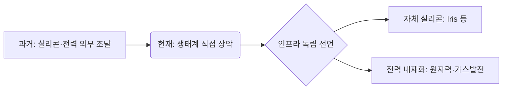

냉장고 한 대 크기의 AI 서버 랙 하나가 가구 65곳의 피크 전력을 몽땅 집어삼키는 시대다. 향후 AI 산업의 패권은 GPU 확보량이 아니라 막대한 전력을 얼마나 빠르고 안정적으로 조달할 수 있는지에 달린 것 같다.

> **핵심 요약**
> AI 확장의 병목이 반도체 공급망에서 전력 인프라로 완전히 이동했다.
> 인프라 구축 속도의 극심한 불일치가 향후 몇 년간 테크 기업의 경쟁력을 결정지을 것이다.
> HBM 수혜와 전력망 빈곤을 동시에 겪는 한국은 이 거대한 자본 흐름 속에서 중대한 기로에 섰다.

## 패러다임의 전환: 지능의 새로운 병목이 된 '전력'

'지능의 병목'이란 AI 모델의 물리적 확장을 가로막는 가장 치명적인 제약 조건을 의미한다. 지난 3년간 이 병목은 명백히 칩이었고, GPU를 얼마나 확보하느냐가 곧 반도체 공급망 전체의 속도를 통제했다.

이제 그 시대가 끝나가고 있다. AI 인프라 확장의 새로운 제약 조건은 전력 설비로 완전히 넘어간 것으로 보인다.

문제의 핵심은 인프라 구축 속도의 극심한 불일치다. 데이터센터는 보통 18~24개월이면 번듯하게 완성된다. 하지만 그곳에 전기를 밀어 넣어줄 계통 접속 대기 기간은 구미 주요 허브 기준 7~10년, 길게는 13년에 달하고, 대형 변압기 리드타임만 해도 평균 128주를 넘어선 상태다.

건물은 번듯하게 서 있는데 전기가 들어오지 않는 역설, 이것이 현재 AI 인프라의 민낯이다.

## 폭증하는 수요와 에너지의 제번스 역설

수요 곡선의 기울기는 아찔할 정도로 가파르다. 이런 현상을 마주할 때면 가장 직관적인 일상 비유가 필요하다. 자동차 연비가 2배 좋아지자 사람들이 차를 4배 더 많이 몰고 다녀서 전체 기름 소비가 오히려 폭증하는 현상과 완전히 같다.

효율이 이렇게 좋아지는데 총전력량은 왜 줄지 않을까? 사람들이 영상 생성, 장시간 추론, 에이전트 워크로드 같은 훨씬 더 무겁고 복잡한 작업을 끊임없이 요구하기 때문이다. 단순 텍스트 응답의 수백에서 수천 배 에너지를 쓰는 작업들.

전력 소모와 관련해 글로벌 인프라의 거대한 수요 이동을 주목할 필요가 있다. 이 추세라면 조만간 지구상의 잉여 전력이 싹 말라버리지 않을까 싶다. 

IEA에 따르면 글로벌 데이터센터 전력 소비는 2025년 485TWh에서 2030년 약 950TWh로 두 배 가까이 늘어 전 세계 전력의 약 3%를 차지할 전망이다. 특히 AI 특화 데이터센터의 전력 소비는 같은 기간 3배가 된다.

AI 태스크당 에너지가 매년 10배 이상씩 개선됨에도 총량이 폭증하는 교과서적 제번스 역설.

## 전력회사가 된 하이퍼스케일러와 인프라 독립 선언

그리드 접속을 무작정 기다릴 수 없는 빅테크들은 결국 스스로 전력회사가 되는 길을 택했다. 비유가 아니라 문자 그대로 발전소를 사고 짓는다. 전력 확보 자체가 핵심 경쟁력이 되어버렸기 때문이다.

이들은 송전망 의존도를 낮추기 위해 수단과 방법을 가리지 않는 것 같다. 2026년 5월 기준 하이퍼스케일러의 원자력 딜은 13건, 9.8GW를 넘어섰다. 마이크로소프트는 스리마일 아일랜드 원전 835MW를 20년 PPA로 계약해 재가동에 나섰고, 메타와 아마존 등도 대규모 원전 전력을 맹렬히 쓸어 담고 있다.

전력 내재화와 더불어 외부 실리콘 의존도를 낮추려는 시도도 거세다. 메타가 브로드컴, TSMC와 협력해 자체 AI 칩 'Iris'를 9월부터 본격 생산하는 것이 대표적.

원전뿐 아니라 현장(onsite) 가스발전과 대규모 배터리 저장장치(ESS) 투자가 급증하는 것도 같은 맥락이다. 초당 50%가 넘는 데이터센터의 극심한 부하 스윙을 막기 위해 2030년까지 배터리 저장 장치만 20~25GW가 깔릴 전망이다.

## 자본의 이동: 병목을 향하는 투자와 시장의 선별적 재평가

하이퍼스케일러의 자본 지출(CAPEX) 규모는 이미 임계점을 돌파했다. 2025년 4천억 달러를 넘어섰고 2026년에는 여기서 75%나 더 증가할 전망이다. 상위 5개 테크 기업의 투자가 전 세계 석유·가스 생산 투자를 웃도는 수준이다.

거대한 자본은 언제나 가장 좁게 막혀 있는 공급망의 초크포인트(Chokepoint)를 향해 흐르기 마련이다. 이 추세라면 인프라 설비 기업들의 전례 없는 어닝 서프라이즈가 한동안 이어지지 않을까 싶다.

2026년 1분기 기준 GE Vernova의 가스터빈 백로그는 무려 100GW 도달. 데이터센터가 분기당 24억 달러어치를 쓸어 담으며 2025년에만 가스터빈 주문이 70% 급증했다. 신규 가스터빈 가격은 2027년 말 kW당 600달러로 치솟을 전망이다. 

다만, 금융시장은 에너지 섹터 전체를 올려주진 않는다. 가스터빈, 전력기기, 그리고 수요가 맞물린 원전 스타트업 등 숫자로 실적을 증명하는 곳만 철저히 선별해 재평가하고 있다.

| 구분 | 시장의 평가 방식 | 대표적 수혜 계층 |
| :--- | :--- | :--- |
| **병목 (초크포인트)** | 높은 마진 허용, 실적 기반 재평가 | 전력기기, 가스터빈, HBM, 원전 |
| **비병목 (범용)** | 단순 유틸리티 취급, 제한적 상승 | 일반 에너지 섹터, 단순 응용 소프트웨어 |

어쨌든 모두가 오르던 축제는 끝나고, 실적이 증명되는 종목만 살아남는 장으로 바뀌고 있다.

병목이 있는 곳에 마진이 있고, 병목이 없는 곳은 그저 평범한 유틸리티로 전락할 뿐이다.

## 한국 시장의 딜레마: 메모리 수혜와 전력망 리스크의 공존

한편, 글로벌 인프라 대격변 속에서 한국은 극단적인 양면을 동시에 맞닥뜨렸다.

전력이 병목이 되면 경쟁의 기준이 옮겨간다. '얼마나 빠른가'가 아니라 '같은 전력으로 얼마나 처리하는가', 즉 전력 대비 성능(전성비)이 기준이 된다. 여기서 메모리가 결정적인 이유는 연산 자체보다 데이터를 옮기는 데 전력이 더 들기 때문이다. 칩 바깥의 메모리에서 데이터를 끌어올 때마다 전력을 쓰는데, HBM은 연산 칩에 바로 붙어 넓은 대역폭을 짧은 거리로 공급해 그 이동 비용을 줄인다. 전력 상한이 정해진 조건에서 와트당 처리량을 끌어올리는 지렛대인 셈이다. 한국이 확실한 수혜처로 꼽히는 지점이 바로 여기다.

지난 6개월간 굳어진 HBM 쇼티지는 최소 2027년 말까지 지속될 전망이다. 고객사마다 고정 가격이나 상하한선 없는 다년 공급 계약(LTA)을 맺으며 HBM은 물론 레거시 D램 주문량까지 2배씩 늘려달라고 아우성치는 상황이다.

하지만 치명적인 리스크는 역시 전력망이다. 용인 반도체 클러스터에 필요한 전력은 삼성전자 15GW와 SK하이닉스 6.3GW를 합쳐 원전 10기가 넘는 규모이고, 이걸 수도권 밖에서 끌어와야 한다.

여기서 진짜 병목은 발전이 아니라 전달이다. 발전소를 어디에 짓든 그 전기를 클러스터까지 실어 나르려면 초고압 송전망과 변전소가 있어야 하는데, 이 건설에 통상 10년 이상이 걸린다. 앞서 본 구미의 계통 접속 지연과 정확히 같은 구조가 한국에서 반복되는 것이다. 공장을 짓는 속도와 전기를 끌어오는 속도가 애초에 다른 시간표 위에 있다.

칸의 집계에 따르면 수도권 데이터센터의 전력 공급 승인률은 1.9%에 불과한데, 정작 민간 데이터센터의 73.4%가 여전히 수도권에 밀집해 있다. 수요는 수도권에 몰려 있는데 그 수요를 받아줄 전력은 거의 승인되지 않는다는 뜻이다.

개인적으로 이 거대한 전력망 리스크가 적기에 해소될지 몹시 우려스럽다. 반도체로 돈을 버는 나라가 정작 그 반도체를 쌩쌩 돌릴 전기는 제대로 대지 못하는 기형적 형국이다.

물론 틀릴 수 있다. 정부와 기업이 과거 고도성장기 수준의 이례적인 속도전을 보여준다면 말이다.

## 한줄 코멘트.

결국 AI 패권은 가장 먼저 칩을 산 자가 아니라, 냉장고 크기의 랙에 가장 먼저 전기를 꽂는 자의 몫이 될 것이다.

참고 자료 (9) — IEA · Enline Energy · Dev Sustainability · mGrid · Power Engineering · SMR Intel · Data Center Dynamics · 파이낸셜뉴스 · 칸

<ul>
<li><a href="https://www.iea.org/reports/key-questions-on-energy-and-ai/executive-summary">Key questions on energy and AI</a> — IEA</li>
<li><a href="https://enline.energy/articles/ai-data-center-grid-capacity-2026">AI Data Center Grid Capacity 2026</a> — Enline Energy</li>
<li><a href="https://www.devsustainability.com/p/ai-data-center-energy-in-2026">AI Data Center Energy in 2026</a> — Dev Sustainability</li>
<li><a href="https://mgrid.org/2026/04/22/ge-vernovas-gas-turbine-backlog-hits-100-gw-as-data-centers-drive-4-billion-in-q1-orders/">GE Vernova's gas turbine backlog hits 100 GW</a> — mGrid, 2026. 04. 22.</li>
<li><a href="https://www.power-eng.com/gas/turbines/data-centers-drive-record-surge-in-ge-vernova-power-equipment-orders-as-turbine-slots-tighten-through-2030/">Data centers drive record surge in GE Vernova power equipment orders</a> — Power Engineering</li>
<li><a href="https://smrintel.com/nuclear-data-center-deals/">Nuclear Data Center Deals</a> — SMR Intel, 2026. 05.</li>
<li><a href="https://www.datacenterdynamics.com/en/news/three-mile-island-nuclear-power-plant-to-return-as-microsoft-signs-20-year-835mw-ai-data-center-ppa/">Three Mile Island nuclear power plant to return as Microsoft signs 20-year 835MW AI data center PPA</a> — Data Center Dynamics</li>
<li><a href="https://www.fnnews.com/news/202607191820585123">용인 반도체 클러스터 전력공급 '산 넘어 산'</a> — 파이낸셜뉴스, 2026. 07. 19.</li>
<li><a href="https://www.kharn.kr/news/article.html?no=31267">수도권 데이터센터 전력공급 승인률 1.9% 불과</a> — 칸</li>
</ul>

