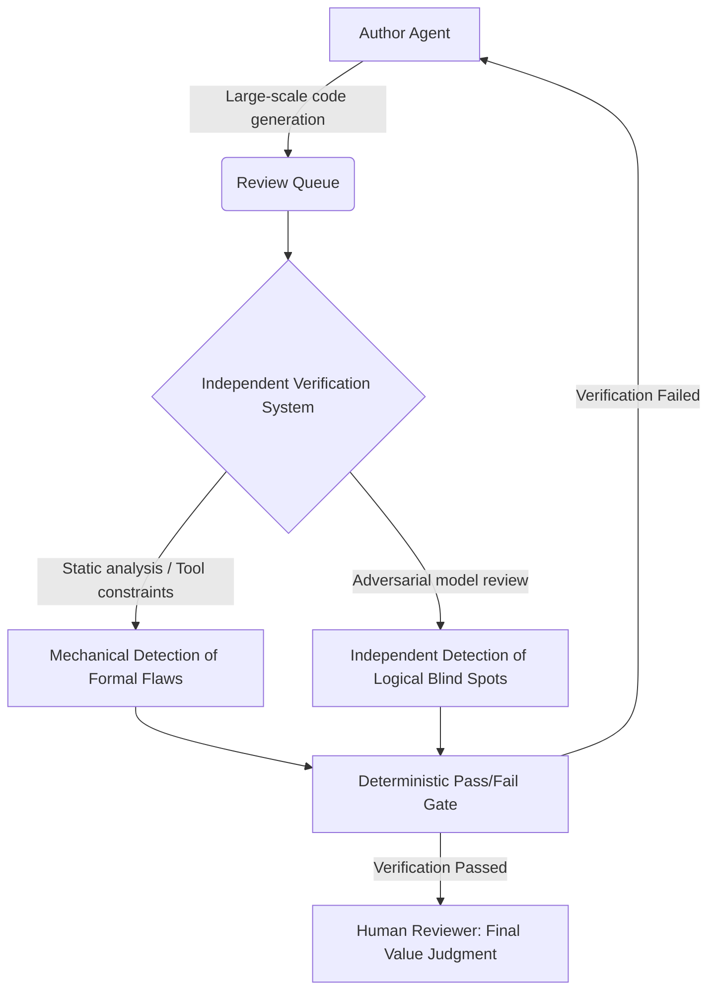

There is a clear indicator of just how severe the queue drain has become. According to Faros AI's 2026 Engineering Benchmark, AI-generated pull requests wait 4.6 times longer before a reviewer picks them up. While code pours out at machine speed, the reviewers approving it remain at human speed. In an era where generation has become free, the true bottleneck has completely shifted from 'production' to 'verification'.

> The introduction of AI agents has caused code productivity to explode, but human reviewers cannot keep up, paralyzing the queue. Code left unchecked without substantial verification accumulates as fatal security debt. Ultimately, only companies that build a harness to adversarially verify agent outputs will win the future race for execution speed.

## 1. The Liberation of Generation and the Shift of the Bottleneck

When the era of free crawling ended, tollgates appeared for data access, and when the chip supply loosened, the infrastructure bottleneck shifted to power supply. Every time a constraint on one resource is lifted, it becomes abundant, and the still-unresolved scarce resource determines the value of the entire system.

Entering the AI agent era, the framework of 'Agent = Model + Harness' has settled as the industry standard.

A harness is a constrained environment and toolset that prevents an agent from repeating a mistake once made. Thanks to this design, as the agent's execution constraints are lifted, the machine tirelessly churns out code.

Then, a problem arises. As observed by Scott Logic, as agents rapidly turn issues into solutions, pull request queues have swollen fiercely. Meanwhile, the reviewers approving that code are still human. No matter how fast the production side is improved, all time is ultimately consumed in the massive queue in front of human reviewers.

According to Little's Law, the moment the arrival rate exceeds the processing rate, the queue grows infinitely long. Review capacity cannot be easily resolved simply by increasing hiring, and the number of skilled personnel who understand the context is tightly bound to the organization's growth rate. At this rate, it seems that sooner or later, most development teams will spend more time reading AI-generated code than developing new features.

## 2. The Fatal Trap of the Verification Bottleneck: Formal Rites of Passage and the Compound Interest of Debt

In any case, once the queue exceeds its threshold, organizations seem to begin making dangerous compromises. When the review queue grows uncontrollably long, the review process tends to degenerate from a meticulous reading of the code into a procedural rite of passage without substantial verification.

According to Ventureburn statistics, 56% of developers admit they rarely review AI-generated code line-by-line, and AI code has a vulnerability density 2.7 times higher than human-written code. If a bottleneck is visible, the system gets fixed; but if it is disguised as a mere rubber-stamping rite of passage, it seems no one notices its severity.

AI-generated code looks plausible but consistently harbors specific types of flaws. Having AI iteratively fix code might improve apparent quality, but the internal structure seems to gradually collapse. There is a prime example showing just how dangerous the process of AI fixing its own code can be. In an experiment from the paper 'Security Degradation in Iterative AI Code Generation', which improved 400 samples over 40 rounds, critical vulnerabilities increased by a staggering 37.6% after just 5 iterations.

While each modification round made the code locally better, it globally accumulated unseen vulnerabilities.

Ultimately, iteration without verification seems to return not as improvement, but as a vicious compound interest of debt.

Meanwhile, data warning of the inherent risks of large-scale code generation is also intriguing. According to an AppSec Santa survey, flaws were found in 25.7% of 522 code snippets generated by major LLMs. With one in four inherently born with risks, it is a truly terrifying figure. At this rate, it seems corporate security risks will explode exponentially as the proportion of AI code increases.

## 3. The Illusion of AI Verification and System Design Principles

So, if we have another AI verify the code generated by an AI, will the bottleneck be easily resolved? Unfortunately, it doesn't seem that simple.

Naively attempting verification with a similar model seems to create a massive echo chamber. A system that evaluates itself appears to infinitely amplify its own biases. Since this is a difficult concept, let's compare it to everyday life. It's easy to understand if you think of a student grading their own math test. A formula they learned incorrectly will still be mistakenly judged as correct during grading.

A verifier sharing the same model lineage and training distribution will miss the exact same logical blind spots the creator missed. The pass signal obtained here seems not to be proof of safety, but merely an illusion of reassurance.

Therefore, the verifier likely needs to undergo an adversarial review session completely separated from the creator. The verifying model doesn't necessarily have to be larger, but its approach and tool environment must apparently be entirely different.

The paper 'Steerability via constraints' clearly demonstrates this difference. When reviewing Python code hiding 11 backdoors without constraints, the detection rate of a small model (Gemma 4 e4b) was only 54.5%. However, when given a constrained environment and around 200 lines of tools, the detection rate jumped to 90.9%.

Ultimately, verifiability is a structural property of the entire system, not the intelligence of a single model. The 'Definition-of-Done', which serves as the verification standard, must not be vague like "it works well," but rather an observable contract that a machine can determine.

## 4. The Paradigm Shift in Code Review: Automating Drudgery and Separating Judgment

In the same vein, the future review paradigm seems to be changing dramatically. If human review has thus far been about 'reading code line-by-line', going forward it appears to be shifting to 'reading an evidence package' compiled by machines. Test results, scan findings, and pre- and post-deployment shadow execution metrics make up the contents of that package.

Mechanical drudgery where pass and fail are clearly divided through deterministic gates likely must be fully automated. Humans seem poised to focus solely on value judgments—deciding "Have all necessary checks been run, and are the results acceptable in light of this product's direction?"

| Category | Traditional Review Paradigm | The New Paradigm of the Agent Era |
|---|---|---|
| **Review Target** | Line-by-line reading of human-written code | Inspecting verification evidence packages collected by machines |
| **Role Division** | Humans inspect both syntax flaws and logic | Machines detect flaws, humans judge value trade-offs |
| **Evaluation Cycle** | One-off bottleneck review at release time | Continuous observation via ongoing evaluation and shadow execution |
| **Automation Perspective** | A simple auxiliary tool for the CI/CD pipeline | Complete automation of drudgery and adversarial model-based review systems |

In fact, leading companies are already moving aggressively. Cloudflare has built its own CI-native orchestration system wrapping open-source models. In its first 30 days, they ran 131,246 AI reviews on 48,095 merge requests across 5,169 repositories, with a median cost per review of just $0.98 and a processing time of 3 minutes and 39 seconds.

The rate at which the gate was arbitrarily bypassed ('break glass') during this process was a mere 0.6%. There are also metrics showcasing the effectiveness of continuous evaluation systems. According to Thinking Inc data citing a Deloitte analysis, enterprise AI programs that introduced continuous evaluation reduced production incidents by 67% compared to one-off periodic evaluations.

However, as third-party plugins increase and the harness itself becomes a new attack surface, security audits must likely be internalized from the initial design phase. In one practical case from Generative Labs, the proportion of verification grew so large that 60% of their total token expenditure was spent on review and CI automation.

Leaving everything entirely to AI without strictly separating drudgery from judgment seems not like efficiency, but a terrible dereliction of duty.

## 5. He Who Owns Verification Dominates the Speed of Learning

Ultimately, it seems clear where organizations should pour their resources. The resources poured into verification infrastructure will likely need to be far greater than those spent on generative model capabilities. There are statistics showing the standard for efficient resource allocation. According to Daniel Keller, a 30-to-70 resource allocation ratio for generation versus verification is recommended, yet 96% of teams actually building something with LLMs are struggling to construct an evaluation framework. At this rate, I suspect teams that fail to properly build verification pipelines will be unable to handle the outpouring of code and will eventually give up on in-house development.

Generation engines seem abundantly available on the market, and their prices continue to drop. Conversely, verification capabilities tied to an organization's unique risks and domain knowledge cannot be bought externally with money. It seems the scarce capability that cannot be bought on the market is always what creates a true competitive advantage.

The fact that coding AI has advanced exceptionally faster than other fields is precisely due to its powerful verifiability—you can immediately know if code succeeds just by running it. This is also the reason Meta is achieving distinct results in its proprietary foundation model investments. They possess a massive internal verification market where trillions of ads generate real-time conversions.

Because they align and evaluate their own models through this data of overwhelming liquidity, they appear to create a distinct differentiation compared to other platform tools. Organizations with dense verification infrastructure can boldly unleash agents without fear of collapse, gathering data and innovating at a frightening pace. Conversely, organizations with lax verification seem forced to keep their agents in chains out of fear of accidents.

Personally, I suspect this polarized infrastructure gap will manifest within 2–3 years as the decisive speed difference that determines survival among companies. Of course, since it's a matter of the future, my prediction might be wrong. The only key to ending the nightmare of the queue mentioned in the introduction seems, ultimately, to be the path of directly owning a powerful verification engine.

Let me compress the entire argument into a single-line comment. Trust is a vague emotion, but verifiability can be structurally designed, and it seems only the companies that master this structure first will be able to freely press the accelerator pedal known as generative agents.

References (10) — Daniel Vaughan · Scott Logic · arXiv · arXiv · AppSec Santa · Ventureburn · Thinking Inc · Generative Labs · Cloudflare · Daniel Keller

<ul>
<li><a href="https://codex.danielvaughan.com/2026/05/24/human-review-bottleneck-code-review-strategies-agent-output/">Human Review Bottleneck: Code Review Strategies for Agent Output</a> — Daniel Vaughan, 2026-05-24</li>
<li><a href="https://blog.scottlogic.com/2026/05/14/the-human-bottleneck.html">The Human Bottleneck</a> — Scott Logic, 2026-05-14</li>
<li><a href="https://arxiv.org/abs/2607.02389">Steerability via constraints: a substrate for scalable oversight of coding agents</a> — arXiv</li>
<li><a href="https://arxiv.org/abs/2506.11022">Security Degradation in Iterative AI Code Generation</a> — arXiv</li>
<li><a href="https://appsecsanta.com/research/ai-security-statistics">AI Security Statistics</a> — AppSec Santa</li>
<li><a href="https://ventureburn.com/ai-statistics-2026-technical-performance-security-risk-business-growth-and-economic-impact/">AI Statistics 2026: Technical Performance, Security Risk, Business Growth and Economic Impact</a> — Ventureburn</li>
<li><a href="https://thinking.inc/en/blue-ocean/agentic/ai-agent-evaluation-production/">AI Agent Evaluation in Production</a> — Thinking Inc</li>
<li><a href="https://www.generativelabs.com/insights/ai-code-review-control-point">AI Code Review Control Point</a> — Generative Labs</li>
<li><a href="https://blog.cloudflare.com/ai-code-review/">AI Code Review</a> — Cloudflare</li>
<li><a href="https://danielkeller.com/tech/verification-not-generation/">Verification Not Generation</a> — Daniel Keller</li>
</ul>

## TL;DR
There is a clear indicator of just how severe the queue drain has become. According to Faros AI's 2026 Engineering Benchmark, AI-generated pull requests wait 4.6 times longer be...

- Intent: how_to
- Core topics: AI code generation, code review bottleneck, agent harness

## Next Step
Link the compared options and recommended tools to the next action.
- Quality gates: unique-angle, clear-structure, source-attribution-if-needed, readability-pass
