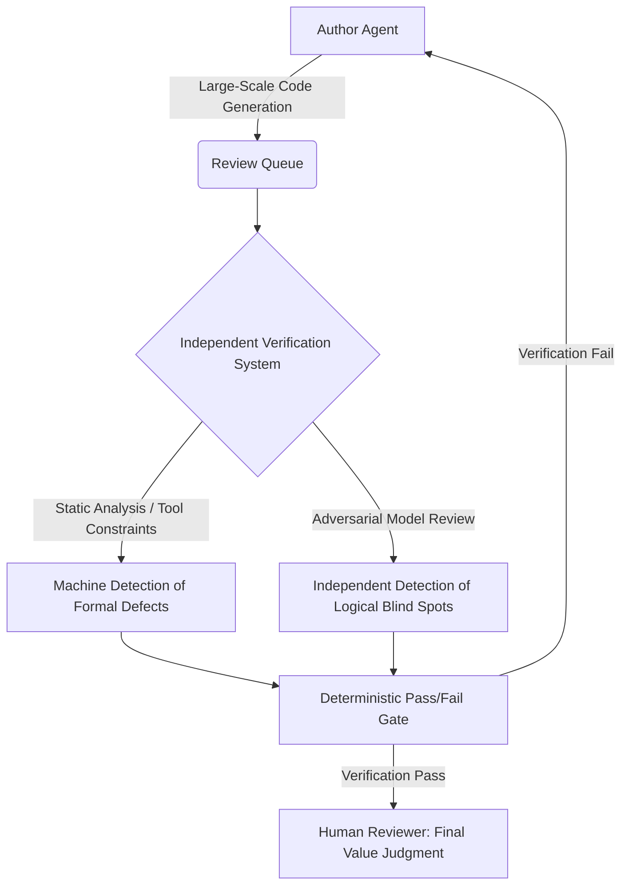

There is a clear metric that shows how severe the exhaustion in the queue is. According to Faros AI's 2026 Engineering Benchmark, AI-generated pull requests wait 4.6 times longer before being picked up by a reviewer. While code pours out at machine speed, the reviewers approving it remain at human speed, and in an era where generation has become free, the true bottleneck has shifted entirely from 'production' to 'verification'.

> The introduction of agents has caused code productivity to explode, but human reviewers cannot keep up, paralyzing the queue. Code left without substantive verification accumulates as critical security debt. Ultimately, only companies that build a harness to adversarially verify the output of agents will win the future race for execution speed.

## 1. The Liberation of Generation and the Shift of the Bottleneck

As the era of free crawling ended, tollbooths appeared for data access, and when the chip supply eased, the infrastructure bottleneck shifted to power supply. Every time a constraint on one resource is lifted, it becomes abundant, and the still-unsolved, scarce resource determines the value of the entire system.

Entering the agent era, the framework of 'Agent = Model + Harness' has settled as the industry standard.

A harness is a constrained environment and a set of tools that prevents an agent from repeating a mistake once it makes one. Thanks to this design, as the execution constraints on the agent are lifted, the machine tirelessly spits out code.

Then, a problem arises. As Scott Logic observed, pull request queues have swollen fiercely as agents rapidly turn issues into solutions. However, the reviewers who approve that code are still human. No matter how fast the production side is improved, all the time is ultimately consumed in the massive queue in front of human reviewers.

According to Little's Law, the moment the arrival rate exceeds the processing rate, the queue grows infinitely long. Review capacity is not easily solved simply by increasing hiring, and the number of skilled personnel who understand the context is tightly bound to the organization's growth rate. Given this trend, it seems likely that most development teams will soon spend more time reading code written by agents than developing new features.

## 2. The Fatal Trap of the Verification Bottleneck: Formal Rites of Passage and the Compound Interest of Debt

In any case, when the queue exceeds its limit, organizations seem to begin making dangerous compromises. When the review queue becomes uncontrollably long, the review process tends to devolve from a meticulous reading of the code into a procedural rite of passage without substantive verification.

According to Ventureburn statistics, 56% of developers admitted they rarely review AI-generated code line-by-line, and AI code has a vulnerability density 2.7 times higher than human code. If a bottleneck is visible, the system gets fixed, but when disguised as a rubber-stamping rite of passage, it seems no one realizes its severity.

AI-generated code looks plausible but consistently harbors specific types of defects. Having it repeatedly fix the code might improve its apparent quality, but the internal structure seems to gradually collapse. There is a prime example showing how dangerous the process of an AI fixing its own code can be. Looking at an experiment in the paper 'Security Degradation in Iterative AI Code Generation', which improved 400 samples over 40 rounds, critical vulnerabilities increased by a staggering 37.6% after just 5 iterations.

Each round of revision made the code better locally, but globally, it piled up invisible vulnerabilities.

Ultimately, iteration without verification seems to return not as improvement, but as the vicious compound interest of debt.

Meanwhile, data warning of the inherent risks of large-scale code generation is also interesting. According to a survey by AppSec Santa, defects were found in 25.7% of 522 code snippets written by major LLMs. Essentially, one in four is born with inherent risks, which is a truly terrifying figure. Given this trend, as the proportion of AI code increases, one cannot help but wonder if enterprise security risks will explode exponentially.

## 3. The Illusion of AI Verification and System Design Principles

If so, would having another AI inspect the code written by an AI easily resolve the bottleneck? Unfortunately, it doesn't seem that simple.

Attempting verification naively with a similar model seems to create a massive echo chamber. A system evaluating itself seems to infinitely amplify its own biases. Since this is a difficult concept, let's compare it to everyday life. It's easy if you imagine a student grading their own math test. It's just like mistakenly thinking a formula they got wrong is correct when grading.

A verifier sharing the same model family and the same training distribution will miss the exact same logical blind spots missed by the author. The pass signal obtained here seems to be merely an illusion of reassurance, not evidence of safety.

Therefore, the verifier likely needs to have an adversarial review session completely separated from the author. The verifying model doesn't necessarily have to be large, but the approaching perspective and tool environment seem to need to be completely different.

The paper 'Steerability via constraints' clearly demonstrates this difference. When reviewing Python code hiding 11 backdoors without constraints, a small model (Gemma 4 e4b) only achieved a 54.5% detection rate, but when given a constrained environment and tools of around 200 lines, the detection rate jumped to 90.9%.

Ultimately, verifiability is not the intelligence of a single model, but a structural property of the entire system. The verification standard, the 'Definition-of-Done', should not be ambiguous like "works well", but rather an observable contract that a machine can determine.

```mermaid
graph TD
    A[Author Agent] -->|Large-Scale Code Generation| B(Review Queue)
    B --> C{Independent Verification System}
    C -->|Static Analysis / Tool Constraints| D[Machine Detection of Formal Defects]
    C -->|Adversarial Model Review| E[Independent Detection of Logical Blind Spots]
    D --> F[Deterministic Pass/Fail Gate]
    E --> F
    F -->|Verification Fail| A
    F -->|Verification Pass| G[Human Reviewer: Final Value Judgment]
```

## 4. The Paradigm Shift in Review: Automation of Toil and Separation of Judgment

In the same vein, the future review paradigm seems to be changing dramatically. If human review has been 'reading code line by line' up until now, it seems to be shifting towards 'reading an evidence package' gathered by machines in the future. Test results, scan findings, and pre/post-deployment shadow execution metrics are the contents of that package.

Mechanical toil where pass and fail are clearly divided through deterministic gates likely needs to be fully automated. Humans will seemingly focus solely on value judgments determining, "Have all necessary checks run, and are the results acceptable in light of the product's direction?"

| Category | Traditional Review Paradigm | New Paradigm in the Agent Era |
|---|---|---|
| **Review Target** | Line-by-line reading of human-written code | Verification of evidence packages collected by machines |
| **Role Division** | Humans inspect both syntax defects and logic | Machines detect defects, humans judge value tradeoffs |
| **Evaluation Cycle** | One-time bottleneck review at release point | Continuous observation through continuous evaluation and shadow execution |
| **Automation Perspective** | Simple auxiliary tool for CI/CD pipelines | Full automation of toil and adversarial model-based review systems |

In reality, leading companies are already moving aggressively. Cloudflare built its own CI-native orchestration system wrapping open-source models. Over the first 30 days, it ran 131,246 AI reviews on 48,095 merge requests across 5,169 repositories, with a median cost per review of just $0.98 and a turnaround time of 3 minutes and 39 seconds.

During this process, the rate of arbitrarily bypassing gates (break glass) was a mere 0.6%. There are also metrics showing the effectiveness of continuous evaluation systems. According to Thinking Inc data citing Deloitte analysis, enterprise AI programs that adopted continuous evaluation reduced production incidents by 67% compared to one-time periodic evaluations.

However, as third-party plugins increase, the harness itself is becoming a new attack surface, so security audits must likely be internalized from the initial design. In a practical case study by Generative Labs, the proportion of verification became so bloated that 60% of total token expenditure was spent on review and CI automation.

Handing everything over to AI entirely without strictly separating toil and judgment seems not like efficiency, but a terrible dereliction of duty.

## 5. He Who Owns Verification Dominates the Speed of Learning

Ultimately, it seems to become clear where an organization should pour its resources. The resources poured into verification infrastructure likely need to be much larger than those spent on generative model capabilities. There is a statistic showing the standard for efficient resource allocation. According to Daniel Keller, a 30 to 70 resource allocation ratio between generation and verification is recommended, but 96% of teams actually building something with LLMs are struggling to construct evaluation systems. Given this trend, teams that fail to properly build verification pipelines will likely be unable to handle the pouring code and eventually give up on in-house development.

Generative engines seem to be common in the market, and their prices continue to drop. On the other hand, verification capabilities coupled with an organization's unique risks and domain knowledge cannot be bought with money from the outside. It seems that rare capabilities that cannot be bought in the market always create true competitive advantage.

The reason coding AI has developed exceptionally faster than other fields is precisely due to its strong verifiability, meaning you can immediately know its success by running the code. This is also why Meta is achieving distinct results in its investment in proprietary foundation models. They possess a massive self-verifying market where trillions of ads drive real-time conversions.

Because they align and evaluate their own models using this data of overwhelming liquidity, they seem to create a distinct differentiator compared to other platform tools. Organizations with dense verification infrastructure boldly unleash agents without fear of collapse, gathering data and innovating at a frightening speed. Conversely, organizations with flimsy verification seemingly have no choice but to keep agents chained out of fear of accidents.

Personally, I suspect this polarized infrastructure gap will emerge as a decisive speed difference that determines survival among companies within 2-3 years. Of course, since it's a matter of the future, my prediction might be wrong. The only key to ending the nightmare of the queue mentioned in the introduction seems to ultimately be the path of directly owning a powerful verification engine.

I'll compress the entire argument into a one-line comment. Trust is a vague emotion, but verifiability can be structurally designed, and it seems only the companies that master this structure first will be able to press the accelerator pedal of generative agents to their heart's content.

References (10) — Daniel Vaughan · Scott Logic · arXiv · arXiv · AppSec Santa · Ventureburn · Thinking Inc · Generative Labs · Cloudflare · Daniel Keller

<ul>
<li><a href="https://codex.danielvaughan.com/2026/05/24/human-review-bottleneck-code-review-strategies-agent-output/">Human Review Bottleneck: Code Review Strategies for Agent Output</a> — Daniel Vaughan, 2026-05-24</li>
<li><a href="https://blog.scottlogic.com/2026/05/14/the-human-bottleneck.html">The Human Bottleneck</a> — Scott Logic, 2026-05-14</li>
<li><a href="https://arxiv.org/abs/2607.02389">Steerability via constraints: a substrate for scalable oversight of coding agents</a> — arXiv</li>
<li><a href="https://arxiv.org/abs/2506.11022">Security Degradation in Iterative AI Code Generation</a> — arXiv</li>
<li><a href="https://appsecsanta.com/research/ai-security-statistics">AI Security Statistics</a> — AppSec Santa</li>
<li><a href="https://ventureburn.com/ai-statistics-2026-technical-performance-security-risk-business-growth-and-economic-impact/">AI Statistics 2026: Technical Performance, Security Risk, Business Growth and Economic Impact</a> — Ventureburn</li>
<li><a href="https://thinking.inc/en/blue-ocean/agentic/ai-agent-evaluation-production/">AI Agent Evaluation in Production</a> — Thinking Inc</li>
<li><a href="https://www.generativelabs.com/insights/ai-code-review-control-point">AI Code Review Control Point</a> — Generative Labs</li>
<li><a href="https://blog.cloudflare.com/ai-code-review/">AI Code Review</a> — Cloudflare</li>
<li><a href="https://danielkeller.com/tech/verification-not-generation/">Verification Not Generation</a> — Daniel Keller</li>
</ul>

