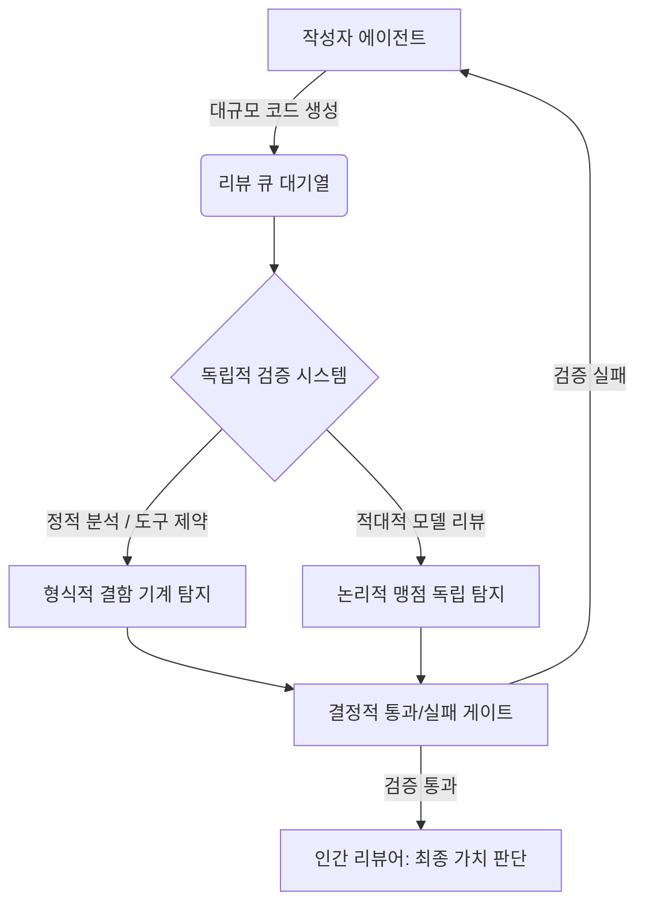

대기열에서의 소모가 얼마나 심각한지 보여주는 명확한 지표가 있다. Faros AI의 2026년 엔지니어링 벤치마크에 따르면 AI가 생성한 풀 리퀘스트는 리뷰어가 집어들기까지 4.6배 더 오래 대기한다. 코드는 기계의 속도로 쏟아지는데 이를 승인하는 리뷰어는 여전히 인간의 속도에 머물러 있으며, 생성이 공짜가 된 시대의 진정한 병목은 '생산'에서 '검증'으로 완전히 이동했다.

> 에이전트 도입으로 코드 생산성은 폭발했지만, 인간 리뷰어가 감당하지 못해 대기열이 마비되고 있다. 실질적 검증 없이 방치된 코드는 치명적 보안 부채로 쌓인다. 결국 에이전트의 산출물을 적대적으로 검증하는 하네스를 구축한 기업만이 미래의 실행 속도 경쟁에서 승리할 것이다.

## 1. 생성의 해방과 병목의 이동

크롤링이 공짜이던 시절이 끝나자 데이터 접근에 요금소가 생겼고, 칩 공급이 풀리자 인프라 병목은 전력 수급으로 옮겨갔다. 매번 한 자원의 제약이 풀리면 그것은 흔해지고, 여전히 풀리지 않은 희소한 자원이 전체 시스템의 가치를 결정한다. 

에이전트 시대에 진입하며 'Agent = Model + Harness'라는 프레임이 업계 표준으로 정착했다.

하네스란 에이전트가 실수할 때마다 그 실수를 다시는 반복하지 못하게 막아주는 제약 환경이자 도구 모음이다. 이 설계 덕분에 에이전트의 실행 제약이 풀리면서 기계는 지치지 않고 코드를 토해낸다.

이어서 문제가 발생한다. Scott Logic의 관찰처럼, 에이전트가 이슈를 빠르게 해결안으로 바꾸면서 풀 리퀘스트 큐가 맹렬히 부풀어 올랐다. 반면 그 코드를 승인하는 리뷰어는 여전히 인간이다. 생산 측을 아무리 빠르게 개선해도 결국 인간 리뷰어 앞의 거대한 대기열에서 모든 시간이 소모된다.

리틀의 법칙에 따라 도착률이 처리율을 넘어서는 순간 대기열은 무한히 길어진다. 리뷰 역량은 채용을 늘린다고 쉽게 해결되지 않으며, 맥락을 아는 숙련된 인력의 수는 조직의 성장 속도에 단단히 묶여 있다. 이 추세라면 조만간 대부분의 개발팀이 새로운 기능 개발보다 에이전트가 짠 코드를 읽는 데 더 많은 시간을 쓰지 않을까 싶다.

## 2. 검증 병목의 치명적 함정: 형식적 통과 의례와 부채의 복리

어쨌든 대기열이 한계치를 넘어서면 조직은 위험한 타협을 시작하는 것으로 보인다. 리뷰 큐가 걷잡을 수 없이 길어질 때, 리뷰는 코드를 꼼꼼히 읽는 행위에서 실질적 검증 없는 절차적 통과 의례로 전락하는 양상을 띤다.

Ventureburn 통계에 따르면 개발자의 56%는 AI 생성 코드를 줄 단위로 거의 리뷰하지 않는다고 인정했고, AI 코드는 인간 코드보다 취약점 밀도가 2.7배나 높다. 병목이 눈에 보이면 시스템을 고치지만, 승인 도장만 찍는 통과 의례로 위장하면 아무도 그 심각성을 알아채지 못하는 것 같다.

AI 생성 코드는 그럴듯해 보이지만 특정 유형의 결함을 일관되게 품는다. 코드를 반복해서 고치게 하면 겉보기 품질은 올라갈지 몰라도 내부 구조는 서서히 무너지는 것으로 보인다. AI가 스스로 코드를 고치는 과정이 얼마나 위험할 수 있는지 보여주는 단적인 사례가 있다. 논문 'Security Degradation in Iterative AI Code Generation'이 400개 샘플을 40라운드에 걸쳐 개선한 실험을 보면, 단 5회 반복 만에 치명 취약점이 37.6%나 증가했다.

각 수정 라운드가 지역적으로는 코드를 낫게 만들었지만, 전역적으로는 보이지 않는 취약점을 쌓아올린 것이다.

결국 검증 없는 반복은 개선이 아니라 부채의 지독한 복리로 돌아오는 것 같다.

한편 대규모 코드 생성의 태생적 위험을 경고하는 데이터도 흥미롭다. AppSec Santa의 조사에 따르면 주요 LLM이 짠 코드 522개 중 25.7%에서 결함이 발견됐다. 네 개 중 하나는 태생적으로 위험을 안고 태어나는 셈이니, 참으로 무서운 수치다. 이 추세라면 AI 코드 비율이 높아질수록 기업의 보안 리스크는 기하급수적으로 폭발하지 않을까 싶다.

## 3. AI 검증의 환상과 시스템 설계 원칙

그렇다면 AI가 짠 코드를 다른 AI에게 검사시키면 병목이 쉽게 풀릴까? 안타깝게도 그렇게 단순하지 않은 것 같다.

순진하게 비슷한 모델로 검증을 시도하면 거대한 에코 체임버가 만들어지는 것으로 보인다. 자기 자신을 평가하는 시스템은 자기 편향을 무한히 확대하는 듯하다. 어려운 개념이니 일상에 빗대보자. 자신이 푼 수학 시험지를 자신이 직접 채점하는 학생을 떠올려보면 쉽다. 본인이 잘못 알고 있는 공식은 채점할 때도 맞았다고 착각하는 것과 같다.

같은 모델 계열, 같은 학습 분포를 공유하는 검증자는 작성자가 놓친 논리적 맹점을 똑같이 놓치게 된다. 여기서 얻은 통과 신호는 안전의 증거가 아니라 단순한 안심의 착시에 불과해 보인다.

따라서 검증자는 작성자와 철저히 분리된 적대적 리뷰(adversarial review) 세션을 가져야 할 것 같다. 검증하는 모델이 무조건 클 필요는 없지만, 접근하는 관점과 도구 환경은 완전히 달라야 하는 것으로 보인다.

'Steerability via constraints' 논문은 이 차이를 명확히 보여준다. 백도어 11개가 숨겨진 파이썬 코드를 제약 없이 리뷰했을 때 소형 모델(Gemma 4 e4b)의 탐지율은 54.5%에 그쳤지만, 제약된 환경과 200줄 안팎의 도구를 쥐여주자 탐지율이 90.9%로 껑충 뛰었다.

결국 검증 가능성은 단일 모델의 지능이 아니라 시스템 전체의 구조적 속성이다. 검증 기준인 '완료의 정의(Definition-of-Done)'는 "잘 동작한다"처럼 모호해서는 안 되며, 기계가 판별 가능한 관측 가능한 계약이어야 할 것 같다.

## 4. 리뷰 패러다임의 전환: 노역의 자동화와 판단의 분리

같은 맥락에서 미래의 리뷰 패러다임은 극적으로 변하는 것 같다. 지금까지 인간의 리뷰가 '코드를 한 줄씩 읽는 일'이었다면, 앞으로는 기계가 모아온 '증거 패키지를 읽는 일'로 바뀌는 것으로 보인다. 테스트 결과, 스캔 지적 사항, 배포 전후의 섀도우 실행(shadow execution) 지표가 그 패키지의 내용물이다.

결정적 게이트를 통해 통과와 실패가 명확히 갈리는 기계적 노역은 완벽히 자동화해야 할 것 같다. 사람은 "필요한 체크가 모두 돌았고 그 결과가 이 제품의 방향성에 비추어 감수할 만한가"를 결정하는 가치 판단에만 집중하게 될 것으로 보인다.

| 구분 | 기존 리뷰 패러다임 | 에이전트 시대의 새로운 패러다임 |
|---|---|---|
| **검토 대상** | 사람이 짠 코드의 줄 단위 열람 | 기계가 수집한 검증 증거 패키지 확인 |
| **역할 분담** | 인간이 문법 결함과 논리를 모두 검수 | 기계가 결함 탐지, 인간은 가치 트레이드오프 판단 |
| **평가 주기** | 릴리스 시점의 일회성 병목 리뷰 | 지속적 평가 및 섀도우 실행을 통한 상시 관측 |
| **자동화 관점** | CI/CD 파이프라인의 단순 보조 수단 | 노역의 완전 자동화 및 적대적 모델 기반 리뷰 시스템 |

실제 선도 기업들은 이미 공격적으로 움직이고 있다. Cloudflare는 오픈소스 모델을 감싸는 CI-네이티브 오케스트레이션 시스템을 자체 구축했다. 첫 30일간 5,169개 저장소에서 48,095건의 머지 리퀘스트에 대해 131,246회의 AI 리뷰를 돌렸고, 리뷰 1건당 중앙 비용은 불과 0.98달러, 소요 시간은 3분 39초였다.

이 과정에서 게이트를 임의로 우회한 비율(break glass)은 0.6%에 불과했다. 상시 평가 시스템의 효과를 보여주는 지표도 있다. 딜로이트 분석을 인용한 Thinking Inc 자료를 보면 지속 평가를 도입한 엔터프라이즈 AI 프로그램은 일회성 주기적 평가 대비 프로덕션 인시던트를 67%나 줄였다.

다만 서드파티 플러그인이 늘어나며 하네스 자체가 새로운 공격 표면이 되고 있으므로, 초기 설계부터 보안 감사가 반드시 내재화되어야 할 것 같다. Generative Labs의 한 실무 사례에서는 총 토큰 지출의 60%가 리뷰와 CI 자동화에 쓰일 만큼 검증의 비중이 비대해졌다.

노역과 판단을 엄격히 분리하지 않은 채 모든 것을 AI에게 통째로 맡기는 것은 효율이 아니라 끔찍한 직무유기로 보인다.

## 5. 검증을 소유한 자가 학습 속도를 지배한다

결국 조직의 자원을 어디에 쏟아야 할지가 명확해지는 것 같다. 생성 모델 능력에 쓰는 자원보다 검증 인프라에 붓는 자원이 훨씬 커야 할 것으로 보인다. 효율적인 자원 배분의 기준을 보여주는 통계가 있다. Daniel Keller에 따르면 생성과 검증의 자원 배분율은 30 대 70이 권고되나, 실제 LLM으로 무언가를 만드는 팀의 96%가 평가 체계 구축에 쩔쩔매고 있다. 이 추세라면 검증 파이프라인을 제대로 구축하지 못한 팀은 쏟아지는 코드를 감당하지 못해 결국 자체 개발을 포기하게 되지 않을까 싶다.

생성 엔진은 시장에 흔하게 널려 있고 가격도 계속 떨어지는 것으로 보인다. 반면 조직 고유의 리스크와 도메인 지식에 결합된 검증 역량은 외부에서 돈을 주고 사 올 수 없다. 언제나 시장에서 사 올 수 없는 희소한 역량이 진짜 경쟁 우위를 만드는 것 같다.

코딩 AI가 다른 분야보다 유독 빠르게 발전한 것도 즉, 코드는 돌려보면 성공 여부를 즉각 알 수 있다는 강력한 검증 가능성 덕분이다. 메타(Meta)가 독자적 파운데이션 모델 투자에서 뚜렷한 성과를 거두는 이유도 이와 같다. 그들은 수조 개의 광고가 실시간으로 전환을 일으키는 거대한 자체 검증 시장을 가지고 있다.

이 압도적 유동성의 데이터를 통해 자체 모델을 정렬하고 평가하기 때문에 타 플랫폼 도구 대비 뚜렷한 차별점을 만드는 것으로 보인다. 검증 인프라가 촘촘한 조직은 붕괴의 두려움 없이 에이전트를 과감하게 풀어놓고 무서운 속도로 데이터를 모으며 혁신한다. 반대로 검증이 허술한 조직은 사고가 무서워 에이전트를 사슬로 묶어둘 수밖에 없는 듯하다.

개인적으로 이 양극화된 인프라 격차가 2–3년 내에 기업 간 생존을 가르는 결정적 속도 차이로 나타나지 않을까 싶다. 물론 미래의 일인 만큼 내 예상이 틀릴 수도 있다. 도입부에서 언급했던 대기열의 악몽을 끝내는 유일한 열쇠는 결국 강력한 검증 엔진을 직접 소유하는 길뿐인 것 같다.

한줄 코멘트로 전체 논지를 압축해 본다. 신뢰는 막연한 감정이지만 검증 가능성은 구조적으로 설계할 수 있으며, 이 구조를 먼저 장악한 기업만이 생성 에이전트라는 가속 페달을 마음껏 밟을 수 있을 것 같다.

참고 자료 (10) — Daniel Vaughan · Scott Logic · arXiv · arXiv · AppSec Santa · Ventureburn · Thinking Inc · Generative Labs · Cloudflare · Daniel Keller

<ul>
<li><a href="https://codex.danielvaughan.com/2026/05/24/human-review-bottleneck-code-review-strategies-agent-output/">Human Review Bottleneck: Code Review Strategies for Agent Output</a> — Daniel Vaughan, 2026-05-24</li>
<li><a href="https://blog.scottlogic.com/2026/05/14/the-human-bottleneck.html">The Human Bottleneck</a> — Scott Logic, 2026-05-14</li>
<li><a href="https://arxiv.org/abs/2607.02389">Steerability via constraints: a substrate for scalable oversight of coding agents</a> — arXiv</li>
<li><a href="https://arxiv.org/abs/2506.11022">Security Degradation in Iterative AI Code Generation</a> — arXiv</li>
<li><a href="https://appsecsanta.com/research/ai-security-statistics">AI Security Statistics</a> — AppSec Santa</li>
<li><a href="https://ventureburn.com/ai-statistics-2026-technical-performance-security-risk-business-growth-and-economic-impact/">AI Statistics 2026: Technical Performance, Security Risk, Business Growth and Economic Impact</a> — Ventureburn</li>
<li><a href="https://thinking.inc/en/blue-ocean/agentic/ai-agent-evaluation-production/">AI Agent Evaluation in Production</a> — Thinking Inc</li>
<li><a href="https://www.generativelabs.com/insights/ai-code-review-control-point">AI Code Review Control Point</a> — Generative Labs</li>
<li><a href="https://blog.cloudflare.com/ai-code-review/">AI Code Review</a> — Cloudflare</li>
<li><a href="https://danielkeller.com/tech/verification-not-generation/">Verification Not Generation</a> — Daniel Keller</li>
</ul>

