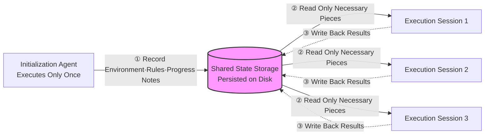

The inference cost of an AI scoring 42 on the MMLU has plummeted 1,000-fold in just three years, yet corporate infrastructure bills are snowballing. The answer lies not in the provider's price tag, but in the user's design discipline.

> Key Takeaway
> Because agents entail explosive resource consumption, a strategy of simply waiting for prices to drop is doomed to fail. Instead of blindly pushing tokens, context engineering—curating a minimum of high-signal tokens and externalizing state—is a core survival competency.

## The Metered Intelligence Era and Jevons Paradox

When GPT-3 first appeared in November 2021, the price of the only model scoring 42 on the MMLU was $60 per 1 million tokens.

Three years later, the unit price of the cheapest model achieving the same score is $0.06 per 1 million tokens.

In just three years, the cost of intelligence inference has plummeted 1,000 times over. At this rate, basic inference unit prices will likely converge to zero in the near future.

Normally, when costs go down, bills should become lighter. However, the infrastructure bills burdened by real-world organizations are increasing steeply instead.

This is the Jevons paradox described in textbooks. When efficiency improves and unit prices drop, usage explodes uncontrollably, eventually expanding overall demand.

The era of the flat-rate buffet is over, and intelligence has begun to be sold strictly by the meter.

The problem is that agents, unlike humans, operate at machine speed and burn through numerous traces of thought as tokens to produce a single answer. It is a structure where the rate of resource consumption increase far outpaces the rate of efficiency improvement.

Ultimately, the strategy of merely waiting and relying on unit price drops is likely to fail miserably. This is because usage does not stay static even when unit prices fall.

The upper end of the supply chain operates on the same premise. In July 2026, Samsung Electronics Chairman Lee Jae-yong met with Sam Altman at OpenAI headquarters in San Francisco to discuss AI and semiconductor cooperation, with observations focusing on HBM and foundries ([The Korea Pulse](https://pulse.koreasignals.com/posts/lee-jae-yong-meets-sam-altman-as-samsung-eyes-the-ai-chip-race/)). While it is still in the realm of expectation rather than a confirmed contract, it is a signal that as inference unit prices fall, they are trying to lock in the memory and manufacturing capabilities that will support that inference in advance.

## The Collapse of an Illusion: Tokens Are Not Value

We often fall into the illusion of equating the volume of tokens inputted with the value of the output.

However, using 50 times more tokens does not yield 50 times the useful economic output. There are plenty of situations where humans waste more time and resources reviewing the massive results churned out by agents.

In other words, expense spending does not directly translate to useful output.

At this point, the question must shift from "How many tokens were used?" to "How much economic value was created relative to the inputted tokens?" This is why Return on Tokens (ROT) must be monitored as a top priority.

The most fatal misconception is treating agents like human workers who toil endlessly without rest.

Personally, I believe agents should be approached not as operational expenses (OpEx) that execute daily to perform tasks, but as capital expenses (CapEx) for writing deterministic code that can be repeatedly executed.

Thinking tasks are expensive, so they should be triggered infrequently, and once completed, the code should be executed cheaply forever.

## New Competitiveness 1: The Aesthetics of Subtraction, Context Engineering

The core technology for defending costs and maintaining model performance is precisely context engineering.

Context engineering is a set of strategies for curating and maintaining which tokens to show the model at the time of inference. If past prompt engineering was about refining at the sentence level, context engineering is closer to designing the system's information architecture.

We believe it is safe to fill up the space just because the context window has lengthened. Is it really okay to freely squander that finite attention budget?

Absolutely not. As the number of tokens in the context window increases, the model's ability to accurately recall information within it actually declines, which is called context rot.

Since it's a difficult concept, let's compare it to a buffet restaurant. If you pile food like a mountain just because the plate got bigger, the most delicious dish ends up buried underneath, and you can't even properly taste it.

Now, the ability to subtract the unnecessary is more important than the ability to add something more. Good context design is finding the minimal set of high-signal tokens that maximizes the probability of the desired outcome.

The sense of crisis among industry leaders recently is clearly revealed in the data below. At this trend, context optimization capabilities will likely establish themselves as a survival requirement for all organizations sooner or later.

| Survey Item (As of 2026) | Agreement Rate |
| :--- | :--- |
| Prompt engineering alone is insufficient for scaling. | 82% |
| Context engineering is critical for large-scale agent operations. | 95% |

Techniques like compaction, which compresses content with high fidelity when conversations get long, or tool result clearing, which discards old results that can be retrieved again while keeping only the call history, are essential.

## New Competitiveness 2: Harness Design and System Optimization

In the same vein, blocking methods that simply place caps on usage or pop up warning windows to solve cost problems are the worst. This only degrades productivity and fails to be a fundamental solution.

The breakthroughs that actually work are better defaults, optimal routing, and smart caching. Routing, which determines what tier of intelligence to assign to tasks of varying difficulty, is now the core cost capability that separates organizations.

Also, one of the most common failure modes is a bloated toolset that tries to cover too many functions or makes it ambiguous which tool to use. As tools increase, judgment becomes clouded, and wasted tokens carrying descriptions increase uncontrollably.

System architecture design is the same. The success or failure of long-running agent tasks depends more on state management persisted in external storage than on the model itself.

The diagram below is a structural chart showing where long-running agents keep their memories. Read it in the order of the numbers attached to the arrows.

① The initialization agent runs just once to record the work environment, rules, and progress in external storage. Its role is to finish preparatory work here so that every session doesn't need to repeat it.

② Subsequent execution sessions do not load the entire storage into their context. They pick and read only the pieces necessary for their task.

③ Upon completing the task, the results and progress are written back to the storage. Since the next session picks up from that point, the context is not broken even when the session changes.

The central storage is the core of this structure. Because memory is placed on the disk rather than in the context, the active context remains thin no matter how long the task runs. The tokens loaded into every call, along with the costs, decrease as a result.

Ultimately, the center of capability has completely shifted from picking a single model to designing the harness and the overall system surrounding the model.

## The Evolution of the Knowledge Work Production Function and Remaining Challenges

However, even with such fierce subtraction and optimization, overall infrastructure demand is expected to continue skyrocketing. This is because tokens have essentially been incorporated as a new intermediate good in knowledge work.

The market is already pricing in that premise. On July 31, 2026, SK Hynix hit its daily limit during intraday trading, soaring 29.95% to 1,718,000 won, and Samsung Electronics also jumped over 20%, but even at those levels, both stocks remained around half of analysts' target prices ([The Korea Pulse](https://pulse.koreasignals.com/posts/sk-hynix-touches-koreas-daily-limit-at-1718000-won-and-analysts-still-see-room/)).

A powerful new input factor called the agent has entered the production function, which in the past was summarized by human time and skill. It is a structural shift where the marginal cost of execution in knowledge work dramatically converges to zero.

In any case, as the bottlenecks of code generation and infinite execution are breached, the true value of humans is shifting to curating inputs, defining goals, and verifying the quality of outputs.

Of course, my forecast could be wrong. Whether the plunge in execution costs will create massive new demand and defend total employment via the Jevons paradox route, or whether it will rapidly replace the workforce itself, is still difficult to conclude hastily.

The clear fact is that a thorough paradigm shift is needed to defend against exponentially exploding resource consumption and to withstand the shock of snowballing bills.

## One-Line Comment

In the metered intelligence era, the weapon to control pouring bills and foster true value is not the price tag, but the user's sharp discipline of system subtraction.

References (4) — a16z · DataHub · Anthropic · Anthropic Cookbook

<ul>
<li><a href="https://a16z.com/llmflation-llm-inference-cost/">LLMflation</a> — a16z</li>
<li><a href="https://datahub.com/blog/context-engineering-vs-prompt-engineering/">State of Context Management Report 2026</a> — DataHub, 2026</li>
<li><a href="https://www.anthropic.com/engineering/effective-context-engineering-for-ai-agents">Effective context engineering for AI agents</a> — Anthropic</li>
<li><a href="https://platform.claude.com/cookbook/tool-use-context-engineering-context-engineering-tools">Context Engineering Tools</a> — Anthropic Cookbook</li>
</ul>

## TL;DR
# Why Are Prices Crashing While Bills Are Growing: Tokenomics and Survival Strategies in the Age of Agents The inference cost of an AI scoring 42 on the MMLU has plummeted 1,000...

- Intent: commercial
- Core topics: token economics, agents, context engineering

## Quick Answers
### We believe it is safe to fill up the space just because the context window has lengthened. Is it really okay to freely squander that finite attention budget?
Absolutely not. As the number of tokens in the context window increases, the model's ability to accurately recall information within it actually declines, which is called context rot.

## Next Step
Keep going with related deep dives on this topic.
- Quality gates: unique-angle, clear-structure, source-attribution-if-needed, readability-pass
