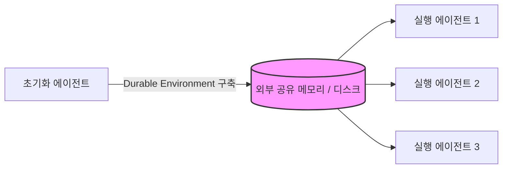

MMLU 42점을 내는 AI의 추론 가격은 불과 3년 만에 1000배나 폭락했지만, 기업의 인프라 청구서는 눈덩이처럼 불어나고 있다. 정답은 공급자의 가격표가 아니라 사용자의 설계 규율에 있다.

> 핵심 요약
> 에이전트는 폭발적인 자원 소모를 동반하기 때문에 가격 하락만 믿고 기다리는 전략은 필패한다. 무작정 토큰을 밀어 넣는 대신 최소한의 고신호 토큰을 선별하고 상태를 외부로 분리하는 컨텍스트 엔지니어링이 핵심 생존 역량이다.

## 지능의 계량기 시대와 제번스의 역설

2021년 11월 GPT-3가 처음 등장했을 때 MMLU 42점을 내는 유일한 모델의 가격은 100만 토큰당 60달러였다.

3년 뒤 동일한 점수를 내는 가장 싼 모델의 단가는 100만 토큰당 0.06달러다.

단 3년 만에 지능의 추론 비용이 1000배나 하락한 셈이다. 이 추세라면 머지않아 기본적인 추론 단가는 0에 수렴하지 않을까 싶다.

비용이 내려가면 청구서도 가벼워져야 정상이다. 하지만 현실 조직이 짊어지는 인프라 청구서는 오히려 가파르게 늘어난다.

이것이 교과서에서 묘사하는 제번스의 역설이다. 효율이 개선되어 단가가 떨어지면 사용량이 걷잡을 수 없이 폭발해 전체 수요는 결국 팽창한다.

이제 정액 뷔페의 시대가 끝나고 지능이 철저한 계량기로 팔리기 시작했다.

문제는 에이전트가 사람과 달리 기계 속도로 작동하며, 답 하나를 내기 위해 수많은 생각의 흔적을 토큰으로 태운다는 점이다. 효율 개선 속도보다 자원 소비 증가 속도가 훨씬 빠른 구조다.

결국 단가 하락만 믿고 기다리는 전략은 참담하게 실패할 것 같다. 단가가 떨어져도 사용량이 가만히 제자리에 머물러 주지 않기 때문이다.

## 착시의 붕괴: 토큰은 가치가 아니다

흔히 우리는 투입한 토큰의 양을 산출물의 가치와 동일시하는 착각에 빠진다.

하지만 토큰을 50배 더 썼다고 해서 유용한 경제적 산출물이 50배로 돌아오지는 않는다. 에이전트가 쏟아낸 방대한 결과를 인간이 검토하느라 시간과 자원을 더 낭비하는 상황도 얼마든지 발생한다.

즉, 비용 지출이 곧바로 유용한 산출로 이어지지 않는다.

이 시점에서 질문은 "얼마나 많은 토큰을 썼는가?"에서 "투입한 토큰 대비 얼마나 큰 경제적 가치를 만들었는가?"로 바뀌어야 한다. 이것이 토큰 투자 수익률(ROT)을 최우선으로 주시해야 하는 이유다.

가장 치명적인 오해는 에이전트를 영원히 쉬지 않고 일하는 인간 노동자처럼 대하는 것이다.

개인적으로 에이전트는 매일 실행하며 작업을 수행하는 운영비(OpEx)가 아니라, 반복 실행할 수 있는 결정론적 코드를 짜는 자본비(CapEx)로 접근해야 한다고 생각한다.

생각하는 작업은 비싸므로 드물게 발생시켜야 하고, 한 번 완성된 코드는 저렴하게 영원히 실행되어야 한다.

## 새로운 경쟁력 1: 덜어냄의 미학, 컨텍스트 엔지니어링

비용을 방어하고 모델의 성능을 유지하는 핵심 기술이 바로 컨텍스트 엔지니어링이다.

컨텍스트 엔지니어링이란 추론 시점에 모델에게 어떤 토큰을 보여줄지 큐레이션하고 유지하는 전략의 집합이다. 과거의 프롬프트 엔지니어링이 문장 단위를 다듬는 일이었다면, 컨텍스트 엔지니어링은 시스템의 정보 구조를 설계하는 일에 가깝다.

우리는 컨텍스트 윈도우가 길어졌다는 이유만으로 그 공간을 가득 채워도 안전하다고 믿는다. 과연 그 유한한 주의력 예산을 마음대로 낭비해도 괜찮을까?

결코 그렇지 않다. 컨텍스트 윈도우의 토큰 수가 늘어날수록 모델이 그 안의 정보를 정확히 회상하는 능력은 오히려 떨어지는데, 이를 컨텍스트 로트(context rot)라고 부른다.

어려운 개념이니 뷔페 식당에 비유해 보자. 접시가 커졌다고 음식을 산처럼 쌓아오면, 정작 제일 맛있는 요리가 밑에 깔려 제대로 맛조차 느끼지 못하는 것과 같다.

이제는 무언가를 더 넣는 능력보다 불필요한 것을 덜어내는 능력이 더 중요하다. 좋은 컨텍스트 설계는 원하는 결과의 가능성을 최대화하는 최소한의 고신호 토큰 집합을 찾아내는 것이다.

최근 업계 리더들의 위기감은 아래 데이터에서 선명하게 드러난다. 이 추세라면 조만간 컨텍스트 최적화 역량이 모든 조직의 생존 요건으로 자리 잡지 않을까 싶다.

| 조사 항목 (2026년 기준) | 동의 비율 |
| :--- | :--- |
| 프롬프트 엔지니어링만으로는 스케일링이 충분하지 않다. | 82% |
| 대규모 에이전트 운영에 컨텍스트 엔지니어링이 중요하다. | 95% |

대화가 길어질 때 내용을 고충실도로 압축하는 컴팩션이나, 다시 가져올 수 있는 오래된 결과는 버리고 호출 기록만 남기는 툴 결과 클리어링 기법이 필수적이다.

## 새로운 경쟁력 2: 하네스 설계와 시스템 최적화

같은 맥락에서, 비용 문제를 풀기 위해 단순히 사용량 상한을 걸거나 경고창을 띄우는 차단 방식은 최악이다. 이는 생산성을 깎아내릴 뿐 근본적인 해결책이 되지 못한다.

실제로 작동하는 돌파구는 더 나은 기본값, 최적의 라우팅, 그리고 영리한 캐싱이다. 어떤 난이도의 작업에 어떤 등급의 지능을 배정할지 결정하는 라우팅은 이제 조직을 가르는 핵심 비용 역량이다.

또한 가장 흔한 실패 모드 중 하나는 너무 많은 기능을 덮으려 하거나 어떤 툴을 써야 할지 모호하게 만드는 비대한 툴셋이다. 툴이 늘어날수록 판단은 흐려지고 설명을 싣는 낭비 토큰만 걷잡을 수 없이 늘어난다.

시스템 구조 설계도 마찬가지다. 오래 도는 에이전트 작업의 성패는 모델 자체보다 외부 저장소에 영속화된 상태 관리에 달렸다.

이 다이어그램처럼 초기화 에이전트가 공유 환경을 구축하면, 이후 세션들은 구조화된 노트를 남기는 메모리 기법을 활용해 모든 것을 활성 컨텍스트에 무겁게 이고 다니지 않는다.

결국 단일 모델을 고르는 일에서 모델을 둘러싼 하네스와 시스템 전체를 설계하는 일로 역량의 중심이 완전히 이동했다.

## 지식 노동의 생산 함수 진화와 남겨진 과제

다만, 이런 치열한 덜어냄과 최적화를 거치더라도 전체 인프라 수요는 계속 폭증할 것으로 보인다. 토큰이 사실상 지식 노동의 새로운 중간재로 편입되었기 때문이다.

과거 인간의 시간과 숙련도로 요약되던 생산 함수에 에이전트라는 막강한 새 투입 요소가 들어왔다. 지식 노동의 실행 한계비용이 극적으로 0에 수렴하는 구조적 변화다.

어쨌든 코드 생성과 무한 실행의 병목이 뚫리면서, 인간의 진짜 가치는 투입재를 큐레이션하고 목표를 정의하며 산출물의 품질을 검증하는 일로 옮겨가고 있다.

물론 내 전망이 틀릴 수 있다. 실행 비용 급락이 거대한 새 수요를 창출해 총고용을 방어하는 제번스 역설 경로로 갈지, 아니면 노동력 자체를 빠르게 대체할지는 아직 속단하기 어렵다.

분명한 사실은 기하급수적으로 폭발하는 자원 소모를 방어하고, 눈덩이 같은 청구서의 충격을 견뎌내려면 철저한 패러다임 전환이 필요하다는 점이다.

## 한줄 코멘트

지능의 계량기 시대, 쏟아지는 청구서를 통제하고 진정한 가치를 키우는 무기는 단가표가 아니라 사용자의 날카로운 시스템 덜어냄 규율이다.

참고 자료 (4) — a16z · DataHub · Anthropic · Anthropic Cookbook

<ul>
<li><a href="https://a16z.com/llmflation-llm-inference-cost/">LLMflation</a> — a16z</li>
<li><a href="https://datahub.com/blog/context-engineering-vs-prompt-engineering/">State of Context Management Report 2026</a> — DataHub, 2026</li>
<li><a href="https://www.anthropic.com/engineering/effective-context-engineering-for-ai-agents">Effective context engineering for AI agents</a> — Anthropic</li>
<li><a href="https://platform.claude.com/cookbook/tool-use-context-engineering-context-engineering-tools">Context Engineering Tools</a> — Anthropic Cookbook</li>
</ul>

