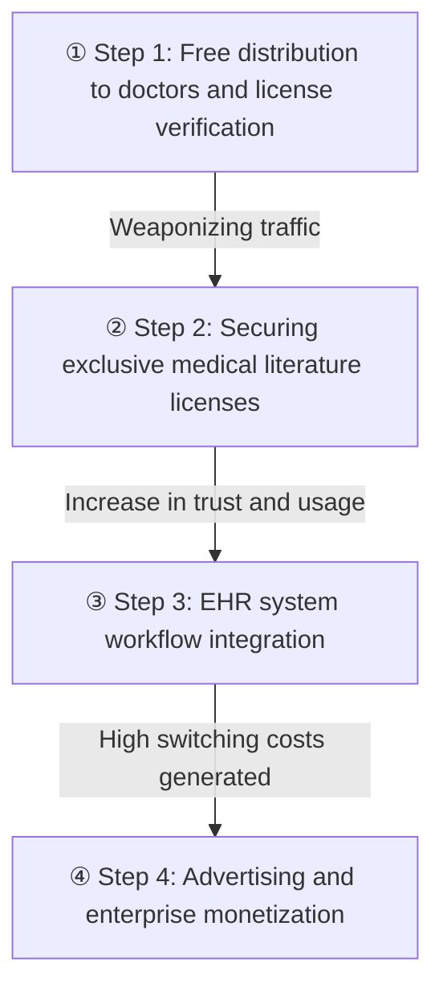

Amid an information explosion where medical literature doubles every five years, the real moat that determines the success or failure of vertical AI is not the parameter size of the model, but 'access rights' to proprietary data and workflows. OpenEvidence proved this formula by distributing its product to doctors for free instead of incurring massive procurement costs, and using that usage volume as leverage to sequentially secure licenses from top-tier journals and a place within electronic health records (EHR).

> OpenEvidence Strategy Summary: Avoided the model performance competition to secure 'access rights'. By gathering verified doctor traffic through free distribution, it leveraged this to achieve exclusive medical licenses and EHR workflow integration, establishing itself as an irreplaceable, essential infrastructure.

## New Rules of the Application Layer

Until now, we have only looked at the infrastructure layer in the AI competition—semiconductors, costs, and model performance.

Will the ultimate winner of the AI race really be a frontier lab? Ultimately, the place where money is made is the application layer, and the rules of victory here are completely different.

The moat of vertical AI lies not in the performance of general-purpose models or competition with frontier labs, but in access rights. Access rights are a combination of unique data, verified users, and workflow integration that competitors cannot immediately secure, even if they spend massive amounts of capital.

This is precisely why Harvey in law, Hebbia in finance, and OpenEvidence in healthcare occupy the same position.

| Category | General AI (OpenAI, Google) | Vertical AI (OpenEvidence, Harvey) |
| --- | --- | --- |
| Core Competency | Model parameter size, infrastructure cost | Proprietary data, users, workflow integration |
| Acquisition Method | Massive capital and computing power | Partnerships and licenses within regulated industries |
| Barriers to Entry | Technical limitations and compute costs | Verified access rights and high switching costs |

OpenEvidence did not win by building a smarter model than frontier labs.

They won by preempting three elements that even OpenAI or Google cannot buy with money: licensed medical literature, a verified user base of doctors, and a place within the EHR.

## Step 1: Bypassing Procurement and the Verification Gate (Securing Distribution)

The order in which a moat is built is crucial, and each step becomes the admission ticket for the next. Step 1 was bypassing hospital procurement through free distribution.

Selling medical software to hospitals takes approximately 18 months, navigating through procurement procedures, security reviews, and budget allocations. Breaking through this head-on requires burning massive sales costs.

The hospital procurement cycle is like a completely jammed highway tollgate. Instead of lining up at this tollgate, OpenEvidence essentially forged a detour by handing out exclusive fast-pass devices for free to individual drivers—the doctors.

However, this free distribution came with conditions. They set up a 'verification gate' that checked medical licenses via NPI number scans or hospital emails, preventing just anyone from using it.

Because it is free yet the user group is strictly defined, that group itself later becomes a powerful asset.

The results of this strategy are evident in the numbers. As of January 2026, the number of clinical consultations reached approximately 20 million per month. This is more than a six-fold increase from about 3 million per month at the same time a year ago.

As a result, more than 40 percent of US doctors use this tool on a daily basis on average. Given the trend of over 65,000 new US clinicians registering for authentication every month, I suspect it will not be long before it becomes an essential tool for medical professionals.

## The AI Experience Evolving into an Essential Clinical Tool

Meanwhile, doctors must cope with 1.5 million medical papers pouring out every year, a volume that doubles every five years. In a situation where information overload has become a constant in the clinical field, OpenEvidence has brilliantly captured the daily Q&A workflows of doctors.

They designed a RAG (Retrieval-Augmented Generation) pipeline that completely refuses to answer if it cannot provide proper citations for the response.

Since a doctor's profession prohibits the use of baseless answers, this strict 'Evidence-Based Medicine (EBM)' rule created a source of trust that general-purpose chatbots cannot imitate.

Through its massive user base, it is assimilating into the thought process of medical professionals, and the model's answers are becoming more concise yet accurately hitting the core the more it is used. As the user experience perfectly aligns with the demands of the clinical setting, this tool has gone beyond a simple search engine.

## Steps 2 & 3: Licensing Leverage and Workflow Integration

The massive usage volume secured immediately became a weapon for the next stage. The following diagram is a flowchart showing how OpenEvidence built its moat step by step.

The verified doctor traffic gathered in Step ① of the diagram above becomes the leverage to extract exclusive licenses from top-tier journals like NEJM and JAMA in Step ②. This is because publishers have a strong incentive to provide content to a tool that is used every day in actual clinical practice.

Based on the overwhelming trust secured in this way, it enters the workflow of dominant EHR systems like Epic in Step ③, which ultimately leads to powerful monetization in Step ④.

In other words, a tool used daily by 40 percent of doctors stands in a completely different position at the negotiating table. It is a virtuous cycle where usage brings licenses, and licenses bring usage again.

Building on this, they even locked in exclusive licensing agreements for society-specific guidelines from organizations such as NEJM, JAMA, and the American College of Cardiology (ACC).

Subsequently, Step 3 is the process of entering the EHR based on the acquired trust. While an app can be deleted, a workflow—a clinical procedure—is not easily removed.

In February 2026, Sutter Health launched OpenEvidence within its Epic workflow, followed by Mount Sinai and Cedars-Sinai carrying out enterprise-wide deployments.

This integration, which pulls a patient's past procedures, comorbidities, and medication data to query literature, generates massive switching costs and maximizes enterprise value.

## Step 4: Overwhelming Monetization of Verified Traffic

In the same vein, what was distributed for free is ultimately recovered as overwhelming revenue in the final Step 4. Traffic consisting only of license-verified doctors acts as a waste-free, high-unit-price medium for pharmaceutical and medical device advertisers.

| Metric | OpenEvidence | Comparison Target |
| --- | --- | --- |
| CPM (Cost Per Mille) | $70–$1,000+ | General Social Media $5–$15 |
| ARPU (Average Revenue Per User) | ~$124 | — |
| Monetization Structure | Advertising recovery after free distribution | UpToDate $500 per seat |
| Distribution Channel | Direct acquisition of doctors | Passing hospital procurement procedures |

The CPM operates on an entirely different scale compared to general social media platforms. Unlike the existing powerhouse, UpToDate, which charges per-seat fees and goes through hospital procurement, OpenEvidence has proven a structure of capturing doctors first and harvesting through advertising.

This strategy has led to dazzling financial performance. According to Sacra's research estimates, the annualized revenue for 2025 is $150 million, an 1,803 percent increase from $7.9 million the previous year.

Furthermore, in its Series D in January 2026, it raised $250 million, earning a valuation of $12 billion. Benefiting from declining LLM costs, their profit margins are expected to climb even higher.

Personally, I lean toward OpenEvidence solidifying its position as an essential tool for doctors' learning and qualitative improvement. Once a platform that has already embodied the medical professionals' thought process takes that position, I suspect it will possess a pricing power that far exceeds current advertising rates.

However, I don't believe a 'super app' strategy that aggregates all functions into one place will succeed. Tools in the clinical setting are utilized better when they mesh well in their respective places rather than being merged into one. Of course, this forecast could be wrong.

## The Symmetrical Cost of Vertical AI: Risks Outside Technology

Just as the moat was built outside of technology, the risks that threaten the business also come from outside technology. Paradoxically, all three risks are completely unrelated to model performance.

**First, regulation and liability.**
If an incident where algorithmic recommendations contributed to poor patient outcomes becomes a major issue, it could trigger liability claims and regulatory restrictions, fundamentally changing the business model.

**Second, dependence on EHR gatekeepers.**
Platforms like Epic or Oracle-Cerner could develop competing AI internally or demand unfavorable revenue splits.

**Third, content licensing costs.**
As major medical publishers realize the value of their data, there is a possibility they will raise licensing fees.

To overcome this, market expansion is underway.

They are broadening their target to 5.2 million nurses and 15 million doctors globally who have similar demands, and by partnering with Veeva Systems, they are positioning themselves as an infrastructure layer for life sciences and pharmaceutical commercial operations, thereby diversifying their risks.

## A One-Line Comment.

Ultimately, the true moat of AI in regulated industries is not a smarter model, but the 'access rights' that have secured a place right in the middle of workflows by passing through verification gates and exclusive licenses.

References (8) — Sacra, OpenEvidence, NEJM Group, JAMA Network, Sutter Health, Mount Sinai, Cedars-Sinai, Veeva

<ul>
<li><a href="https://sacra.com/c/openevidence/">OpenEvidence revenue, valuation &amp; funding</a> — Sacra (Revenue, ARPU, CPM estimates and risk analysis)</li>
<li><a href="https://www.cnbc.com/2026/01/21/openevidence-chatgpt-for-doctors-doubles-valuation-to-12-billion.html">OpenEvidence doubles valuation to $12 billion</a> — CNBC, 2026-01-21 (Series D $250 million, Thrive, DST)</li>
<li><a href="https://www.openevidence.com/announcements/openevidence-and-nejm">OpenEvidence and NEJM Group sign content agreement</a> — OpenEvidence, 2025-02-19</li>
<li><a href="https://www.prnewswire.com/news-releases/openevidence-and-the-jama-network-sign-strategic-content-agreement-302473690.html">OpenEvidence and the JAMA Network sign strategic content agreement</a> — PR Newswire, 2025-06-05</li>
<li><a href="https://www.openevidence.com/announcements/sutter-health-collaborates-with-openevidence-to-bring-evidence-based-ai-powered-insights-into-physician-workflows">Sutter Health Collaborates with OpenEvidence</a> — OpenEvidence, 2026-02-11 (First deployment in Epic workflow)</li>
<li><a href="https://www.openevidence.com/announcements/mount-sinai-health-system-collaborates-with-openevidence-to-provide-evidence-based-knowledge-within-electronic-medical-record">Mount Sinai Health System Collaborates with OpenEvidence</a> — OpenEvidence, 2026-03-31 (Enterprise deployment across 7 hospitals)</li>
<li><a href="https://www.cedars-sinai.org/newsroom/cedars-sinai-enhances-clinical-decision-making-with-openevidence/">Cedars-Sinai Enhances Clinical Decision-Making With OpenEvidence</a> — Cedars-Sinai, 2026-05-20 (Integration with patient EHR context)</li>
<li><a href="https://www.veeva.com/resources/openevidence-and-veeva-announce-open-vista-partnership/">OpenEvidence and Veeva Announce Open Vista Partnership</a> — Veeva Systems, 2025-10-16</li>
</ul>

## TL;DR
# The True Moat of Vertical AI: OpenEvidence's Proven 4-Step Access Right Strategy Amid an information explosion where medical literature doubles every five years, the real moat...

- Intent: informational
- Core topics: vertical AI, OpenEvidence, medical AI

## Next Step
Keep going with related deep dives on this topic.
- Quality gates: unique-angle, clear-structure, source-attribution-if-needed, readability-pass
