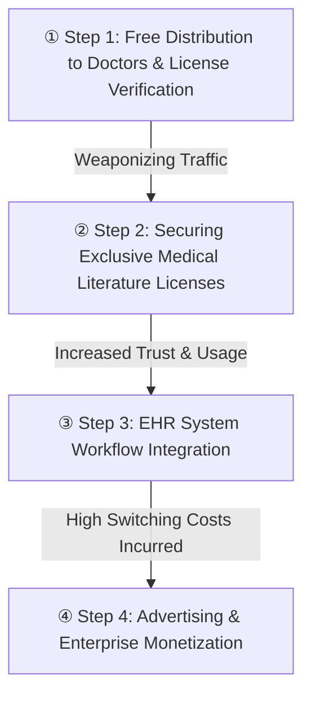

Amidst an information explosion where medical literature doubles every five years, the true moat that determines the success or failure of vertical AI is not the size of a model's parameters, but 'access' to proprietary data and workflows. OpenEvidence proved this formula by releasing its product to doctors for free instead of incurring massive procurement costs, and weaponizing that usage to consecutively secure licenses from top-tier journals and a place within Electronic Health Records (EHR).

> OpenEvidence Strategy Summary: Avoided model performance competition to secure 'access.' Gathered verified doctor traffic through free distribution, and leveraged this to achieve exclusive medical licenses and EHR workflow integration, establishing itself as an irreplaceable essential infrastructure.

## The New Rules of the Application Layer

Until now, we have only looked at the infrastructure layer in the AI competition, such as semiconductors, costs, and model performance.

Will the ultimate winner of the AI race truly be the frontier labs? Ultimately, the place where money is made is the application layer, and the rules for winning here are completely different.

The moat of vertical AI lies not in the performance of general-purpose models or competition with frontier labs, but in access. Access is a combination of unique data, verified users, and workflow integration that competitors cannot immediately secure, even if they spend massive amounts of money.

This is exactly why Harvey in legal, Hebbia in finance, and OpenEvidence in healthcare are in the same position.

| Category | General AI (OpenAI, Google) | Vertical AI (OpenEvidence, Harvey) |
| --- | --- | --- |
| Core Competitiveness | Model parameter size, infrastructure cost | Unique data, users, workflow integration |
| Acquisition Method | Massive capital and computing power | Partnerships and licenses within regulated industries |
| Barrier to Entry | Technological limits and computational costs | Verified access and high switching costs |

OpenEvidence didn't win by building a smarter model than the frontier labs.

They won by preemptively securing three elements that even OpenAI or Google cannot buy with money: licensed medical literature, a verified user base of doctors, and a place within the EHR.

## Step 1: Procurement Bypass and Verification Gate (Securing Distribution Channels)

The order in which the moat is built is crucial, and each step becomes the admission ticket for the next. Step 1 was bypassing hospital procurement through free distribution.

Selling medical software to hospitals takes roughly 18 months, going through procurement procedures, security reviews, and budget allocations. Breaking through this head-on requires burning massive sales costs.

The hospital procurement cycle is like a completely blocked highway tollbooth. Instead of lining up at this tollbooth, OpenEvidence essentially carved out a bypass by handing out dedicated fast-pass transponders for free to individual drivers—the doctors.

However, this free distribution came with a condition. They set up a 'verification gate' that confirmed licenses via NPI number scans or hospital emails, ensuring that not just anyone could use it.

Because it is free yet the user group is precisely defined, that group itself later becomes a powerful asset.

The results of this strategy are evident in the numbers. The number of clinical consultations reached approximately 20 million per month as of January 2026. This is a more than sixfold increase from about 3 million per month during the same period a year ago.

As a result, more than 40 percent of US doctors use this tool on average every day. Given the trend of over 65,000 US clinicians newly registering and authenticating each month, it will likely soon establish itself as an essential tool for medical professionals.

## The AI Experience Evolving into an Essential Tool in the Clinical Field

Meanwhile, doctors must cope with medical papers that pour out at a rate of 1.5 million per year, doubling every five years. In a situation where information overload has become a constant in the clinical field, OpenEvidence has masterfully dominated the daily Q&A of doctors.

They designed a RAG (Retrieval-Augmented Generation) pipeline that completely refuses to respond if it cannot provide proper citations for its answers.

Since being a doctor is a profession that cannot use unfounded answers, this rigorous 'Evidence-Based Medicine (EBM)' rule created a source of trust that general-purpose chatbots cannot imitate.

Through a massive user base, it is assimilating into the cognitive frameworks of medical professionals, and the model's answers are becoming more concise the more it is used, while still accurately pinpointing the core. As the user experience perfectly aligns with the needs of the clinical field, this tool has moved beyond a simple search engine.

## Steps 2 & 3: License Bargaining Power and Workflow Integration

The massive usage secured immediately became a weapon for the next steps. The following figure is a flowchart showing how OpenEvidence built its moat step by step.

```mermaid
graph TD
    A[① Step 1: Free Distribution to Doctors & License Verification] -->|Weaponizing Traffic| B[② Step 2: Securing Exclusive Medical Literature Licenses]
    B -->|Increased Trust & Usage| C[③ Step 3: EHR System Workflow Integration]
    C -->|High Switching Costs Incurred| D[④ Step 4: Advertising & Enterprise Monetization]
```

The verified doctor traffic gathered in Step ① of the above diagram becomes the leverage to extract exclusive licenses from top-tier journals like NEJM and JAMA in Step ②. This is because, from the journals' perspective, there is a strong incentive to provide content to a tool used daily in actual clinical settings.

Based on this overwhelmingly secured trust, it enters the workflows of dominant EHR systems like Epic in Step ③, which ultimately leads to powerful monetization in Step ④.

In other words, a tool used daily by 40 percent of doctors stands in a completely different position at the negotiating table. It is a virtuous cycle where usage brings licenses, and licenses bring usage again.

Based on this, they tied up guidelines for specific societies, including NEJM, JAMA, and the American College of Cardiology (ACC), into exclusive license agreements.

Subsequently, Step 3 is the process of entering the EHR based on the acquired trust. While apps can be deleted, workflows, which are clinical procedures, are not easily erased.

In February 2026, Sutter Health launched OpenEvidence within its Epic workflow, followed by Mount Sinai and Cedars-Sinai executing enterprise-wide deployments.

This integration, which pulls in data on the patient's past procedures, comorbidities, and medications taken to pose literature queries, generates massive switching costs and maximizes enterprise value.

## Step 4: Overwhelming Monetization of Verified Traffic

In the same vein, what was distributed for free is ultimately recovered as overwhelming revenue in the final Step 4. Traffic comprised only of doctors with verified licenses acts as a high-value, zero-waste medium for pharmaceutical and medical device advertisers.

| Metric | OpenEvidence | Comparison Target |
| --- | --- | --- |
| CPM (Cost Per Mille) | $70–$1,000+ | General Social Media $5–$15 |
| Average Revenue Per User (ARPU) | ~$124 | — |
| Monetization Structure | Free distribution followed by ad recovery | UpToDate $500 per seat |
| Distribution Channel | Direct acquisition of doctors | Passing hospital procurement procedures |

The CPM is orders of magnitude different from general social media platforms. Unlike the existing powerhouse UpToDate, which charges per-seat fees and goes through hospital procurement, OpenEvidence proved a structure of capturing doctors first and harvesting through advertising.

This strategy led to dazzling financial performance. According to Sacra's research estimates, the annualized revenue run rate for 2025 is $150 million, a 1,803 percent increase from $7.9 million the previous year.

Furthermore, in its Series D in January 2026, it raised $250 million, achieving a valuation of $12 billion. In a structure that benefits from the declining costs of LLMs, their profit margins are expected to climb increasingly higher.

Personally, I lean toward OpenEvidence establishing itself as an essential tool for doctors' learning and quality improvement. When a platform that has already internalized the cognitive frameworks of medical professionals stands in that position, I suspect it will gain a pricing power that far exceeds current advertising rates.

However, I do not believe a 'super app' strategy that gathers all functions in one place will necessarily succeed. This is because tools in the clinical setting are used more when they interlock well in their respective places rather than being merged into one. Of course, this forecast could be wrong.

## The Symmetrical Cost of Vertical AI: Risks Outside of Technology

Just as the moat was built outside of technology, the risks that threaten the business also come from outside of technology. It is paradoxical that all three risks have nothing to do with model performance.

**First, regulation and liability.**
If an incident where algorithmic recommendations contribute to poor patient outcomes blows up, it could trigger liability claims and regulatory restrictions, fundamentally changing the business model.

**Second, dependence on EHR gatekeepers.**
Platforms like Epic or Oracle-Cerner could internally develop competing AI or demand unfavorable revenue sharing.

**Third, content licensing costs.**
As major medical publishers realize the value of their data, there is a possibility they will raise licensing costs.

To break through this, market expansion is underway.

They are widening their target to 5.2 million nurses with similar needs and 15 million doctors worldwide, and by partnering with Veeva Systems to position themselves as the infrastructure layer for life sciences and pharmaceutical commercial operations, they are diversifying their risks.

## One-Line Comment.

Ultimately, the real moat for AI in regulated industries is not a smarter model, but 'access'—having established a place right in the middle of workflows through verification gates and exclusive licenses.

References (8) — Sacra, OpenEvidence, NEJM Group, JAMA Network, Sutter Health, Mount Sinai, Cedars-Sinai, Veeva

<ul>
<li><a href="https://sacra.com/c/openevidence/">OpenEvidence revenue, valuation &amp; funding</a> — Sacra (Revenue, ARPU, CPM estimates and risk analysis)</li>
<li><a href="https://www.cnbc.com/2026/01/21/openevidence-chatgpt-for-doctors-doubles-valuation-to-12-billion.html">OpenEvidence doubles valuation to $12 billion</a> — CNBC, 2026-01-21 (Series D $250 million, Thrive, DST)</li>
<li><a href="https://www.openevidence.com/announcements/openevidence-and-nejm">OpenEvidence and NEJM Group sign content agreement</a> — OpenEvidence, 2025-02-19</li>
<li><a href="https://www.prnewswire.com/news-releases/openevidence-and-the-jama-network-sign-strategic-content-agreement-302473690.html">OpenEvidence and the JAMA Network sign strategic content agreement</a> — PR Newswire, 2025-06-05</li>
<li><a href="https://www.openevidence.com/announcements/sutter-health-collaborates-with-openevidence-to-bring-evidence-based-ai-powered-insights-into-physician-workflows">Sutter Health Collaborates with OpenEvidence</a> — OpenEvidence, 2026-02-11 (Initial deployment in Epic workflow)</li>
<li><a href="https://www.openevidence.com/announcements/mount-sinai-health-system-collaborates-with-openevidence-to-provide-evidence-based-knowledge-within-electronic-medical-record">Mount Sinai Health System Collaborates with OpenEvidence</a> — OpenEvidence, 2026-03-31 (Enterprise-wide deployment across 7 hospitals)</li>
<li><a href="https://www.cedars-sinai.org/newsroom/cedars-sinai-enhances-clinical-decision-making-with-openevidence/">Cedars-Sinai Enhances Clinical Decision-Making With OpenEvidence</a> — Cedars-Sinai, 2026-05-20 (Patient EHR context integration)</li>
<li><a href="https://www.veeva.com/resources/openevidence-and-veeva-announce-open-vista-partnership/">OpenEvidence and Veeva Announce Open Vista Partnership</a> — Veeva Systems, 2025-10-16</li>
</ul>

