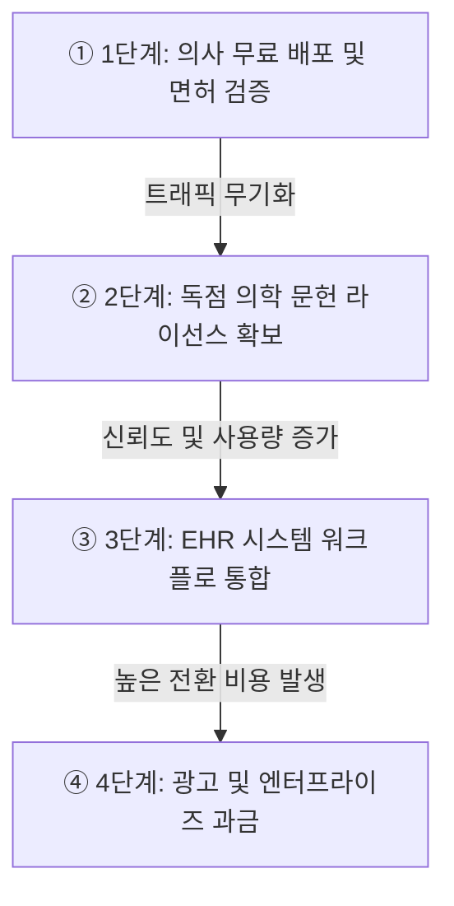

의학 문헌이 5년마다 두 배씩 늘어나는 정보 폭발 속에서, 버티컬 AI의 승패를 가르는 진짜 해자는 모델의 매개변수 크기가 아니라 독점적 데이터와 워크플로에 대한 '접근권'이다. Openevidence는 막대한 조달 비용 대신 의사들에게 무료로 제품을 풀고, 그 사용량을 무기로 최상위 저널의 라이선스와 전자건강기록(EHR) 내의 자리를 연쇄적으로 따내며 이 공식을 증명했다.

> Openevidence 전략 요약: 모델 성능 경쟁을 피해 '접근권'을 확보했다. 무료 배포로 검증된 의사 트래픽을 모으고, 이를 지렛대로 독점 의학 라이선스와 EHR 워크플로 통합을 이뤄내며 대체 불가능한 필수 인프라로 자리 잡았다.

## 애플리케이션 레이어의 새로운 규칙

지금까지 우리는 AI 경쟁에서 반도체, 비용, 모델 성능 같은 인프라 레이어만 바라봤다. AI 경쟁의 최종 승자는 과연 프런티어 랩일까? 결국 돈이 만들어지는 곳은 애플리케이션 레이어이며, 이곳의 승리 규칙은 완전히 다르다.

버티컬 AI의 해자는 범용 모델의 성능이나 프런티어 랩과의 경쟁이 아니라 접근권에 있다. 접근권이란 경쟁자가 막대한 돈을 들이더라도 당장 확보할 수 없는 고유 데이터, 검증된 사용자, 그리고 워크플로 통합의 결합이다. 법률의 Harvey, 금융의 Hebbia, 그리고 의료의 Openevidence가 같은 자리에 있는 이유가 바로 이것이다.

| 구분 | 범용 AI (OpenAI, Google) | 버티컬 AI (Openevidence, Harvey) |
| --- | --- | --- |
| 핵심 경쟁력 | 모델 매개변수 크기, 인프라 비용 | 고유 데이터, 사용자, 워크플로 통합 |
| 확보 방식 | 막대한 자본과 컴퓨팅 파워 | 규제 산업 내 파트너십과 라이선스 |
| 진입 장벽 | 기술적 한계와 연산 비용 | 검증된 접근권과 높은 전환 비용 |

Openevidence는 프런티어 랩보다 똑똑한 모델을 만들어서 이긴 것이 아니다. 이들은 OpenAI나 Google조차 돈으로 살 수 없는 세 가지 요소를 선점해 승리했다. 라이선스된 의학 문헌, 의사라는 검증된 사용자 기반, 그리고 EHR 안의 자리가 그것이다.

## 1단계: 조달 우회와 검증 게이트 (유통망 확보)

해자가 쌓이는 순서는 매우 중요하며, 각 단계는 다음 단계의 입장권이 된다. 1단계는 무료 배포를 통해 병원 조달을 우회한 것이다.

의료 소프트웨어를 병원에 팔려면 조달 절차, 보안 심사, 예산 배정을 거치며 대략 18개월이 걸린다. 이를 정면으로 뚫으려면 막대한 영업 비용을 태워야 한다. 병원 조달 사이클은 꽉 막힌 고속도로 요금소와 같다. Openevidence는 이 요금소에 줄을 서는 대신, 의사라는 개별 운전자들에게 전용 하이패스 단말기를 무료로 나눠주며 우회로를 뚫은 셈이다.

다만, 이 무료 배포에는 조건이 붙었다. NPI 번호 스캔이나 병원 이메일로 면허를 확인하는 '검증 게이트'를 두어 아무나 쓸 수 없게 만들었다. 무료이면서도 사용자 집단이 정확히 규정되기 때문에, 그 집단 자체가 나중에 강력한 자산이 된다.

이 전략의 결과는 숫자에서 드러난다. 임상 상담 건수는 2026년 1월 기준 월 약 2,000만 건에 도달했다. 1년 전 같은 시기의 월 약 300만 건에서 여섯 배 넘게 늘었다.

그 결과 미국 의사의 40퍼센트 이상이 이 도구를 평균적으로 매일 쓴다. 매달 6만 5,000명 이상의 미국 임상의가 새로 인증 등록을 하는 추세라면, 멀지 않아 의료진의 필수 툴로 자리 잡지 않을까 싶다.

## 임상 현장의 필수 툴로 진화하는 AI 경험

한편, 의사들은 매년 150만 편씩 쏟아져 5년마다 두 배가 되는 의학 논문을 감당해야 한다. 정보 과부하가 임상 현장의 상수가 된 상황에서, Openevidence는 의사들의 일상적 질의응답을 훌륭하게 장악했다.

이들은 답변에 제대로 된 인용을 달지 못하면 응답을 아예 거부하는 RAG(검색증강생성) 파이프라인을 설계했다. 의사는 근거 없는 답을 쓸 수 없는 직업이기에, 이 철저한 '근거중심의학(EBM)' 규칙은 범용 챗봇이 흉내 낼 수 없는 신뢰의 원천을 만들었다.

막대한 유저 베이스를 통해 의료진의 사고체계에 동화되고 있으며, 모델의 답변은 쓸수록 간결해지면서도 핵심을 정확히 짚어내고 있다. 사용자 경험이 임상 현장의 요구에 완벽히 맞춰지면서 이 도구는 단순한 검색 엔진을 넘어섰다.

## 2·3단계: 라이선스 협상력과 워크플로 통합

확보된 막대한 사용량은 곧바로 다음 단계의 무기가 되었다. 다음 그림은 Openevidence가 어떻게 단계별로 해자를 구축했는지 보여주는 흐름도다.

위 다이어그램의 ①단계에서 모인 검증된 의사 트래픽은 ②단계에서 NEJM, JAMA 같은 최상위 저널의 독점 라이선스를 끌어내는 지렛대가 된다. 저널 입장에서는 실제 임상 현장에서 매일 쓰이는 도구에 콘텐츠를 제공할 유인이 크기 때문이다. 이렇게 확보된 압도적 신뢰도를 바탕으로 ③단계에서 Epic 같은 지배적 EHR 시스템의 워크플로에 들어가게 되며, 이는 궁극적으로 ④단계의 강력한 수익화로 이어진다.

즉, 40퍼센트의 의사가 매일 쓰는 도구는 협상 테이블에서 완전히 다른 위치에 선다. 사용량이 라이선스를 부르고, 라이선스가 다시 사용량을 부르는 선순환이다. 이를 바탕으로 NEJM, JAMA, 그리고 미국심장학회(ACC) 등 학회별 지침까지 독점 라이선스 계약으로 묶어냈다.

이어서 3단계는 획득한 신뢰를 바탕으로 EHR 안으로 들어가는 과정이다. 앱은 지워질 수 있어도 진료 절차인 워크플로는 쉽게 지워지지 않는다. 2026년 2월 Sutter Health가 Epic 워크플로 안에 Openevidence를 가동했고, 이어 Mount Sinai와 Cedars-Sinai가 전사 배포를 단행했다. 환자의 과거 시술, 동반질환, 복용 약물 데이터를 끌어와 문헌 질의를 던지는 이 통합은 막대한 전환 비용을 발생시키며 엔터프라이즈 가치를 극대화한다.

## 4단계: 검증된 트래픽의 압도적 수익화

같은 맥락에서, 무료로 뿌린 것은 결국 마지막 4단계에서 압도적인 수익으로 회수된다. 면허를 확인받은 의사만 모여 있는 트래픽은 제약사 및 의료기기 광고주에게 낭비 없는 고단가 매체로 작용한다.

이 매체의 CPM은 70–1,000달러 이상으로 형성되는데, 일반적인 소셜 미디어 플랫폼의 5–15달러와는 자릿수 자체가 다르다. 이는 사용자당 평균 매출(ARPU) 약 124달러로 환산된다. 기존 강자인 UpToDate가 좌석당 500달러를 받으며 병원 조달을 거치는 것과 달리, Openevidence는 의사를 먼저 잡고 광고로 수확하는 구조를 증명했다.

이러한 전략은 눈부신 재무적 성과로 이어졌다. Sacra의 리서치 추정치에 따르면 2025년 연환산 매출은 1억 5,000만 달러로, 전년 790만 달러 대비 1,803퍼센트 증가했다. 더불어 2026년 1월 시리즈 D에서는 2억 5,000만 달러를 조달하며 120억 달러의 밸류에이션을 인정받았다. LLM 비용 하락의 수혜를 입는 구조에서 이들의 이익률은 점점 더 높아질 것으로 보인다.

개인적으로는 Openevidence가 의사의 학습과 질적 향상을 위한 필수 툴로 자리 잡는 쪽에 무게를 둔다. 의료진의 사고체계를 이미 체화한 플랫폼이 그 자리에 서면, 지금의 광고 단가를 훌쩍 넘는 과금력을 갖게 되지 않을까 싶다.

다만 모든 기능을 한곳에 모으는 '슈퍼앱' 전략까지 성공할 것 같지는 않다. 진료 현장의 도구는 하나로 합쳐질 때보다 각자의 자리에서 잘 맞물릴 때 쓰이기 때문이다. 물론 이 전망은 틀릴 수 있다.

## 버티컬 AI의 대칭적 대가: 기술 밖의 리스크들

해자가 기술 밖에 구축되었듯, 비즈니스를 위협하는 리스크 역시 기술 밖에서 온다. 세 리스크 모두 모델 성능과는 무관하다는 점이 역설적이다.

첫째는 규제와 배상책임 리스크다. 알고리즘 권고가 나쁜 환자 결과에 기여한 사건이 크게 불거지면 배상 청구와 규제 제한을 촉발해 사업 모델이 근본적으로 바뀔 수 있다. 둘째는 EHR 게이트키퍼 의존이다. Epic이나 Oracle-Cerner 같은 플랫폼이 내부적으로 경쟁 AI를 개발하거나 불리한 수익 배분을 요구할 수 있다. 셋째는 주요 의학 퍼블리셔들의 콘텐츠 라이선스 비용 인상 가능성이다.

이를 돌파하기 위해 시장 확장이 진행되고 있다. 유사한 수요를 가진 간호사 520만 명과 전 세계 1,500만 명의 의사로 타깃을 넓히고 있으며, Veeva Systems와 협력해 생명과학 및 제약 상업 운영의 인프라 계층으로 자리매김하며 리스크를 분산하고 있다.

## 한줄 코멘트.

결국 규제 산업에서 AI의 진짜 해자는 더 똑똑한 모델이 아니라, 검증 게이트와 독점 라이선스를 거쳐 워크플로 한복판에 자리를 잡아낸 '접근권'이다.

참고 자료 (1) — Sacra

<ul>
<li><a href="https://sacra.com/c/openevidence/">Openevidence</a> — Sacra</li>
</ul>

