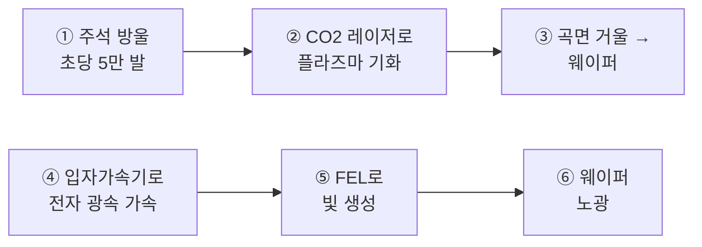

In March 2026, a single sentence from Elon Musk shook the semiconductor industry. "The most epic chip manufacturing project in history." Its name is TeraFab.

But the real battleground wasn't hidden in the grand building itself — it was in the massive 'ring structure' running beneath it.

> **Key Summary**
> TeraFab is a mega-scale semiconductor plant targeting 1 terawatt of AI compute per year.
> Instead of ASML EUV's tin-based method, Musk aims to generate the lithography light source using a particle accelerator and a free-electron laser (FEL).
> If it succeeds, ASML's monopoly on selling EUV machines that cost hundreds of billions of won each could be shaken.

## TeraFab, a Project on a Different Scale from the Start

TeraFab is a name combining Tera (a trillion) and Fab (a semiconductor plant). Its goal is 1 terawatt of AI compute capacity per year.

How much is 1 terawatt? It's on par with the entire power generation capacity of the United States. In effect, it's a declaration to produce compute equivalent to all the power plants in the U.S. from a single plant.

The production scale is also beyond common sense. It starts at 100,000 wafers per month and scales up to 1 million. At that level, the math works out to a single plant churning out 70% of TSMC's production volume.

The site is in Grimes County, Texas, with an area of 100 million square feet. The building will rise on a footprint 3.2 times the size of Yeouido. Phase 1 construction alone costs $16.8 billion, and combining all phases, it could reach up to $119 billion.

What will the chips be used for? Reportedly, 80% is allocated to space data centers and 20% to semiconductors for Optimus robots.

## Intel Joins as the First Foundry Customer

In April 2026, Intel joined as a TeraFab partner.

This point is significant. Intel's foundry division had long lacked any notable external customers. But with Tesla and SpaceX deciding to use Intel's 14A process, they effectively emerged as its first customer.

## The 'Ring Structure' and 'FEL FTW' in the Night Rendering

On August 6, 2026, a night rendering of TeraFab began circulating on X. A rendering refers to a projected completion image drawn with computer 3D graphics.

The key was the ring structure running beneath the building. People asked, "Isn't that the particle accelerator of an FEL (free-electron laser)?" Musk replied curtly: **"FEL FTW."**

Let's unpack the terms here. A particle accelerator is a device that pushes electrons and protons with an electric field to accelerate them to near the speed of light. The device that extracts light from such accelerated electrons is the free-electron laser (FEL).

FTW is an abbreviation for "For The Win." Saying "coffee FTW" means "coffee is the best, as expected." So "FEL FTW" reads as a strong declaration of intent: "FEL is the answer, we're going with this."

## Existing EUV vs. Musk's FEL Concept

How does ASML EUV, which makes today's most advanced chips, work?

Tin droplets are fired more than 50,000 times per second. A high-power CO2 laser strikes these droplets precisely, vaporizing them into a light-emitting plasma. Curved mirrors gather that light and send it to the wafer.

That's why it requires enormous electricity and extreme precision.

Musk's concept is fundamentally different in method. Instead of turning tin droplets into plasma, he intends to accelerate electrons to near the speed of light with a particle accelerator and extract light with an FEL.

Below is a diagram placing the light-source generation flow of the two methods side by side. The top ①–③ is ASML's current method, and the bottom ④–⑥ is Musk's FEL method.

①–③ rely on consumable tin and precision mirrors. That brings along contaminants, power, and maintenance costs. ④–⑥ have no tin. Since electrons are accelerated directly and converted into light, there is no tin contamination at all, and room for wavelength tuning opens up.

If it succeeds? It's an attempt that could break ASML's structure of monopolizing the supply of EUV machines costing hundreds of billions of won each. For reference, ASML's latest High-NA EUV equipment, the EXE:5200, costs around $350–400 million per unit, and fewer than 12 are installed worldwide.

## Already Proven Technology — the Problem Is Size and Cost

Here's a misconception to clear up. Extracting FEL light with a particle accelerator is itself an already-proven method.

Korea has it too. The Pohang Accelerator Laboratory's (PAL) PAL-XFEL is one of the earliest XFELs ever built, alongside those in the U.S., Japan, and Switzerland, and has provided user services since 2017.

The problem is size. PAL-XFEL reaches about 1.1 km in total length. Compared to ASML EUV, which is barely over 10 m, it's overwhelmingly large.

It might seem like no comparison, but on closer examination, there's a part that makes sense. A single FEL can supply light equivalent to dozens of EUV units, and if designed exclusively for EUV rather than for research, it can be made much shorter.

What about cost-effectiveness? Organized in a table, it looks like this.

| Item | ASML EUV | FEL (estimated) |
|---|---|---|
| Reference scale | 20 units introduced | 1 unit built |
| Reference unit price | $350-400 million per unit (about 500-560 billion won) | About 403.8 billion won (about $400 million), Pohang basis |
| Total | About 10-11 trillion won | About 1.2 trillion won even at 3x |
| Length | About 10 m | Over 1 km (can be shortened with dedicated design) |

The Pohang FEL had a total project cost of about 403.8 billion won, roughly $400 million in USD. Since the land was already owned, that's purely the construction cost. Texas, where TeraFab will be located, also has a low land-cost burden, so only construction costs need to be counted.

Personally, I suspect that the '1.2 trillion won vs. 11 trillion won' gap in that table is the real reason that moved Musk. Of course, the cost of making lithography practical isn't fully captured in that estimate, so I could be wrong.

## xLight Moved First, and FEL's Real Strength

In fact, Musk isn't the first. The attempt to replace the EUV light source with an FEL has been pursued since 2021 by a U.S. startup called xLight.

Former Intel CEO Pat Gelsinger serves as chairman of its board, and in June 2026, it secured $150 million in CHIPS Act funding from the U.S. Department of Commerce and NIST. The goal is a prototype demonstration in 2028 at the Albany NanoTech Complex in New York. xLight claims its FEL light source delivers 4 times the output compared to current methods.

But FEL's real strength lies elsewhere. It's the electricity savings through an ERL (Energy Recovery Linac).

An FEL uses an enormous amount of electricity to accelerate electrons. In short, it's an energy-guzzling hippo. Instead of discarding the energy used at this point, the ERL returns it to the accelerator to reuse it for the next acceleration.

It's easy to picture with a roller coaster. Just as the kinetic energy gained coming down a hill carries you up the next hill, the energy released by decelerating electrons accelerates new electrons. That's why Musk calls FEL 'free energy.'

## Closing — A Leap-Before-You-Look Challenge, and Our State of Mind

Theoretically, it looks possible. However, whether this can actually be used in a real semiconductor lithography process is an entirely different matter.

FEL EUV is cited for its advantages of high output, absence of tin contamination, and low operating costs, but it hasn't yet reached the mass-production-ready stage. Even though there appear to be many challenges to solve, the mood is closer to 'just go for it first.'

This is where feelings get complicated. From our position, with Samsung Electronics and SK hynix, it's awkward to simply wish for TeraFab's success.

Going a step further, a question like this flickers by. What happens if China replaces EUV with FEL? It means that ring structure from the beginning could be something that touches not just the lithography monopoly but even the geopolitical landscape.

A one-line comment. As always, Musk jumped into the river before the bridge was finished — this time, after laying a giant ring beneath the river.

참고 자료 (7) — CNBC · Manufacturing Dive · 포항가속기연구소 · Technology.org · Bits&Chips · The Next Web · X

<ul>
<li><a href="https://www.cnbc.com/2026/05/06/elon-musks-spacex-chip-fab-in-texas-to-cost-up-to-119-billion.html">Elon Musk's SpaceX chip fab in Texas to cost up to $119 billion</a> — CNBC</li>
<li><a href="https://www.manufacturingdive.com/news/xlight-chips-science-act-commerce-fel-albany-nanoplex-former-intel-pat-gelsinger/806767/">xLight secures CHIPS Act funding for FEL EUV in Albany</a> — Manufacturing Dive</li>
<li><a href="https://pal.postech.ac.kr/ko/intro/mechanism4th.do">PAL-XFEL 소개</a> — 포항가속기연구소</li>
<li><a href="https://www.technology.org/2026/07/29/asml-400-million-ai-chip-machines/">ASML's $400 million AI chip machines</a> — Technology.org</li>
<li><a href="https://bits-chips.com/article/musk-hints-at-free-electron-laser-euv-source-tech-for-terafab/">Musk hints at free-electron laser EUV source tech for Terafab</a> — Bits&Chips</li>
<li><a href="https://thenextweb.com/news/xlight-euv-350m-asml-euclyd">xLight raises $350M to challenge ASML's EUV monopoly</a> — The Next Web</li>
<li><a href="https://x.com/elonmusk/status/2085508463740760308">"FEL FTW"</a> — Elon Musk (X), 2026-08-06</li>
</ul>

## TL;DR
In March 2026, a single sentence from Elon Musk shook the semiconductor industry. "The most epic chip manufacturing project in history." Its name is TeraFab. But the real battle...

- Intent: informational
- Geo focus: us
- Core topics: terafab, Elon Musk, free electron laser FEL

## Quick Answers
### How does ASML EUV, which makes today's most advanced chips, work?
Tin droplets are fired more than 50,000 times per second. A high-power CO2 laser strikes these droplets precisely, vaporizing them into a light-emitting plasma. Curved mirrors gather that light and send it to the wafer.

## Next Step
Keep going with related deep dives on this topic.
- Quality gates: unique-angle, clear-structure, source-attribution-if-needed, readability-pass
