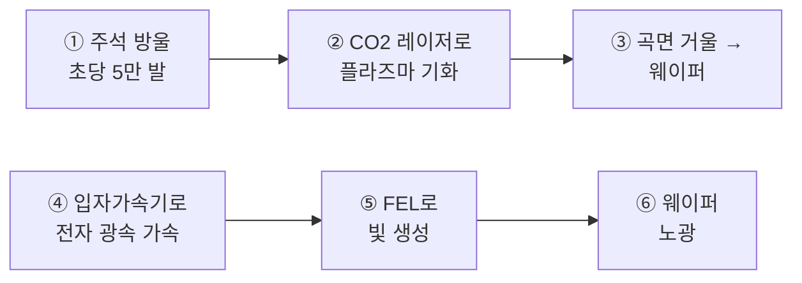

2026년 3월, 일론 머스크가 던진 문장 하나가 반도체 업계를 흔들었다. "역사상 가장 서사적인 칩 제조 프로젝트." 이름은 테라팹이다.

그런데 진짜 승부처는 웅장한 건물이 아니라, 그 건물 밑을 지나가는 거대한 '링 구조'에 숨어 있었다.

> **핵심 요약**
> 테라팹은 연간 1테라와트 AI 연산을 목표로 한 초대형 반도체 공장이다.
> 머스크는 ASML EUV의 주석 방식 대신 입자가속기·자유전자레이저(FEL)로 노광 광원을 만들려 한다.
> 성공하면 대당 수천억 원짜리 EUV를 파는 ASML의 독점이 흔들릴 수 있다.

## 테라팹, 스케일부터 다른 프로젝트

테라팹은 Tera(1조)와 팹(반도체 공장)을 합친 이름이다. 담긴 목표는 연간 1테라와트의 AI 연산능력이다.

1테라와트가 어느 정도인가? 미국 전체 발전용량과 맞먹는 수준이다. 공장 하나로 미국 전체 발전소급 연산을 뽑겠다는 선언인 셈이다.

생산 규모도 상식 밖이다. 처음엔 월 10만 장 웨이퍼로 시작해 100만 장까지 늘린다. 이 정도면 TSMC 생산량의 70%를 단일 공장에서 찍어내는 계산이 나온다.

부지는 텍사스 그라임스 카운티, 면적은 1억 제곱피트다. 여의도의 3.2배 위에 건물이 올라간다. 1단계 건설비만 168억 달러이고, 전체 단계를 합치면 최대 1,190억 달러까지 갈 수 있다.

만든 칩은 어디에 쓸까. 80%는 우주 데이터센터, 20%는 옵티머스 로봇용 반도체로 배정한다고 한다.

## 인텔의 합류, 파운드리 첫 고객

2026년 4월, 인텔이 테라팹 파트너로 합류했다.

이 대목이 의미심장하다. 인텔 파운드리 사업부는 그동안 이렇다 할 외부 고객이 없었다. 그런데 테슬라와 스페이스X가 인텔의 14A 공정을 쓰기로 하면서 사실상 첫 고객으로 등장했다.

## 야간 렌더링 속 '링 구조'와 'FEL FTW'

2026년 8월 6일, 테라팹의 야간 렌더링이 X에 돌기 시작했다. 렌더링이란 컴퓨터 3D 그래픽으로 그린 완성 예상도를 말한다.

핵심은 건물 밑을 지나가는 링 구조였다. 사람들이 물었다. "저거 FEL(자유전자레이저)의 입자가속기 아니냐?" 머스크는 짧게 답했다. **"FEL FTW."**

여기서 용어를 풀어보자. 입자가속기란 전자·양성자를 전기장으로 밀어 광속에 가깝게 가속하는 장치다. 그렇게 가속된 전자로 빛을 뽑아내는 장치가 자유전자레이저(FEL)다.

FTW는 "For The Win"의 약자다. "커피 FTW"라고 하면 "역시 커피가 최고지"라는 뜻이 된다. 그러니 "FEL FTW"는 "FEL이 정답이다, 이걸로 간다"는 강한 의지 표명으로 읽힌다.

## 기존 EUV vs 머스크의 FEL 구상

지금 최첨단 칩을 만드는 ASML EUV는 어떻게 작동할까?

주석 방울이 초당 5만 번 이상 발사된다. 고출력 CO2 레이저가 이 방울을 정확히 맞혀 빛을 내는 플라즈마로 기화시킨다. 그 빛을 곡면 거울이 모아 웨이퍼로 보낸다.

막대한 전기와 극도의 정밀성이 필요한 이유다.

머스크의 구상은 방식 자체가 다르다. 주석 방울을 플라즈마로 만드는 대신, 입자가속기로 전자를 광속 가까이 가속해 FEL로 빛을 뽑아내겠다는 것이다.

아래는 두 방식의 광원 생성 흐름을 나란히 놓은 그림이다. 위쪽 ①–③이 ASML의 현행 방식, 아래쪽 ④–⑥이 머스크의 FEL 방식이다.

①–③은 소모품인 주석과 정밀 거울에 의존한다. 그래서 오염물과 전력, 유지비가 따라붙는다. ④–⑥은 주석이 없다. 전자를 직접 가속해 빛으로 바꾸니 주석 오염물이 아예 없고, 파장 조절 여지도 생긴다.

성공한다면? 대당 수천억 원짜리 EUV를 독점 공급하는 ASML 구도가 깨질 수 있는 시도다. 참고로 ASML의 최신 High-NA EUV 장비 EXE:5200은 대당 3억 5천만–4억 달러 수준이며, 전 세계에 12대 미만이 깔려 있다.

## 이미 검증된 기술, 문제는 크기와 비용

여기서 오해를 풀어야 한다. 입자가속기로 FEL 빛을 뽑는 것 자체는 이미 검증된 방식이다.

한국도 갖고 있다. 포항가속기연구소(PAL)의 PAL-XFEL은 미국·일본·스위스와 함께 세계에서 가장 이른 시기에 지어진 XFEL 중 하나로, 2017년부터 이용자 서비스를 하고 있다.

문제는 크기다. PAL-XFEL은 전체 길이가 약 1.1km에 이른다. 10m 남짓한 ASML EUV와 비교하면 압도적으로 크다.

비교가 안 될 것 같지만, 따져보면 말이 되는 구석이 있다. FEL 1대가 수십 대의 EUV급 빛을 공급할 수 있고, 연구용이 아니라 EUV 전용으로 설계하면 훨씬 짧게 만들 수 있기 때문이다.

가성비는 어떨까. 표로 정리하면 이렇다.

| 항목 | ASML EUV | FEL(추정) |
|---|---|---|
| 기준 규모 | 20대 도입 | 1대 건설 |
| 참고 단가 | 대당 3.5~4억 달러(약 5,000~5,600억 원) | 포항 기준 약 4,038억 원(약 4억 달러) |
| 총액 | 약 10~11조 원 | 3배로 잡아도 약 1.2조 원 |
| 길이 | 약 10m | 1km 초과(전용 설계 시 단축 가능) |

포항 FEL은 총사업비가 약 4,038억 원, 미화로 약 4억 달러였다. 땅은 이미 갖고 있어 순수 건설비만 든 값이다. 테라팹이 들어서는 텍사스 역시 땅값 부담이 낮아 건설비만 계산하면 된다.

개인적으로는 저 표의 '1.2조 원 대 11조 원' 격차가 머스크를 움직인 진짜 이유가 아닐까 싶다. 물론 노광 실용화 비용이 저 추정에 다 담기진 않았을 테니, 틀릴 수 있다.

## 먼저 움직인 xLight, 그리고 FEL의 진짜 강점

사실 머스크가 처음은 아니다. EUV 광원을 FEL로 대체하려는 시도는 xLight라는 미국 스타트업이 2021년부터 해왔다.

전 인텔 CEO 팻 겔싱어가 이사회 의장을 맡았고, 2026년 6월 미 상무부·NIST와 CHIPS법 1억 5천만 달러 지원을 확정했다. 뉴욕 올버니 나노텍 단지에서 2028년 프로토타입 실증이 목표다. xLight는 자사 FEL 광원이 현행 대비 4배 출력을 낸다고 주장한다.

그런데 FEL의 진짜 강점은 따로 있다. ERL(에너지 회수 선형가속기)을 통한 전기 절감이다.

FEL은 전자를 가속하느라 전기를 엄청나게 쓴다. 한마디로 전기 먹는 하마다. ERL은 이때 쓴 에너지를 버리지 않고 가속기로 되돌려 다음 가속에 재사용한다.

롤러코스터를 떠올리면 쉽다. 언덕을 내려오며 얻은 운동에너지로 다음 언덕을 오르듯, 감속하는 전자가 내놓은 에너지로 새 전자를 가속하는 것이다. 머스크가 FEL을 '공짜 에너지'라 부르는 이유다.

## 마무리 — 지르고 보는 도전, 그리고 우리의 심경

이론적으로는 가능해 보인다. 다만 이걸 실제 반도체 노광공정에 쓸 수 있느냐는 전혀 다른 문제다.

FEL EUV는 높은 출력과 주석 오염물 부재, 낮은 운영비라는 장점이 거론되지만 아직 양산 준비 단계에 이르지 못했다. 해결할 과제가 많아 보이는데도, 분위기는 '일단 지르고 본다'에 가깝다.

여기서 마음이 복잡해진다. 삼성전자와 SK하이닉스를 둔 우리 입장에서 테라팹의 성공을 마냥 기원하기는 애매하다.

한발 더 나아가면 이런 질문도 스친다. 중국이 FEL로 EUV를 대체해버리면 어떻게 되나? 처음의 그 링 구조가, 노광 독점을 넘어 지정학의 판도까지 건드릴 수 있는 물건이라는 얘기다.

한줄 코멘트. 머스크는 늘 그렇듯 다리가 완성되기 전에 강으로 뛰어들었다 — 이번엔 강 밑에 거대한 링을 깔아두고서.

참고 자료 (7) — CNBC · Manufacturing Dive · 포항가속기연구소 · Technology.org · Bits&Chips · The Next Web · X

<ul>
<li><a href="https://www.cnbc.com/2026/05/06/elon-musks-spacex-chip-fab-in-texas-to-cost-up-to-119-billion.html">Elon Musk's SpaceX chip fab in Texas to cost up to $119 billion</a> — CNBC</li>
<li><a href="https://www.manufacturingdive.com/news/xlight-chips-science-act-commerce-fel-albany-nanoplex-former-intel-pat-gelsinger/806767/">xLight secures CHIPS Act funding for FEL EUV in Albany</a> — Manufacturing Dive</li>
<li><a href="https://pal.postech.ac.kr/ko/intro/mechanism4th.do">PAL-XFEL 소개</a> — 포항가속기연구소</li>
<li><a href="https://www.technology.org/2026/07/29/asml-400-million-ai-chip-machines/">ASML's $400 million AI chip machines</a> — Technology.org</li>
<li><a href="https://bits-chips.com/article/musk-hints-at-free-electron-laser-euv-source-tech-for-terafab/">Musk hints at free-electron laser EUV source tech for Terafab</a> — Bits&Chips</li>
<li><a href="https://thenextweb.com/news/xlight-euv-350m-asml-euclyd">xLight raises $350M to challenge ASML's EUV monopoly</a> — The Next Web</li>
<li><a href="https://x.com/elonmusk/status/2085508463740760308">"FEL FTW"</a> — Elon Musk (X), 2026-08-06</li>
</ul>

