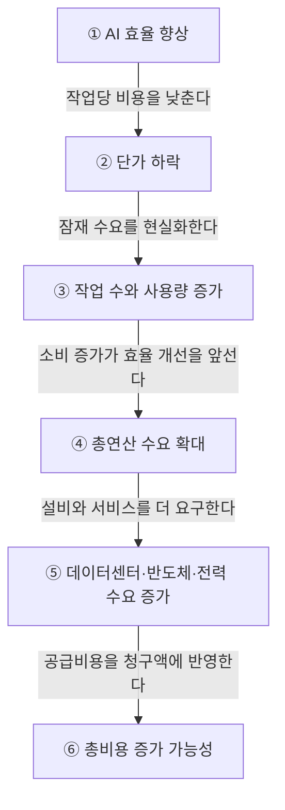

AI가 낮춘 것은 지능의 가격만이 아니라 ‘틀렸을 때 치르는 비용’이다. 그러나 시도가 쉬워질수록 사용량과 총수요는 폭증할 수 있으므로, 빠른 탐색과 느린 투자를 동시에 설계해야 한다.

> AI 시대에는 실패 비용이 낮은 실험을 빠르게 반복해야 한다.  
> 검증된 우량 기업은 낮은 포트폴리오 회전율로 오래 보유해야 한다.  
> 더 많이 시도하면서 덜 거래하는 것이 AI 시대의 이중 회전 전략이다.

## AI가 바꾸는 낙관과 비관의 비용

과거에는 충분히 확신한 다음 실행하는 순서가 자연스러웠다. 아이디어를 제품으로 만들고 시장에 내놓는 데 큰돈과 긴 시간이 필요했기 때문이다.

AI는 이 계산을 바꾸고 있다.

**잘못된 낙관의 가격은 내려간다.**

될 것이라고 믿고 시도했지만 실패했을 때 치르는 비용이 작아진다. AI로 시제품을 만들고, 코드를 작성하고, 콘텐츠를 제작하면 가설을 검증하는 데 필요한 시간과 인력이 줄어든다.

**잘못된 비관의 가격은 올라간다.**

안 될 것이라고 판단해 시도하지 않았는데 경쟁자가 먼저 기회를 발견하면 손실이 커진다. 다른 사람은 저렴한 비용으로 수십 개의 가설을 검증하는데 혼자 확신이 생길 때까지 기다린다면 탐색 속도에서 밀릴 수밖에 없다.

그렇다면 확신이 부족해도 무조건 실행해야 할까? 그렇지는 않지만, 작게 시험할 수 있는 가설까지 회의실에 오래 붙잡아 둘 이유는 줄었다.

AI는 지능을 싸게 만들었고, 더 중요하게는 틀림을 싸게 만들었다.

## 단가는 내려가도 청구서는 커지는 이유

AI의 효율 향상은 개별 작업에 필요한 연산량과 비용을 낮춘다. 하지만 가격이 내려가면 이전에는 경제성이 없었던 작업까지 실행되면서 전체 사용량이 늘어난다.

**제번스 역설이란 자원 사용의 효율이 높아져 단위 비용이 내려갔지만, 사용량이 더 빠르게 증가해 자원의 총소비가 오히려 늘어나는 현상이다.** 윌리엄 스탠리 제번스는 1865년 증기기관의 효율 향상이 석탄 수요를 줄이기보다 사용 범위를 넓힐 수 있다고 지적했다. 이 개념을 AI 연산에 적용하는 것은 역사적 논리를 현재 기술에 확장한 해석이다. [예일대학교 Energy History](https://energyhistory.yale.edu/w-stanley-jevons-the-coal-question-1865/)

AI 비용과 사용량이 어떻게 총인프라 수요로 연결되는지를 나타내면 다음과 같다.

첫 단계에서는 같은 작업을 더 적은 비용으로 처리한다. 이어서 낮아진 단가가 새로운 사용자와 새로운 업무를 끌어들이고, 늘어난 작업 수가 효율 개선분을 넘어설 때 총연산 수요와 AI 인프라 수요가 확대된다.

이는 연비가 좋아진 자동차를 타면서 이동 횟수와 거리를 크게 늘리는 상황과 비슷하다. 1㎞를 달리는 비용은 줄었지만 한 달 유류비는 오히려 커질 수 있다.

가격은 내려가는데 청구서는 왜 커질까? 단가가 떨어지는 속도보다 소비량이 늘어나는 속도가 더 빠르기 때문이다.

## 실험의 회전율을 높여야 하는 시대

틀릴 때의 손실이 작아진 환경에서는 더 많은 가설을 짧은 주기로 시험하는 편이 합리적으로 보인다. AI를 단순한 인건비 절감 수단이 아니라 탐색 범위와 실험 횟수를 확대하는 도구로 활용해야 한다.

| 구분 | 기존 방식 | AI 시대의 방식 |
|---|---|---|
| 실행 순서 | 충분한 확신을 확보한 뒤 실행했다. | 작은 실험을 먼저 진행한 뒤 증거를 쌓는다. |
| 실패 처리 | 실패 자체를 피하는 데 초점을 맞췄다. | 실패 비용과 학습 속도를 함께 관리한다. |
| AI의 역할 | 기존 업무의 비용을 절감하는 데 활용했다. | 더 많은 가설과 선택지를 검증하는 데 활용한다. |
| 핵심 지표 | 작업당 비용을 중심으로 평가했다. | 학습 속도와 실제 가치 창출을 함께 평가한다. |

다만, 실험 횟수가 늘었다는 사실이 가치 창출을 의미하지는 않는다. 사용량 증가로 얻은 효율 개선액이 추가로 발생한 AI 청구액과 설계·제조·소프트웨어 비용을 웃돌아야 한다.

개인적으로 AI 도입의 성패는 얼마나 많이 사용했는지가 아니라 얼마나 빨리 틀린 가설을 버리고 유효한 가설을 키웠는지에서 갈릴 것 같다. 물론 틀릴 수 있지만, 사용량보다 검증된 성과를 측정하는 조직이 더 오래 앞서갈 가능성이 커 보인다.

## 투자 포트폴리오의 회전율은 왜 낮아야 하는가

업무에서는 실험의 회전율을 높여야 하지만 투자에서는 반대 원칙이 필요하다.

**포트폴리오 회전율이란 일정 기간 포트폴리오의 증권이 얼마나 자주 교체됐는지를 나타내는 지표다.** 펀드의 공식 계산에서는 일반적으로 연간 매수액과 매도액 중 작은 금액을 해당 기간의 월평균 포트폴리오 가치로 나눈다. [미국 SEC Form N-1A](https://www.sec.gov/files/form-n-1a.pdf)

따라서 거래금액이 줄거나 평가자산이 커지면 회전율은 낮아진다. 다만 평가자산 증가로 분모만 커지는 것보다 불필요한 거래를 줄이는 것이 투자자가 직접 통제할 수 있는 방법이다.

퀄리티 투자자는 잦은 매매보다 경쟁력과 재무 건전성, 성장성을 갖춘 우수한 기업을 오래 보유하는 낮은 포트폴리오 회전율을 지향한다. 이는 아무 기업이나 무작정 붙잡는 전략이 아니라 보유 근거가 유지되는 기업에 시간을 허용하는 전략이다.

## 낮은 회전율이 만드는 장기적 우위

낮은 포트폴리오 회전율은 거래비용을 줄이고 감정적 판단을 억제하며 장기 복리가 작동할 시간을 확보한다.

| 장기적 우위 | 작동 방식 |
|---|---|
| 거래비용을 절감한다. | 매수와 매도 횟수가 줄어 수수료와 기타 거래비용이 감소한다. |
| 세금 부담을 관리한다. | 과세 계좌에서는 잦은 매매로 발생할 수 있는 과세 실현을 줄인다. |
| 감정적 투자를 예방한다. | 시장 변동에 대한 즉흥적인 추격 매수와 공포 매도를 줄인다. |
| 본질가치에 집중한다. | 단기 주가보다 기업의 이익과 현금흐름 성장을 관찰한다. |
| 장기 복리를 강화한다. | 수익이 다시 수익을 만드는 데 필요한 보유 시간을 확보한다. |

SEC 투자자 안내서는 높은 포트폴리오 회전율이 더 큰 거래비용과 과세 부담으로 이어질 수 있다고 설명한다. 또한 작은 비용도 장기간 누적되면 포트폴리오 가치에 큰 차이를 만들 수 있다고 제시한다. [Investor.gov의 회전율 안내](https://www.investor.gov/introduction-investing/general-resources/news-alerts/alerts-bulletins/investor-bulletins/updated-investor-bulletin-how-read-mutual-fund-or-etf-shareholder-report), [Investor.gov의 투자비용 안내](https://www.investor.gov/introduction-investing/getting-started/understanding-fees)

물론 낮은 회전율 자체가 높은 수익률을 보장하지는 않는다. 기업의 경쟁력이 훼손됐거나 최초 투자 가설이 틀렸다면 오래 보유하는 행동은 복리가 아니라 손실을 키울 수 있다.

결국 낮은 회전율의 핵심은 거래하지 않는 데 있지 않다. 무엇을 오래 보유할지 신중하게 선택하고, 시장의 소음과 기업의 본질적 변화를 구분하는 데 있다.

## 더 많이 시도하면서도 덜 거래해야 한다

AI 시대의 핵심은 모든 회전율을 일률적으로 높이거나 낮추는 데 있지 않다. 실패 비용이 낮은 탐색과 실험은 빠르게 반복하되, 검증을 거쳐 선택한 우량 기업에는 낮은 포트폴리오 회전율로 오래 머물러야 한다.

같은 맥락에서 기업을 찾고 분석하는 과정에는 AI를 활용해 실험의 회전율을 높일 수 있다. 그러나 투자 판단까지 매일 뒤집는다면 AI가 높여준 탐색 능력이 과잉 매매로 변할 수 있다.

AI가 틀림을 싸게 만들었다고 해서 모든 결정을 가볍게 내려도 된다는 뜻은 아니다. 되돌리기 쉬운 실험은 빠르게 하고, 복리가 필요한 자본 배분은 느리게 해야 한다.

**한줄 코멘트.** AI 시대에는 넓게 시승하되, 좋은 차를 골랐다면 목적지까지 자주 갈아타지 않는 편이 나을 것 같다.

참고 자료 (1) — X

<ul>
<li><a href="https://x.com/JensenHuang/status/2086934705207959965">@JensenHuang 게시물</a> — X</li>
</ul>

