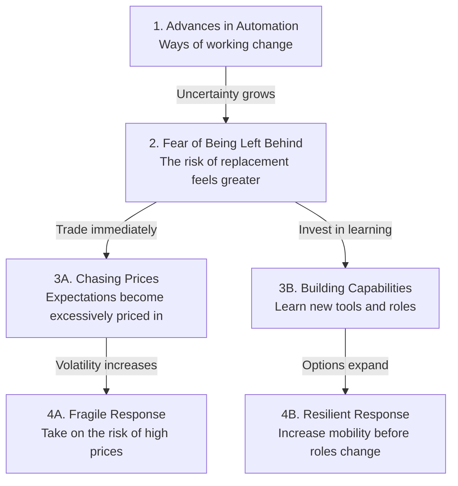

When seismic changes such as war or automation loom, the fear that “I might be the only one left behind” arrives before reality does. The problem is that a hyperactive market can combine this universal fear with greed, pushing prices far beyond reality.

> Fear comes for everyone, but that does not make chasing prices out of fear rational.  
> We must consider not only the speed of automation but also the pace of individual learning and skill development.  
> The most resilient investment is not an overheated asset but a capability that remains useful after the change.

## Fear Arrives Before Major Change

I was afraid. Each time, a momentous change comparable to war arrived, and each time, fear spread before the actual impact.

The essence of that fear is simple: the anxiety that everyone else will ride the wave of change while I alone am left behind. This feeling is not a flaw found only in some people but a universal response shared by anyone facing uncertainty.

Fear comes for everyone equally.

But does the universality of fear make actions driven by it rational? No. Even when people feel the same fear, deciding what to buy, what to learn, and how long to wait requires separate judgment.

## A Market Where Fear and Greed Drive Up Prices

Today’s market is hyperactive. Because information spreads in an instant and trades are executed immediately, fear turns into price movements before it passes through calm judgment.

When the anxiety of being left behind combines with the greed for greater profits, people pay attention to how quickly others are buying rather than to an asset’s fair value. It is like buying the same workbook as a friend without even checking what material will be on the exam.

Prices then become extremely expensive.

The market’s recent extreme volatility and dramatic price movements also seem difficult to explain solely by the scale of technological change. We should also consider the possibility that expectations and fears surrounding automation became concentrated in one direction over a short period, amplifying prices.

| Subject of Judgment | Interpretation When Fear Takes the Lead | Question That Must Also Be Considered |
|---|---|---|
| Automation technology | It is assumed to be rapidly replacing every job. | Which tasks are actually being replaced, and which are being augmented? |
| Market prices | It is assumed that one must buy at any price before being left behind. | How much of the expected growth is already priced in? |
| Individual response | It is concluded that no one can keep pace with technological change. | How much can productivity be increased through learning and the use of new tools? |
| Job transformation | It is assumed that the disappearance of an existing role will immediately lead to unemployment. | How much time and support will career transitions and reskilling require? |

## Is the Market Overestimating the Threat of Automation?

The current market appears to be pricing in a strong assumption that automation will advance faster than individuals can develop their capabilities. If this assumption proves correct, a painful adjustment period could follow job displacement as people learn new roles.

However, exposure to automation and the actual disappearance of jobs are not the same thing. **Automation exposure refers to how much of the work that makes up an occupation can be performed by technology.**

In 2025, the International Labour Organization estimated that one in four workers worldwide had a job exposed to generative AI to some degree. However, because many tasks still require human involvement, it concluded that job transformation is more likely than complete replacement.

This figure should not be interpreted as meaning that one in four jobs will disappear. In my view, this finding does not mean that automation poses no risk. Rather, it suggests that the market’s extreme assumption—that there will be no time at all to respond—is not yet an established fact.

## Consider Both the Speed of Automation and the Pace of Skill Development

Recent statistics indicate that workers may be able to adapt their capabilities to technological change. In the World Economic Forum’s 2025 employer survey, the proportion of workers who had completed education, reskilling, or upskilling programs rose from 41% in 2023 to 50% in 2025. The proportion of core skills expected to change or become obsolete by 2030 was estimated at 39%, lower than in the previous survey.

If this trend continues, perhaps at least some workers will be able to learn new tools and ways of working before their current roles change completely. However, because the survey is based on employers’ responses and forecasts, it does not directly prove that individual skill development is outpacing automation.

Of course, this judgment could be wrong. Learning speeds vary widely depending on industry, occupation, income, and access to education, and new technologies could certainly spread faster than education systems can adapt.

Ultimately, the comparison should not be between technology and a fixed level of human ability. We must compare the pace of technological progress with the pace at which people learn, use tools, and secure new opportunities.

The following diagram illustrates how fear of automation can lead either to market price chasing or to an individual response.

In the first stage, automation changes some aspects of existing work. In the second stage, people immediately interpret that change as complete replacement and become afraid of being left behind.

What they choose next matters. Turning fear immediately into trades means accepting high prices and severe volatility. Turning it into learning, however, expands the range of work available after the change.

## Invest in Capabilities, Not Price Chasing

The fact that fear comes for everyone equally does not mean that fear-driven market behavior is correct. If greed leads investors to pay excessively high prices, they can accurately predict the direction of automation and still fail as investors.

So what should we buy? The answer does not necessarily have to be a particular asset. Building knowledge, skills, experience, and learning habits that can be applied before the transformation accelerates appears to be a more resilient response.

In the same context, stock-price growth is not the only key metric in the age of automation. We must also measure the time required to learn new tools, the extent to which existing experience can be transferred to other roles, and the time that can be invested consistently in learning.

In an era of seismic change, fear can arrive before reality, and market prices can race far beyond it. Ultimately, what we need is not to fear automation and chase expensive prices, but to ensure that our capabilities reach new opportunities before our jobs change.

**One-line comment.** Rather than chasing an overpriced ticket for the automation express, it is better to first develop the ability to transfer to any train.

References (5) — International Labour Organization · World Economic Forum · meta.com · Bloomberg.com · Naver

<ul>
<li><a href="https://www.ilo.org/publications/generative-ai-and-jobs-2025-update">Generative AI and Jobs: A 2025 Update</a> — International Labour Organization, May 20, 2025</li>
<li><a href="https://www.weforum.org/publications/the-future-of-jobs-report-2025/digest/">The Future of Jobs Report 2025</a> — World Economic Forum, January 7, 2025</li>
<li><a href="https://www.meta.com/thefutureisforeveryone/">The Future is for Everyone</a> — meta.com, 2026-08-10</li>
<li><a href="https://www.bloomberg.com/news/articles/2026-07-01/meta-is-building-a-cloud-business-to-sell-excess-ai-compute">Meta Is Planning a Cloud Business to Sell AI Computing Power</a> — Bloomberg.com</li>
<li><a href="https://blog.naver.com/tmdejr1267/224355806838">Naver blog post</a> — Naver</li>
</ul>

