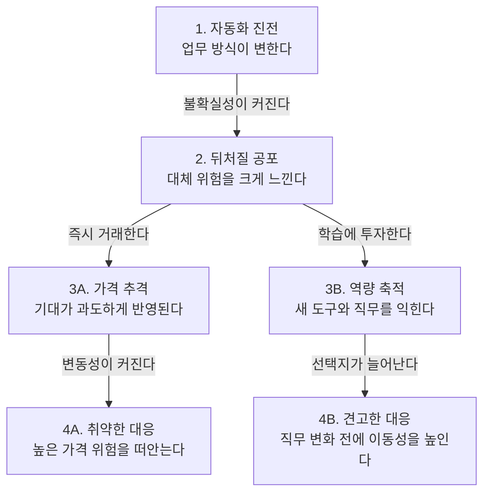

전쟁이나 자동화처럼 거대한 변화가 예고될 때 현실보다 먼저 도착하는 것은 ‘나만 뒤처질 수 있다’는 공포다. 문제는 과잉 활동적인 시장이 이 보편적인 공포를 욕심과 결합해 가격을 현실보다 훨씬 멀리 밀어낼 수 있다는 점이다.

> 공포는 누구에게나 찾아오지만, 공포에 따른 가격 추격까지 합리적인 것은 아니다.  
> 자동화의 속도만 보지 말고 개인의 학습과 역량 성장 속도를 함께 봐야 한다.  
> 가장 견고한 투자는 과열된 자산이 아니라 변화 이후에도 활용할 수 있는 능력이다.

## 큰 변화보다 먼저 찾아오는 공포

겁이 났다. 매번 전쟁과 같은 중대한 변화가 찾아왔고, 매번 실제 충격보다 공포가 먼저 확산했다.

그 공포의 핵심은 단순하다. 다른 사람은 변화에 올라타는데 나만 뒤처질 수 있다는 두려움이다. 이 감정은 일부 사람만의 결함이 아니라 불확실성을 마주한 사람이라면 누구나 느끼는 보편적인 반응이다.

공포는 모두에게 평등하게 찾아온다.

그렇다면 공포가 보편적이라는 이유로 공포에 따른 행동까지 합리적일까? 그렇지는 않다. 같은 두려움을 느끼더라도 무엇을 사고, 무엇을 배우며, 얼마나 기다릴지는 별개의 판단이다.

## 공포와 욕심이 가격을 밀어 올리는 시장

지금의 시장은 극도로 과잉 활동적이다. 정보가 순식간에 퍼지고 거래가 즉시 이뤄지기 때문에 공포가 냉정한 판단을 거치기 전에 가격으로 전환된다.

뒤처지지 않으려는 불안에 더 큰 이익을 얻고 싶은 욕심이 붙으면 사람들은 자산의 적정 가치보다 다른 사람의 매수 속도를 먼저 본다. 학교에서 시험 범위도 확인하지 않은 채 친구가 산 문제집부터 따라 사는 것과 비슷하다.

그러면 가격은 매우 비싸진다.

최근 시장의 극심한 변동성과 과격한 가격 움직임도 변화의 크기만으로 설명하기는 어려울 것 같다. 자동화에 대한 기대와 공포가 짧은 시간에 한쪽으로 몰리면서 가격을 증폭했을 가능성도 함께 살펴야 한다.

| 판단 대상 | 공포가 앞설 때의 해석 | 함께 확인해야 할 질문 |
|---|---|---|
| 자동화 기술 | 모든 일자리를 빠르게 대체한다고 본다. | 실제로는 어떤 업무가 대체되고 어떤 업무가 보완되는가를 확인해야 한다. |
| 시장 가격 | 뒤처지기 전에 어떤 가격이라도 사야 한다고 본다. | 기대가 이미 가격에 얼마나 반영됐는지를 따져야 한다. |
| 개인의 대응 | 기술의 속도를 따라잡을 수 없다고 단정한다. | 학습과 도구 활용으로 생산성을 얼마나 높일 수 있는지를 측정해야 한다. |
| 일자리 변화 | 기존 직무가 사라지면 곧바로 실업으로 이어진다고 본다. | 직무 전환과 재교육에 필요한 시간과 지원을 함께 계산해야 한다. |

## 시장은 자동화의 위협을 과대평가하고 있는가

현재 시장은 자동화가 개인의 역량 성장보다 빨라질 것이라는 가정을 강하게 가격에 반영하는 것으로 보인다. 이 가정이 맞다면 일자리 대체 이후 사람들이 새로운 직무를 익힐 때까지 고통스러운 적응 기간이 이어질 수 있다.

다만, 자동화 노출과 실제 일자리 소멸은 같은 개념이 아니다. **자동화 노출이란 한 직업을 이루는 업무 가운데 기술로 수행할 수 있는 부분이 얼마나 되는지를 뜻한다.**

국제노동기구는 2025년 전 세계 노동자 네 명 중 한 명이 생성형 AI에 어느 정도 노출된 직업에 종사한다고 추정했다. 그러나 인간의 투입이 계속 필요한 업무가 많아 완전한 대체보다 직무의 변화가 더 가능성 높은 결과라고 평가했다.

이 수치를 읽을 때는 ‘네 명 중 한 명의 일자리가 사라진다’고 해석해서는 안 된다. 개인적으로 이 결과는 자동화의 위험이 없다는 뜻보다, 대응할 시간이 전혀 없다는 시장의 극단적인 가정이 아직 확정된 사실은 아니라는 뜻에 가깝다고 본다.

## 자동화 속도와 역량 성장 속도를 함께 보라

최근 통계는 노동자의 역량이 기술 변화에 적응할 가능성을 보여준다. 세계경제포럼의 2025년 기업 설문에서는 교육·재교육·역량 강화 과정을 마친 노동자 비중이 2023년 41%에서 2025년 50%로 높아졌고, 2030년까지 달라지거나 낡을 것으로 예상되는 핵심 역량의 비중은 이전 조사보다 낮아진 39%로 집계됐다.

이 추세라면 적어도 일부 노동자는 현재 직무가 완전히 바뀌기 전에 새로운 도구와 업무 방식을 익힐 수 있지 않을까 싶다. 다만 이 조사는 기업의 응답과 전망에 기초하므로, 개인의 역량 성장이 자동화보다 빠르다는 사실을 직접 증명하지는 않는다.

물론 이 판단은 틀릴 수 있다. 산업과 직무, 소득, 교육 접근성에 따라 학습 속도가 크게 다르고, 새로운 기술이 교육 체계보다 빠르게 확산할 가능성도 충분하다.

결국 비교해야 할 대상은 기술과 인간의 고정된 능력이 아니다. 기술이 발전하는 속도와 사람이 배우고 도구를 활용하며 새로운 기회를 확보하는 속도를 함께 비교해야 한다.

다음 그림은 자동화에 대한 공포가 시장 가격과 개인의 대응으로 갈라지는 과정을 나타낸다.

첫 단계에서 자동화는 기존 업무의 일부를 바꾼다. 두 번째 단계에서 사람들은 변화를 곧바로 완전한 대체로 확대해 해석하며 뒤처질 공포를 느낀다.

그다음 선택이 중요하다. 공포를 즉시 거래로 옮기면 비싼 가격과 큰 변동성을 감수하게 되지만, 학습으로 옮기면 변화 이후 선택할 수 있는 일의 범위가 넓어진다.

## 가격 추격이 아니라 역량에 투자하라

공포가 모두에게 평등하게 찾아온다는 사실은 공포에 따른 시장 행동까지 옳다는 뜻이 아니다. 욕심 때문에 지나치게 비싼 가격을 지불하면 자동화의 방향을 맞히고도 투자에서는 실패할 수 있다.

그렇다면 무엇을 사야 할까? 답은 반드시 특정 자산일 필요가 없다. 변화가 본격화되기 전에 활용할 수 있는 지식, 기술, 경험과 학습 습관을 축적하는 편이 더 견고한 대응으로 보인다.

같은 맥락에서 자동화 시대의 핵심 지표는 주가 상승률만이 아니다. 새로운 도구를 익히는 시간, 기존 경험을 다른 직무에 옮길 수 있는 정도, 학습에 꾸준히 투입할 수 있는 시간도 함께 측정해야 한다.

큰 변화의 시대에는 공포가 현실보다 먼저 도착하고 시장 가격은 현실보다 멀리 달려갈 수 있다. 결국 필요한 것은 자동화를 두려워하며 비싼 가격을 추격하는 일이 아니라, 일자리가 바뀌기 전에 자신의 능력이 먼저 새로운 가능성에 도달하도록 만드는 일이다.

**한줄 코멘트.** 자동화라는 급행열차의 표를 비싸게 추격하기보다, 어느 열차로든 갈아탈 수 있는 능력을 먼저 갖추는 편이 낫다.

참고 자료 (5) — 국제노동기구 · 세계경제포럼 · meta.com · bloomberg.com · blog.naver.com

<ul>
<li><a href="https://www.ilo.org/publications/generative-ai-and-jobs-2025-update">Generative AI and Jobs: A 2025 Update</a> — 국제노동기구, 2025년 5월 20일</li>
<li><a href="https://www.weforum.org/publications/the-future-of-jobs-report-2025/digest/">The Future of Jobs Report 2025</a> — 세계경제포럼, 2025년 1월 7일</li>
<li><a href="https://www.meta.com/thefutureisforeveryone/">The Future is for Everyone</a> — meta.com, 2026-08-10</li>
<li><a href="https://www.bloomberg.com/news/articles/2026-07-01/meta-is-building-a-cloud-business-to-sell-excess-ai-compute">meta is building a cloud business to sell excess ai compute</a> — bloomberg.com</li>
<li><a href="https://blog.naver.com/tmdejr1267/224355806838">blog.naver.com</a> — blog.naver.com</li>
</ul>

