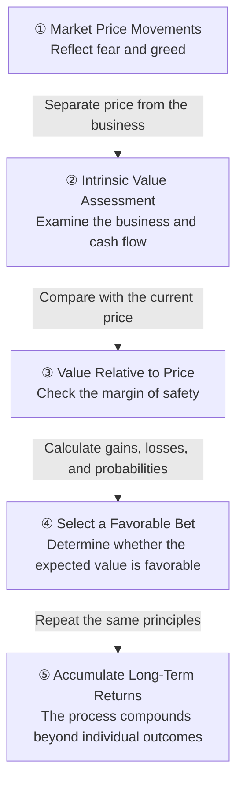

Watching prices swing dramatically each day can make the market feel different from what it once was. Today’s price movements are certainly extreme, but what separates successful investors from unsuccessful ones is not how quickly they react to volatility. It is whether they can calmly assess value and probability amid the noise of market prices.

> The essence of investing is not predicting every market movement correctly.  
> Investors must focus on value rather than price and repeatedly make bets when the odds are favorable.  
> Ultimately, long-term investment performance depends on sound judgment and emotional discipline.

## An Overactive Market Creates Extreme Volatility

Recent market volatility has been severe. But this is more than simply a highly volatile market—it is an extremely overactive one.

Information spreads in real time, and investors react immediately. Combined with short-term trading and herd mentality, even minor news can trigger enormous price movements.

Extreme price movements do not necessarily indicate material changes in a business. More often, they reflect market participants’ fear and optimism, greed and impatience.

Does that mean a company whose share price has plunged suddenly became a bad company overnight? Not necessarily.

Its products and services, competitive advantages, and cash-generating ability may remain unchanged while only market sentiment has shifted. The stronger the impression that the market has fundamentally changed, the more important it becomes to distinguish short-term prices from a company’s intrinsic value.

## Greed and Misjudgment Can Make the Same Business Expensive

Even when the underlying business remains the same, the price assigned to it by the market can vary dramatically. When optimism spreads, favorable future possibilities are quickly priced into the present. When greed takes over, the price rises beyond even that level.

The asset becomes excessively expensive—even though the business itself has not changed.

A good business and a good investment are not the same thing. A good business has competitive advantages, growth potential, and profitability. A good investment means buying an asset at an attractive price relative to its value.

| Category | Primary Focus | Question Investors Should Ask |
|---|---|---|
| Good business | Competitive advantages and growth potential | Can this company remain profitable over the long term? |
| Good asset | Cash flow and sustainability | Does this asset provide tangible value? |
| Good investment | Value relative to price | Does buying at the current price offer sufficient expected returns? |
| Expensive investment | Price reflecting optimism | Am I already paying too much upfront for a promising future? |

No matter how excellent an asset may be, buying it at an excessively high price makes it an unfavorable investment. It is like buying delicious bread outside a school. No matter how good the bread tastes, paying ten times its usual price would hardly qualify as a good purchase.

The moment greed leads you to overpay, the burden of a high purchase price may outweigh the advantages of owning a good company.

## Focus on Value Relative to Price, Not Price Alone

Value relative to price describes the relationship between the price an investor pays today and the tangible value the asset is expected to provide. Put simply, it is the value for money offered by an investment.

The key to investment analysis is not merely whether an asset is attractive in absolute terms. Investors must also consider how much value they will receive relative to its current price.

Personally, I believe investment opportunities arise when the market appears to be misjudging a company or situation. Of course, that assessment can be wrong. This is why investors must continually examine evidence that contradicts their own estimates.

Can you invest even when uncertainty remains? If the gap between price and value is sufficiently wide and you can withstand the possibility of loss, doing so may be a rational choice.

The investment implication is clear: the price you pay matters just as much as what you buy.

## Choose Favorable Odds Over Certain Predictions

A favorable bet is not a choice that guarantees success. It is a choice whose expected outcome favors you after considering the potential gains and losses and the probability of each.

Investing always involves uncertainty. Instead of feeling certain about a single outcome, investors must compare multiple possibilities and determine whether the expected return is favorable.

The following diagram illustrates the decision-making process that leads from market noise to long-term investment performance.

In step ①, investors must distinguish whether a price movement reflects a change in the business or merely a psychological reaction. In steps ② and ③, they must determine whether there is a meaningful gap between the company’s intrinsic value and its current price.

In step ④, expected returns and the probability of success must be evaluated alongside the possibility of loss. Even when losses are possible, a sufficiently attractive expected outcome can still make an investment a bet with fairly favorable odds.

However, even a favorable bet can fail once. That is why a single failure does not mean the entire decision-making process was flawed.

Long-term investment performance appears to come less from the ability to get every investment right and more from consistently repeating bets with favorable odds. As long as investors continue making such bets, they can withstand fluctuations in individual outcomes.

## Investing Is Ultimately a Mental Game

The investing game is fascinating. The problem is that exciting market movements can make investors excessively active.

When prices soar, anxiety about being left behind takes hold. When prices plunge, fear creates an urge to escape immediately. At such moments, investors are more likely to follow the crowd’s emotions than rely on valuation analysis.

| Market Situation | Common Emotion | Unfavorable Behavior | Necessary Mindset |
|---|---|---|---|
| Rapid price increase | Greed and fear of missing out | Buying at an excessively high price | Recompare intrinsic value with the purchase price |
| Rapid price decline | Fear and regret | Panic selling without analysis | First determine whether the business has materially changed |
| High uncertainty | Impatience and confusion | Relying excessively on predictions | Assess the range of gains and losses and their probabilities |
| Failed bet | Self-doubt | Abandoning principles immediately | Separate the outcome from the decision-making process |

Ultimately, investing is a mental game.

The same applies to decision-making in other areas. Establishing sound criteria and repeatedly making favorable choices matters more than a single emotional decision.

In this context, investors must continually reassess their own valuations and probability judgments instead of focusing on the market’s reactions. As market noise grows louder, the ability to remain steady and wait becomes more important than the ability to act more frequently.

## Control Your Own Judgment, Not Market Noise

The essence of investing is not predicting every market movement correctly. Investors must remember that even the same business can become extremely expensive because of collective greed and misjudgment.

Focus on value relative to price rather than price alone, and choose bets with favorable probabilities even amid uncertainty. Instead of becoming fixated on a single success or failure, consistently making good decisions according to the same sound criteria appears to be the surer path toward long-term investment performance.

After all, market noise is beyond your control. What you can control is the price you pay, your decision-making process, and the emotions that may unsettle you along the way.

**One-line comment.** Investing is not a game of predicting the waves; it is a game of keeping the boat balanced and repeatedly choosing the most favorable course.

Sources (7) — bloomberg.com · YouTube · blog.naver.com · m.blog.naver.com · stratechery.com · about.fb.com

<ul>
<li><a href="https://www.bloomberg.com/news/articles/2026-07-01/meta-is-building-a-cloud-business-to-sell-excess-ai-compute">meta is building a cloud business to sell excess ai compute</a> — bloomberg.com</li>
<li><a href="https://www.youtube.com/watch?v=07KeJEEXVq4">watch</a> — YouTube</li>
<li><a href="https://blog.naver.com/tmdejr1267/224355806838">blog.naver.com</a> — blog.naver.com</li>
<li><a href="https://m.blog.naver.com/ranto28/224379237136">m.blog.naver.com</a> — m.blog.naver.com, 2026-08-15</li>
<li><a href="https://blog.naver.com/oracleyongsan/224389521421">blog.naver.com</a> — blog.naver.com</li>
<li><a href="https://stratechery.com/2026/openai-does-math-reward-hacking-meta-launches-personal-agent/">openai does math reward hacking meta launches personal agent</a> — stratechery.com</li>
<li><a href="https://about.fb.com/news/2026/09/introducing-muse-personal-ai-agent/">introducing muse personal ai agent</a> — about.fb.com</li>
</ul>

