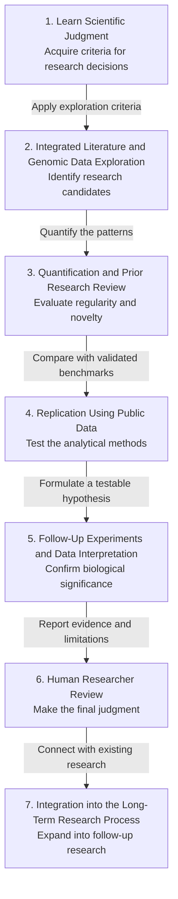

In September 2026, Anthropic announced a molecular machine that Claude found by reading the literature and genomic data. The system is built on reverse transcriptase (RT) and may turn out to be a new gene-editing mechanism. CEO Dario Amodei said Claude did most of the research, and the team itself ran the validation experiments Claude proposed. This article draws on the research process Anthropic's life sciences team published to lay out the validation steps that make Claude's findings trustworthy.

When AI claims to have found clues to a novel biological system in vast bodies of literature and genomic data, how can researchers trust its findings? The key is not to accept Claude’s confidence at face value, but to establish a step-by-step validation process that extends from learning scientific judgment to replication, experimentation, and human review.

> Claude’s research findings become trustworthy only after literature review, quantitative analysis, replication, and experimentation.  
> AI confidence is not a conclusion but a hypothesis that initiates validation.  
> The final judgment and responsibility rest with researchers who critically evaluate the evidence.

## Teach Claude the Research Team’s Scientific Judgment

The research team first teaches Claude to emulate its scientific judgment and approach to inquiry. Scientific judgment here refers to the ability to distinguish research-worthy questions and targets from a large volume of information and determine what additional evidence must be examined.

Is it enough simply to have Claude read many papers? No. Researchers must also provide the types of evidence they consider important, the patterns that warrant skepticism, and the conditions that define a promising hypothesis. Only then can Claude move beyond basic information retrieval and identify scientifically meaningful research targets.

This is less like having a student memorize correct answers and more like showing them how an experienced professor approaches a problem. Even when reading the same data, Claude must learn what questions to ask before it can become an effective research assistant.

## Explore the Literature and Large-Scale Genomic Data Together

Claude reads relevant literature alongside vast genomic datasets to identify compelling research targets. It uses the literature to understand established biological contexts and explores genomic data for patterns that are difficult to explain using existing knowledge alone.

The reason for integrating these two sources is clear. An unusual sequence discovered in the data may simply be random noise if it cannot be linked to relevant biology, while reviewing the literature alone may overlook patterns that have not yet been reported.

| Source Explored | What Claude Examines | Role in Research |
|---|---|---|
| Relevant literature | Existing hypotheses, known mechanisms, and limitations of prior research | Establishes the biological context of the discovery. |
| Large-scale genomic data | Repetitive structures, relationships among sequences, and anomalous patterns | Identifies new research candidates. |
| Cross-analysis of literature and data | Whether established knowledge aligns with observed patterns | Distinguishes random signals from meaningful clues. |

Claude then evaluates how the candidates it has discovered relate to existing knowledge. At this stage, the important outcome is not a finalized conclusion but a hypothesis worth testing.

## Quantify Patterns and Review Prior Research

Claude does more than describe observed patterns: it counts the number of repeats and measures the intervals between them. Quantification is the process of expressing a notable phenomenon through numbers and criteria so that it can be compared and reexamined.

For example, the mere impression that a repetitive structure exists is not enough to support a claim of a novel biological system. Researchers must calculate how frequently the repeats occur, whether their spacing is consistent, and whether they are concentrated in particular genomic regions to distinguish chance from regularity.

In the same context, Claude searches the literature again to determine whether the pattern has previously been reported. If a similar phenomenon appears in existing research, the differences must be clearly identified. If it has not been reported, researchers must check whether the search scope and keywords were sufficiently comprehensive.

After a thorough analysis, Claude may conclude that the pattern is highly likely to represent a novel biological system. However, Claude’s high confidence is not evidence of discovery and should be treated only as grounds for proceeding to the next validation stage.

## Evaluate Methodological Reproducibility Using Public Data

Before presenting a new claim, Claude evaluates its analytical methods by reproducing established results using public data. Reproducibility is the ability to obtain the same existing results when using the same data and analytical procedures.

Why not begin by analyzing new data? Testing the tools first on a problem with a known answer makes it easier to identify errors in the analytical process. It is like checking the brakes and steering on a familiar route before taking a driving test.

Reproducing results with public data provides a benchmark for verifying that the analysis code, data preprocessing, and pattern-detection criteria work properly. If replication fails, the cause of that failure must be investigated before making claims about a new discovery.

The following diagram illustrates the validation workflow required for Claude’s discovery to reach a final human judgment.

Each stage is designed so that its results are tested again in the next stage. Data exploration leads to quantification, quantitative analysis undergoes replication using public data, and computational hypotheses develop into biological claims through experimentation and human review.

## Validate Discoveries Through Experimentation and Interpretation

Claude proposes follow-up experiments that can empirically validate patterns discovered through computational analysis. A strong experimental proposal should include the hypothesis to be tested, the necessary control groups, the expected results, and the outcomes that would occur if the hypothesis were incorrect.

If the experimental results align with the hypothesis, is that enough? Not yet. Researchers must also examine whether other causes could produce the same results and whether the experimental design contains any bias.

Claude can also help interpret the data generated by subsequent experiments. It can outline potential links between computational discoveries and actual biological functions and propose alternative hypotheses to examine in follow-up analyses.

Personally, I believe Claude’s most valuable role is not to declare the correct answer, but to clarify what the next experiment must distinguish.

## Complete the Final Assessment Through Human Review

Claude compiles its analytical process, the data used, observed patterns, replication results, experimental proposals, and limitations into a report for human review. Researchers must examine the raw data and analytical procedures and critically assess whether Claude’s interpretations go beyond the available evidence.

| Review Item | Questions for Researchers |
|---|---|
| Data sources | Are the data quality and sample composition appropriate for the claim? |
| Analytical methods | Can the preprocessing and measurement criteria be independently reproduced? |
| Novelty | Is there truly no prior research reporting similar patterns? |
| Alternative explanations | Are there other hypotheses that could explain the same results? |
| Experimental results | Were appropriate control groups and replicate experiments included? |
| Scope of the conclusion | Does the claim extend beyond what the available evidence supports? |

Ultimately, AI confidence itself must not be regarded as a conclusion. Researchers must make the final judgment after reviewing the evidence and interpretations, and responsibility for that judgment remains with the human researchers.

## Connect New Discoveries to the Long-Term Research Process

Claude’s discoveries should be understood not as isolated achievements but as extensions of related research accumulated over decades. Even a claim concerning a novel biological system gains significance only when compared with the concepts, data, and experimental techniques established by prior research.

AI’s role is not to replace the context of established science. Claude is better understood as a tool that builds on that foundation by exploring more literature and genomic data, suggesting connections that researchers may have overlooked, and broadening the scope of validation.

Of course, Claude can be wrong. In particular, evaluating the true novelty and biological significance of a discovery requires the supporting raw materials, including research reports, public dataset identifiers, analysis code, and experimental results.

## Trusting Claude Means Trusting the Validation Process

What makes Claude an effective research assistant is not a single discovery or a high level of confidence. Learning scientific judgment, integrating literature and data analysis, quantifying patterns, reproducing established results, conducting and interpreting follow-up experiments, and completing human review must all work together in sequence.

Returning to the initial question, there is no need to immediately trust Claude’s claim that it has found clues to a novel biological system. Instead, researchers should verify the process through which those clues gain credibility by passing each stage of validation.

**One-line comment.** Claude is not a researcher who crosses the finish line on our behalf, but a research colleague who helps us identify every checkpoint along the way.

Sources (2) — anthropic.com · X (formerly Twitter)

<ul>
<li><a href="https://www.anthropic.com/news/claude-discovers-novel-enzyme-system">Claude discovers a novel enzyme system</a> — anthropic.com</li>
<li><a href="https://x.com/darioamodei/status/2102831170299834652">Dario Amodei (@DarioAmodei) on X</a> — X (formerly Twitter)</li>
</ul>

