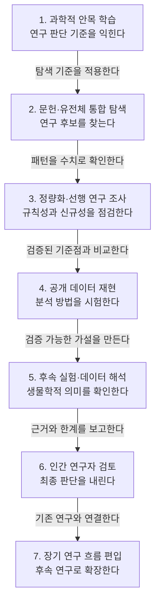

2026년 9월, Anthropic은 Claude가 문헌과 유전체 데이터를 읽고 찾아낸 분자 기계를 발표했다. 역전사효소(RT)를 기반으로 한 시스템으로, 새로운 유전자 편집 메커니즘일 가능성이 있다고 한다. 다리오 아모데이 CEO는 연구의 대부분을 Claude가 수행했고, Claude가 제안한 검증 실험은 연구팀이 직접 진행했다고 밝혔다. 이 글은 Anthropic 생명과학팀이 공개한 연구 과정을 바탕으로, Claude의 발견을 신뢰할 수 있게 만드는 검증 단계를 정리한 것이다.

AI가 방대한 문헌과 유전체 데이터에서 새로운 생물학적 시스템의 단서를 찾았다고 말할 때, 연구자는 그 결과를 어떻게 신뢰할 수 있을까? 핵심은 Claude의 확신을 그대로 받아들이는 것이 아니라, 과학적 안목의 학습부터 재현, 실험, 인간 검토까지 이어지는 단계적 검증 과정을 구축하는 데 있다.

> Claude의 연구 결과는 문헌 조사, 정량 분석, 재현, 실험을 거쳐야 신뢰할 수 있다.  
> AI의 확신은 결론이 아니라 검증을 시작하게 만드는 가설이다.  
> 최종 판단과 책임은 근거를 비판적으로 검토한 연구자에게 있다.

## 연구진의 과학적 안목을 학습시키다

연구진은 먼저 Claude가 자신들의 과학적 안목과 탐구 방식을 모방하도록 가르친다. 여기서 과학적 안목이란 많은 정보 가운데 연구 가치가 있는 질문과 대상을 구별하고, 어떤 근거를 추가로 확인해야 하는지 판단하는 능력이다.

논문을 많이 읽게 하는 것만으로 충분할까? 그렇지 않다. 연구진이 중요하게 보는 증거, 의심해야 할 패턴, 유망한 가설의 조건을 함께 제시해야 Claude도 단순한 정보 검색을 넘어 연구적으로 의미 있는 대상을 찾을 수 있다.

이는 학생에게 정답만 외우게 하는 일이 아니라, 숙련된 교수가 문제를 바라보는 방식을 보여주는 일과 비슷하다. 같은 데이터를 읽더라도 무엇을 질문해야 하는지 배워야 제대로 된 연구 보조자가 될 수 있다.

## 문헌과 대규모 유전체 데이터를 함께 탐색하다

Claude는 관련 문헌과 방대한 유전체 데이터를 함께 읽으며 흥미로운 연구 대상을 찾는다. 문헌에서는 이미 알려진 생물학적 맥락을 파악하고, 유전체 데이터에서는 기존 설명만으로 이해하기 어려운 패턴을 탐색한다.

두 자료를 통합하는 이유는 분명하다. 데이터에서 특이한 배열을 발견하더라도 관련 생물학과 연결되지 않으면 우연한 잡음일 수 있고, 문헌만 검토하면 아직 보고되지 않은 패턴을 놓칠 수 있기 때문이다.

| 탐색 자료 | Claude가 확인하는 내용 | 연구에서 맡는 역할 |
|---|---|---|
| 관련 문헌 | 기존 가설, 알려진 기작, 선행 연구의 한계 | 발견의 생물학적 맥락을 설정한다. |
| 대규모 유전체 데이터 | 반복 구조, 배열 간 관계, 예외적 패턴 | 새로운 연구 후보를 발굴한다. |
| 문헌과 데이터의 교차 분석 | 기존 지식과 관찰 패턴의 일치 여부 | 우연한 신호와 의미 있는 단서를 구분한다. |

이어서 Claude는 발견한 후보가 기존 지식과 어떻게 연결되는지 평가한다. 이 단계에서 중요한 결과는 완성된 결론이 아니라, 검증할 가치가 있는 가설이다.

## 패턴을 정량화하고 선행 연구를 확인하다

Claude는 관찰한 패턴을 설명하는 데 그치지 않고 반복 횟수를 세고, 반복 사이의 간격을 측정한다. 정량화란 눈에 띄는 현상을 비교하고 재검사할 수 있도록 수치와 기준으로 표현하는 과정이다.

예를 들어 반복 구조가 보인다는 인상만으로는 새로운 시스템을 주장하기 어렵다. 반복이 얼마나 자주 나타나는지, 간격이 일정한지, 특정 유전체 영역에 집중되는지를 계산해야 우연과 규칙을 구별할 수 있다.

같은 맥락에서 Claude는 해당 패턴이 이전에 보고된 적이 있는지 문헌을 다시 검색한다. 기존 연구와 비슷한 현상이라면 차이를 분명히 밝혀야 하고, 보고된 적이 없다면 검색 범위와 검색어가 충분했는지 점검해야 한다.

철저한 분석 끝에 Claude가 새로운 생물학적 시스템일 가능성이 높다고 판단할 수는 있다. 다만 Claude의 높은 확신은 발견의 증거가 아니며, 다음 검증 단계로 넘어갈 근거로만 다뤄야 한다.

## 공개 데이터로 방법의 재현성을 점검하다

Claude는 새로운 주장을 내놓기 전에 공개 데이터에서 이미 알려진 결과를 재현하며 분석 방법을 점검한다. 재현성이란 같은 데이터와 분석 절차를 사용했을 때 기존 결과를 다시 얻을 수 있는 성질이다.

왜 새로운 데이터부터 분석하지 않을까? 정답을 알고 있는 문제로 도구를 먼저 시험해야 분석 과정의 오류를 찾기 쉽기 때문이다. 운전시험에 나서기 전에 익숙한 코스에서 브레이크와 조향 장치를 점검하는 것과 같다.

공개 데이터를 이용한 재현은 분석 코드, 데이터 전처리, 패턴 탐지 기준이 제대로 작동하는지 확인하는 기준점이 된다. 재현에 실패했다면 새로운 발견을 주장하기보다 실패 원인부터 찾아야 한다.

다음 그림은 Claude의 발견이 인간의 최종 판단에 도달하기까지 필요한 검증 흐름을 나타낸다.

각 단계는 앞 단계의 결과를 다음 단계에서 다시 시험하도록 설계된다. 데이터 탐색은 정량화로 이어지고, 정량 분석은 공개 데이터 재현을 거치며, 계산적 가설은 실험과 인간 검토를 통해 생물학적 주장으로 발전한다.

## 실험과 해석으로 발견을 검증하다

Claude는 계산 과정에서 발견한 패턴을 실제로 검증할 수 있는 후속 실험을 제안한다. 좋은 실험 제안에는 검증할 가설, 필요한 대조군, 예상 결과, 가설이 틀렸을 때 나타날 결과가 함께 포함돼야 한다.

실험 결과가 가설과 일치하면 그것으로 충분할까? 아직은 아니다. 다른 원인이 같은 결과를 만들었을 가능성과 실험 설계의 편향을 추가로 살펴야 한다.

한편 Claude는 실험 이후 생성된 데이터의 해석도 돕는다. 계산적 발견과 실제 생물학적 기능 사이의 연결 가능성을 정리하고, 후속 분석에서 확인할 대안 가설을 제시할 수 있다.

개인적으로 Claude의 가장 유용한 역할은 정답을 선언하는 데 있지 않고, 다음 실험에서 무엇을 구분해야 하는지 명료하게 만드는 데 있다고 본다.

## 인간 검토로 최종 판단을 완성하다

Claude는 분석 과정, 사용한 데이터, 관찰한 패턴, 재현 결과, 실험 제안과 한계를 보고서로 정리해 사람의 검토를 받는다. 연구자는 원본 데이터와 분석 절차를 확인하고, Claude의 해석이 근거보다 앞서 나가지 않았는지 비판적으로 살펴야 한다.

| 검토 항목 | 연구자가 확인할 질문 |
|---|---|
| 데이터 출처 | 데이터의 품질과 표본 구성이 주장에 적합한가? |
| 분석 방법 | 전처리와 측정 기준을 독립적으로 재현할 수 있는가? |
| 신규성 | 유사한 패턴을 보고한 선행 연구가 정말 없는가? |
| 대안 설명 | 같은 결과를 설명할 다른 가설이 존재하는가? |
| 실험 결과 | 적절한 대조군과 반복 실험이 포함됐는가? |
| 결론의 범위 | 확보한 근거보다 넓은 주장을 하고 있지 않은가? |

결국 AI의 확신 자체를 결론으로 간주해서는 안 된다. 최종 판단은 연구자가 근거와 해석을 검토한 뒤 내려야 하며, 판단에 대한 책임도 인간 연구자에게 남는다.

## 새로운 발견을 장기적인 연구 흐름에 연결하다

Claude의 발견은 고립된 성과가 아니라 수십 년 동안 축적된 관련 연구의 연장선에서 이해해야 한다. 새로운 생물학적 시스템이라는 주장도 이전 연구가 만든 개념, 데이터, 실험 기법과 비교될 때 의미를 얻는다.

AI의 역할은 기존 과학의 맥락을 대체하는 것이 아니다. Claude는 그 위에서 더 많은 문헌과 유전체 데이터를 탐색하고, 연구자가 미처 살피지 못한 연결을 제시하며 검증 범위를 넓히는 도구에 가깝다.

물론 틀릴 수 있다. 특히 실제 발견의 신규성과 생물학적 의미를 평가하려면 연구 보고서, 공개 데이터셋 식별자, 분석 코드와 실험 결과 같은 원자료를 함께 제시해야 한다.

## Claude를 신뢰하는 방법은 검증 과정을 신뢰하는 것이다

Claude를 효과적인 연구 보조자로 만드는 것은 한 번의 발견이나 높은 확신이 아니다. 과학적 안목의 학습, 문헌과 데이터의 통합 분석, 패턴의 정량화, 기존 결과의 재현, 후속 실험과 해석, 인간 검토가 차례로 맞물려야 한다.

처음 던진 질문으로 돌아가면, 새로운 생물학적 시스템의 단서를 발견했다는 Claude의 말을 곧바로 신뢰할 필요는 없다. 대신 그 단서가 단계적 검증을 통과하면서 신뢰를 얻는 과정을 확인해야 한다.

**한줄 코멘트.** Claude는 결승선을 대신 통과하는 연구자가 아니라, 모든 검문소를 빠짐없이 찾아주는 연구 동료에 가깝다.

참고 자료 (2) — anthropic.com · X (formerly Twitter)

<ul>
<li><a href="https://www.anthropic.com/news/claude-discovers-novel-enzyme-system">Claude discovers a novel enzyme system</a> — anthropic.com</li>
<li><a href="https://x.com/darioamodei/status/2102831170299834652">Dario Amodei (@DarioAmodei) on X</a> — X (formerly Twitter)</li>
</ul>

